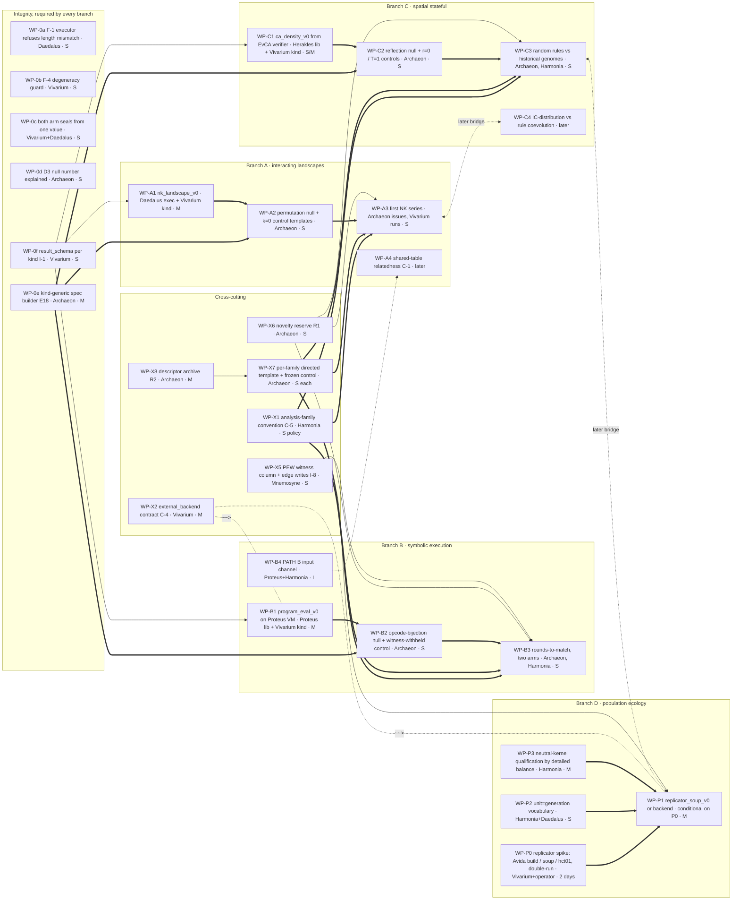

# Dependency and complexity graph

Annex to `archaeon/docs/ROADMAP.md` §Diversity. 2026-09-07. `==>` required,
`-->` helpful, `~~>` alternative route, `<->` later bridge between families.
Effort: S under a day, M a few days, L longer. Work-package detail in
`WORK_PACKAGES.md`.



Plain-text form, for terminals and diffs:

```
[BENCH TODAY] one qualified world (24-bit seeded onemax), 3 kinds,
              1 informative walk axis, scalar outcome rule + within-run
              aggregate (branch), no witness, no relatedness, no population

INTEGRITY (every branch; not diversity work)
  WP-0a F-1 refuse length mismatch ........ Daedalus ........ S
  WP-0b F-4 degeneracy guard under reset .. Vivarium ........ S
  WP-0c one arm value -> both seals ....... Vivarium+Daedalus S
  WP-0d D3 null fire-rate explained ....... Archaeon ........ S   (before M-SIGNAL)
  WP-0e kind-generic spec builder (E18) ... Archaeon ........ M   ==> every non-bitstring template
  WP-0f result_schema per kind (I-1) ...... Vivarium ........ S   --> every new kind checkable

CROSS-CUTTING
  WP-X1 analysis-family convention (C-5) .. Harmonia ........ S   ==> any cross-observation claim
  WP-X6 novelty reserve (R1) .............. Archaeon ........ S   --> new families get draws
  WP-X8 descriptor archive (R2) ........... Archaeon ........ M   --> region seeds for directed templates
  WP-X7 directed template + frozen control  Archaeon ........ S/family ==> closes the fossil->selection loop per family
  WP-X2 external_backend contract (C-4) ... Vivarium ........ M   ~~> alternative route for B1, P1
  WP-X5 PEW witness column + edge writes .. Mnemosyne ....... S   --> queryable witness, lineage

A  INTERACTING LANDSCAPES      A1 nk_landscape_v0 (M) ==> A2 null+control (S) ==> A3 first series (S)
                               A4 shared-table relatedness .......... later, behind a stateful organism
B  SYMBOLIC EXECUTION          B1 program_eval_v0 on Proteus VM (M) ==> B2 (S) ==> B3 two-arm rounds-to-match (S)
                               B4 PATH B input channel (L) ......... prerequisite for organism/transfer claims
C  SPATIAL STATEFUL            C1 ca_density_v0 from EvCA verifier (S/M) ==> C2 (S) ==> C3 random vs historical (S)
                               C4 IC-vs-rule coevolution ........... later bridge to D
D  POPULATION ECOLOGY          P0 spike (2 days) ==> P1 soup or backend (M); P2 unit vocabulary (S) ==> P1;
                               P3 neutral kernel by detailed balance (M) ==> any diversity claim

Later bridges:  A3 <-> C4 (a landscape the IC distribution co-evolves on)
                C3 <-> P1 (rule populations under resource competition)
                B4 --> A4 (a stateful organism makes relatedness a transfer experiment)
```

**Reading the graph.** Three branches (A, B, C) are independent of each other
and of D; each is three increments deep to its first bounded experiment; each
first experiment needs only the integrity packages, the analysis convention,
and its own directed template. Nothing in A, B, or C waits on the population
branch, on the external backend, or on relatedness. The population branch is
the only one that begins with a spike rather than a build, because nothing
runnable exists for it.
