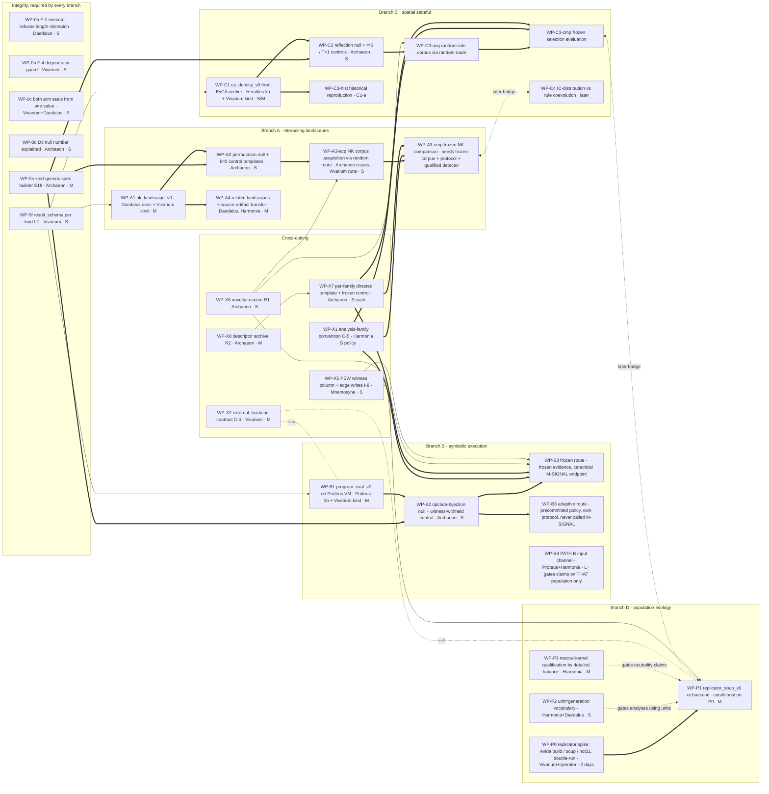

# Dependency and complexity graph

Annex to `archaeon/docs/ROADMAP.md` §Diversity. 2026-09-07. `==>` required,
`-->` helpful, `~~>` alternative route, `<->` later bridge between families.
Effort: S under a day, M a few days, L longer. Work-package detail in
`WORK_PACKAGES.md`.



Plain-text form, for terminals and diffs:

```
[BENCH TODAY] one qualified world (24-bit seeded onemax), 3 kinds,
              1 informative walk axis, scalar outcome rule + within-run
              aggregate (branch), no witness, no relatedness, no population

INTEGRITY (every branch; not diversity work)
  WP-0a F-1 refuse length mismatch ........ Daedalus ........ S
  WP-0b F-4 degeneracy guard under reset .. Vivarium ........ S
  WP-0c one arm value -> both seals ....... Vivarium+Daedalus S
  WP-0d D3 null fire-rate explained ....... Archaeon ........ S   (before M-SIGNAL)
  WP-0e kind-generic spec builder (E18) ... Archaeon ........ M   ==> every non-bitstring template
  WP-0f result_schema per kind (I-1) ...... Vivarium ........ S   --> every new kind checkable

CROSS-CUTTING
  WP-X1 analysis-family convention (C-5) .. Harmonia ........ S   ==> any cross-observation claim
  WP-X6 novelty reserve (R1) .............. Archaeon ........ S   --> new families get draws
  WP-X8 descriptor archive (R2) ........... Archaeon ........ M   --> region seeds for directed templates
  WP-X7 directed template + frozen control  Archaeon ........ S/family ==> closes the fossil->selection loop per family
  WP-X2 external_backend contract (C-4) ... Vivarium ........ M   ~~> alternative route for B1, P1
  WP-X5 PEW witness column + edge writes .. Mnemosyne ....... S   --> queryable witness, lineage

A  INTERACTING LANDSCAPES      A1 nk_landscape_v0 (M) ==> A2 null+control (S) ==> A3-acq corpus (random route)
                                                                              ==> A3-cmp frozen comparison (X1, X7, qualified detector)
                               A1 ==> A4 related landscapes + source-artifact transfer (mapping + baselines; no runtime memory needed)
B  SYMBOLIC EXECUTION          B1 program_eval_v0 on Proteus VM (M) ==> B2 (S) ==> B3 frozen route (M-SIGNAL) | B3 adaptive route (own protocol)
                               B4 PATH B input channel (L) ......... gates claims relying on that population/channel ONLY
C  SPATIAL STATEFUL            C1 ca_density_v0 from EvCA verifier (S/M) ==> C2 (S) ==> C3-acq random-rule corpus ==> C3-cmp frozen evaluation
                               C1 ==> C3-hist historical reproduction (separate qualification report)
                               C4 co-development .................. bounded design/spike may precede full C3 qualification
D  POPULATION ECOLOGY          P0 spike (operator-capped) ==> P1 route (M); P2 units gate ANALYSES using them;
                               P3 neutral baseline gates CLAIMS needing neutrality; descriptive execution proceeds

Later bridges:  A3-cmp <-> C4 (a landscape the IC distribution co-evolves on)
                C3-cmp <-> P1 (rule populations under resource competition)
```

**Reading the graph (amended).** Three branches (A, B, C) are independent of
each other and of D. Each first **corpus acquisition** needs only its
library/kind, the generic builder, local integrity checks, the admitted
random route and its null/control semantics. Each **frozen comparison** needs
a frozen corpus/universe, the approved protocol, correct provenance/units and
the qualification of the detector used. No pure-library test waits on B4, P3
or D3. Dependencies are local: 0a gates affected candidates, 0d gates D3
claims, P2 gates analyses using its units. The population branch begins with
a spike because nothing runnable exists for it.
