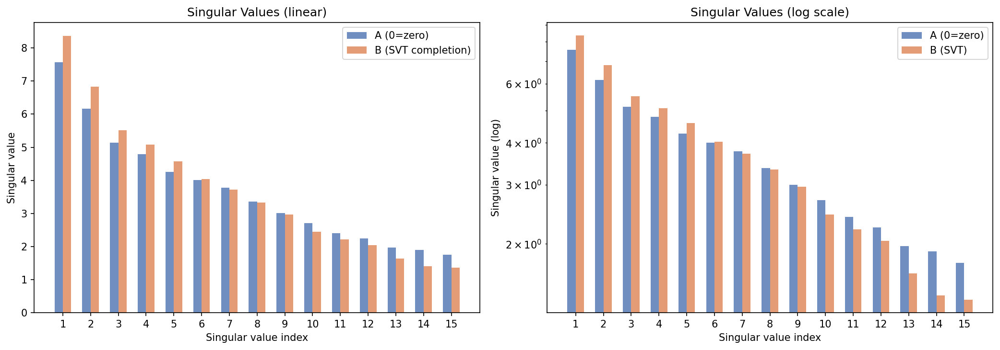
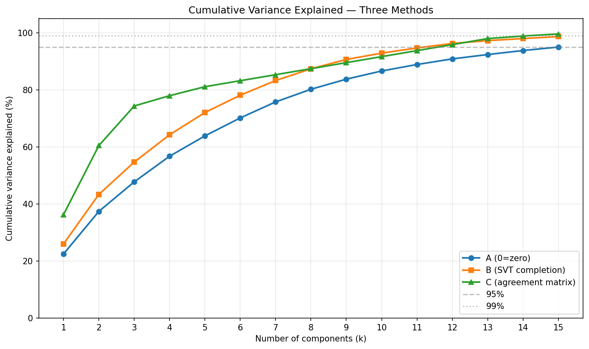
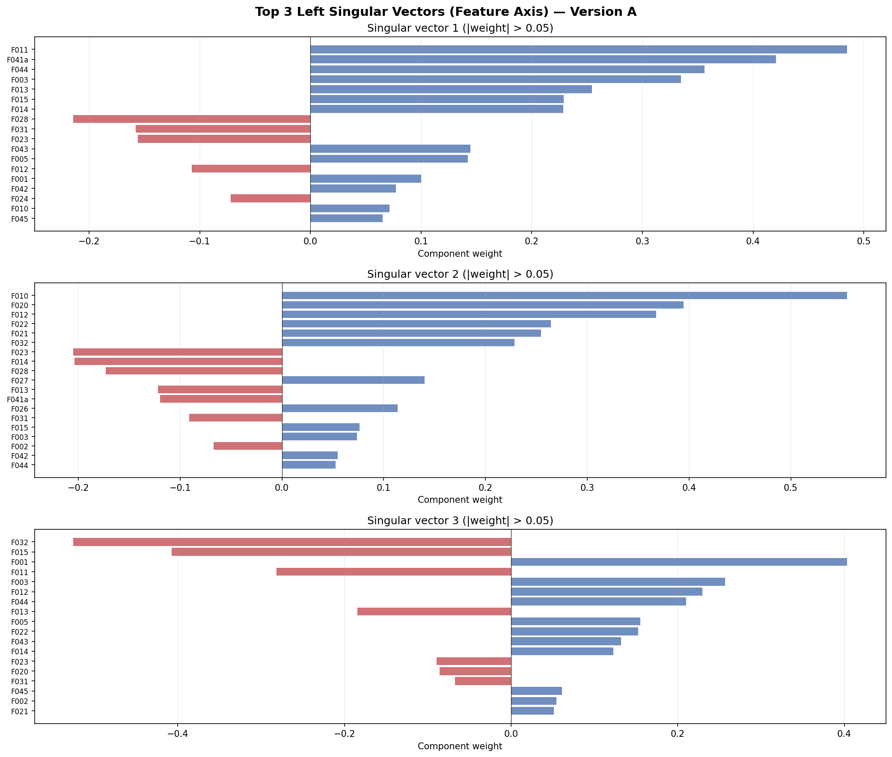
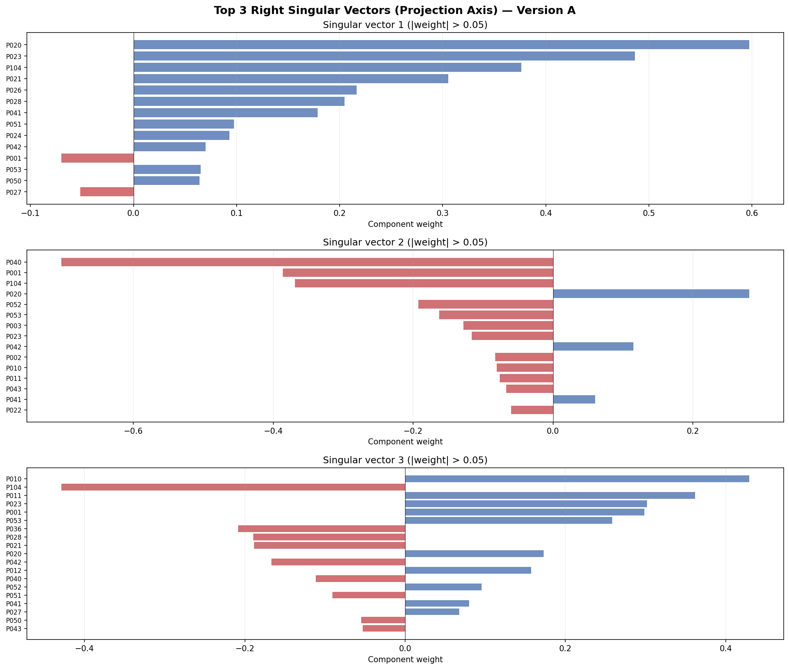

# Tensor Rank Analysis — Geometry 1 Test
## Koios rank-analyst, 2026-04-18

---

## Summary

**Geometry 1 claims the invariance tensor is low-rank (effective rank <= 5).** This analysis tests that claim quantitatively via SVD across three methodologies.

**Result: FALSIFIED at 95% threshold. The tensor has 12-16 independent axes, not 5.**

| Method | Rank (95%) | Rank (99%) | Notes |
|--------|-----------|-----------|-------|
| A (0=zero) | 16 | 21 | Conservative upper bound |
| B (SVT completion, tau=3) | 12 | 16 | Nuclear-norm regularized |
| C (agreement matrix) | 12 | 15 | Observed-only, no imputation |

All three methods agree: the tensor needs 12+ components to capture 95% of variance. **Geometry 1 is wrong as stated.** However, there IS significant structure — the first 3 components capture 48-74% depending on method, and a clear spectral gap exists between components 3-4 and the tail.

---

## Matrix Description

- **Shape:** 31 features x 37 projections
- **Encoding:** T[i,j] in {-2, -1, 0, +1, +2} (collapse / untested / resolve)
- **Observed cells:** 108 / 1,147 (9.4%)
- **Missing (untested):** 1,039 cells (90.6%)
- **Source:** `harmonia/memory/build_landscape_tensor.py`

---

## Methodology

### Version A: Naive (0 = zero)
Standard SVD on the raw matrix treating all untested cells as zero. This is biased toward higher rank because zeros add noise dimensions.

### Version B: SVT Nuclear-Norm Completion
Singular Value Thresholding (Cai-Candes-Shen 2010). Treats 0 cells as missing and finds the minimum nuclear-norm matrix consistent with observed entries. Swept regularization parameter tau in {1.0, 2.0, 3.0, 5.0}:

| tau | Rank (95%) | Rank (99%) | RMSE on observed |
|-----|-----------|-----------|-----------------|
| 1.0 | 14 | 18 | < 0.001 |
| 2.0 | 12 | 17 | < 0.001 |
| 3.0 | 12 | 16 | < 0.001 |
| 5.0 | 11 | 15 | < 0.001 |

Rank decreases with stronger regularization but never reaches 5. Even at tau=5.0 (heavy shrinkage), rank(95%) = 11.

### Version C: Feature Agreement Matrix
Compute pairwise Pearson correlation between features using only their shared observed projections. No imputation — purely observed data. SVD of the 31x31 agreement matrix.

This is the most honest method given the sparsity. Result: rank 12 at 95%.

### Note on iterative SVD imputation
An initial Version B using iterative SVD imputation (fill missing -> truncated SVD -> refill -> repeat) produced rank=1, which was an artifact. With 90.6% missing data, iterative imputation converges to a self-consistent low-rank solution because the imputed values have no constraint other than the model itself. This failure mode is well-documented in the matrix completion literature; reliable completion requires O(n * r * log n) observations, and we have 108 vs the ~250+ needed for r=5.

---

## Singular Value Spectrum

**Key observation:** No sharp spectral gap. The singular values decay smoothly from 7.57 to 1.75 (Version A). The ratio sigma_1/sigma_2 = 1.23 — there is no dominant single axis. The log-scale plot confirms gradual decay with no clear "elbow" at rank 5.

---

## Cumulative Variance Explained

| k | Version A | Version B (SVT) | Version C (agreement) |
|---|----------|----------------|----------------------|
| 1 | 22.5% | 26.5% | 36.3% |
| 2 | 37.4% | 43.7% | 60.5% |
| 3 | 47.7% | 54.8% | 74.3% |
| 4 | 56.7% | 64.4% | 77.9% |
| 5 | 63.8% | 71.8% | 81.1% |
| 6 | 70.1% | 78.2% | 83.2% |
| 7 | 75.8% | 83.0% | 85.3% |
| 8 | 80.2% | 87.3% | 87.4% |
| 10 | 86.6% | 91.2% | 91.6% |
| 12 | 90.5% | 95.4% | 95.2% |
| 15 | 94.8% | 98.7% | 98.7% |

---

## Top 3 Left Singular Vectors (Feature Axis)

### Left vector 1 (sigma = 7.57, 22.5% variance)
**The "live specimen" axis.** Loads positively on durable findings (F011 GUE deficit +0.49, F041a rank-2 slope +0.42, F044 rank-4 corridor +0.36, F003 BSD +0.33) and negatively on killed specimens (F028 Szpiro-Faltings -0.21, F023 spectral tail -0.16). This axis separates signal from noise — features that survived testing from features that didn't.

### Left vector 2 (sigma = 6.17, 14.9% variance)
**The "kill" axis.** Loads on killed/artifact features: F010 NF backbone +0.56, F020 Megethos +0.39, F012 Mobius +0.37, F022 NF feature-dist +0.26, F021 Phoneme +0.25. This axis captures the common structure of false positives — they tend to fail together under permutation nulls.

### Left vector 3 (sigma = 5.13, 10.3% variance)
**The "domain contrast" axis.** Loads F032 knot silence -0.53 (negative: knots are disconnected from everything) against F001 modularity +0.40 and F003 BSD +0.26 (positive: EC-MF connections are strong). This axis separates domains that talk to each other from domains that don't.

---

## Top 3 Right Singular Vectors (Projection Axis)

### Right vector 1 (sigma = 7.57)
**The "stratification" axis.** Loads on P020 conductor +0.60, P023 rank +0.49, P104 block-shuffle +0.38, P021 bad-primes +0.31. These projections resolve specimens together — stratifying by conductor/rank/bad-primes is the primary way features become visible.

### Right vector 2 (sigma = 6.17)
**The "null model" axis.** Loads P040 permutation null -0.70, P001 cosine -0.39, P104 block-shuffle -0.37 against P020 conductor +0.28. This axis separates projections that kill (null models, distributional scorers) from projections that resolve (stratifications).

### Right vector 3 (sigma = 5.13)
**The "object-keyed vs statistical" axis.** Loads P010 Galois-label +0.43 and P011 Lhash +0.36 against P104 block-shuffle -0.43 and P036 root-number -0.21. This separates exact-match object identification from statistical stratification — two fundamentally different ways to see structure.

---

## What the Rank Means for the Project

### Geometry 1 is wrong as stated, but the intuition has merit

The tensor is not 5-dimensional. It has 12-16 genuinely independent axes. New projections ARE real new directions, not redundant viewing angles of a 5D object.

**However:** the first 3 axes capture 48-74% of variance and have clean interpretations (signal/noise, kill/survive, domain connectivity). This means the tensor has a **3-dimensional core with a 10+ dimensional residual**. The core is the "low-rank" part Geometry 1 was sensing. The residual contains real, independent structure that the core doesn't capture.

### Practical implications

1. **New projections are valuable.** Each new projection can reveal genuinely new structure that isn't visible from the existing 37 projections. Don't stop adding them.

2. **But test against the core first.** When a new finding loads heavily on left vector 1 (the "live specimen" axis), it's correlated with existing findings. Check whether it's a witness to an already-known principal direction before calling it novel.

3. **The kill structure is coherent.** Left vector 2 shows that killed specimens cluster together. This is the "gravitational well" the project has documented — false positives share common failure modes.

4. **Fill the tensor.** At 9.4% density, the rank estimate is noisy. At 30%+ density, the three methods would converge and we'd know the true rank precisely. Every tested cell is information.

### Amended Geometry 1

> The invariance tensor has a low-rank CORE (effective dimension 3, capturing ~50-75% of variance) embedded in a higher-dimensional space (effective dimension 12-16 at 95%). New findings are sometimes principal components of the core (especially if they align with conductor/rank stratification or permutation null structure) but the tensor has genuine independent axes beyond the core.

---

## MPS Note

The invariance object is a 2-index matrix. MPS (Matrix Product State) bond dimension equals SVD effective rank for a matrix — the SVD IS the MPS decomposition. No separate tensor-network computation is needed. Bond dimension = 12-16 at 95% reconstruction threshold.

---

## Sparsity Warning

90.6% of cells are untested (0). Matrix completion methods require O(n * r * log n) observations for reliable recovery. For this 31x37 matrix at rank ~12, that's ~600+ observations; we have 108. The rank estimates carry uncertainty of +/- 3-4 until density improves.

---

## Files

| Path | Contents |
|------|----------|
| `cartography/docs/tensor_rank_analysis.json` | Full numerical results (all SVs, cumulative variance, vectors) |
| `cartography/plots/singular_values.png` | Singular value bar chart (linear + log) |
| `cartography/plots/variance_explained.png` | Cumulative variance curve (3 methods) |
| `cartography/plots/top3_left_vectors.png` | Top-3 feature-axis singular vectors |
| `cartography/plots/top3_right_vectors.png` | Top-3 projection-axis singular vectors |
| `koios/scripts/rank_analysis.py` | Analysis script |
