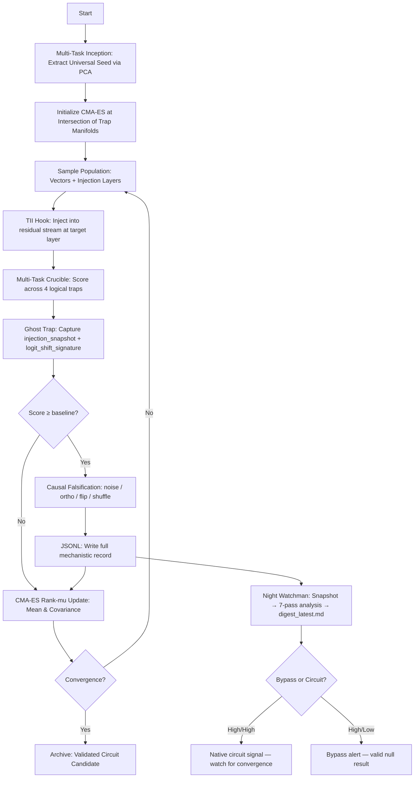

# Ignis — Latent Vector Evolution

**Version:** 2.0
**Status:** Active / TII-Exclusive
**Parent Project:** Prometheus

---

## Docs structure
This project uses a dedicated `docs/` folder for Ignis documentation. Keep the top-level files to:
- `README.md` (this operational overview)
- `ignis_paper.md`
- `design_spec.md`

Supplemental notes and analysis go into:
- `docs/prompts/`
- `docs/advisory/`
- `docs/science/`

---

## The North Star

Ignis exists for one reason: **reasoning circuit discovery**.

Not prompt engineering. Not behavioral fine-tuning. The hypothesis is that
transformer models develop structured, reusable neural mechanisms for logical
self-correction — and that these mechanisms can be found by evolving steering
vectors in latent space and watching what happens when you inject them.

Small models may not have mature reasoning circuits. That's fine. The tool is
built to detect whether circuits *are* present, and if they're not, to say
so clearly rather than report false signal. When new models release — and they
will, often — this pipeline runs against them. We're building the rotating
platform, not studying a single shadow.

> *"We are not detecting circuits directly. We are detecting compatibility
> between the steering vector and the model's ongoing computation. That is the
> correct primitive."*

This distinction matters. A circuit is a structural hypothesis — neurons
connected in a pattern. Compatibility is a dynamical hypothesis — the model's
computation at this layer, at this moment, is receptive to perturbation along
this direction. Circuits are static. Compatibility is contextual. A direction
might be compatible during self-correction and incompatible during confident
generation. That's not a failure to find a circuit — it's a finding about when
the model's computational regime shifts.

---

## The Shadow Analogy

The model's internal state is the object. Your steering vectors and fitness
scores are the shadow on the wall. With enough shadows from enough angles —
different vectors, different layers, different model scales, different traps —
you can infer the shape of the object. You never touch the object directly.

That's not a limitation of the tool. That's the epistemological condition of
all intervention-based science.

This is Plato's Cave, but with a twist he didn't anticipate: **you choose which
light sources to aim and from which angles.** Evolutionary search doesn't pick
one hypothesis and shine one light. It systematically rotates the light source
across the full space and catalogs how the shadow changes. Most interpretability
researchers pick one angle, describe the shadow they see, and stop. Ignis
builds the rotating platform.

The tensor decomposition work in the cartography phase fits this metaphor
exactly. If you collect enough shadow projections from enough angles, you can
reconstruct the 3D object via tomography — the same mathematics behind CT scans.
Each steering vector at each layer is a projection angle. Each fitness score is
the shadow intensity. The SVD of the elite vector population is literally
computing the principal axes of the object from its projections. The rank of
that decomposition tells you how many dimensions the object has.

---

## What the Pipeline Actually Proves

To claim that a high-fitness vector is circuit-compatible and not just a
prompt-level hack, three things must be demonstrated simultaneously:

| Proof | How | Signal |
|---|---|---|
| **Causality** | Reversing the vector collapses performance | Sign-flip falsification `[STEP:falsification_verdict]` |
| **Native compatibility** | Vector aligns with the model's ongoing computation | `cos_with_residual` in `injection_snapshot` |
| **Geometric structure** | The solution space has definite dimensionality | `manifold_dim` trajectory in `[STEP:generation_summary]` |

All three are captured on every genome without bottlenecking the search loop.

The **Night Watchman** synthesizes these three proofs into a real-time digest.
It is the difference between knowing "fitness reached 0.7" and knowing "fitness
reached 0.7 via artificial bypass — not circuit evidence." Without the Watchman,
high-fitness bypass vectors are indistinguishable from circuit discoveries at a
glance. The first thing the Watchman reported in a live run (Gen 1, fitness 0.7076)
was bypass dominance with cosine-fitness correlation r=0.001 — immediately
preventing a false-positive circuit claim.

### The Four Quadrants

Every genome lands in one of four regimes based on fitness and
`cos_with_residual` (the cosine similarity between the steering vector and
the natural residual stream at injection):

| Fitness | cos_with_residual | Interpretation |
|---|---|---|
| High | High (> 0.5) | **Native circuit amplification** — the vector pushes along a direction the model already uses for reasoning |
| High | Low (~0.0) | **Artificial bypass** — the vector works but is foreign to the model's natural computation |
| Low | High | The model's native direction here isn't involved in verification |
| Low | Low | Noise |

The trajectory of CMA-ES across these quadrants across generations is the
actual experimental result. If evolution drives the population toward
High/High, it is discovering native compatibility. That is the finding.

The Night Watchman tracks this trajectory in real time via the `Ghost Trap`
section of `digest_latest.md`, reporting `native_circuit_candidates` vs
`artificial_bypass_candidates` counts and the `cosine_fitness_corr` scalar
each wake cycle. **A run where fitness climbs but `cosine_fitness_corr` stays
near zero is finding a sophisticated bypass, not a circuit** — an important
null result that is itself publishable.

---

## Architecture

Ignis replaces text-based prompt evolution with direct latent space search.
Instead of evolving reasoning module sequences, it evolves **steering vectors**
($d_{model}$-dimensional tensors) injected directly into the residual stream.



The **TII (Transformer Internal Injection)** engine eliminates the Ollama
handoff. Evolution and probing occur entirely within a single `HookedTransformer`
instance, giving ~10x iteration speed vs. v1 and enabling white-box
`hook_resid_pre` access.

> **Ollama is not used.** Models load directly from HuggingFace via
> `HookedTransformer.from_pretrained()`. If a model doesn't appear in
> `ollama list`, that's expected — it was never registered there.

---

## Key Design Choices

**Multi-Task Crucible** (`fitness.py`): Geometric mean fitness across 4 logical
traps (Decimal Magnitude, Density Illusion, Spatial Inversion, Anti-Sycophancy).
Geometric mean forces all traps to contribute — a vector that aces one trap and
fails three scores worse than one that passes all four at a lower level. This
prevents the search from discovering trap-specific heuristics instead of
generalizable reasoning directions.

**Causal Falsification Battery**: Every genome that reaches baseline (fitness ≥
0.30) runs four control probes — Gaussian noise vector, orthogonal projection,
sign-flip (−v), and shuffled components. A genome passes only if all four
controls score below 80% of the primary score. Sign-flip asymmetry is the
strongest signal: reversing a real circuit direction damages performance;
reversing noise doesn't.

**Logit Tier-2 Scoring**: Forced-choice forward pass (no generation) extracts
p(correct) / (p(correct) + p(wrong)) for each trap using single-token
target/anti pairs. Blended 70/30 with marker fitness. This channel is immune
to phrasing variation and gives a continuous gradient where markers produce
step functions.

**`[HEALTH]` Diagnostic**: Per-trap cross-reference of marker tier vs. logit
confidence. `FLOOR + Strong logit` means the model internally knows the correct
answer but didn't phrase it in a way markers detected — add markers. `FLOOR +
Weak logit` means the vector genuinely isn't activating the right computation —
architectural change needed.

**PCA Inception**: Contrastive deltas from all traps → first principal component
→ CMA-ES seed. Avoids signal cancellation from simple averaging. Hot-starts
the search along the dominant shared reasoning axis rather than a random
direction.

**Ratio-Based Layer Targeting**: No hardcoded layer indices. Injection depth is
`target_layer_ratio × n_layers`, automatically adapting to any architecture.
The same config runs against 0.5B and 70B models.

**Scout / MAIN Split**: 80% of each generation evaluates at the target layer.
20% ("Scouts") explore [0.3, 0.9] depth range. Every genome is tagged
`[EXPLORE:SCOUT]` or `[EXPLORE:MAIN]`. Scouts build the layer productivity map
without biasing the main CMA-ES distribution.

**Multi-Model Marathon**: Rotates through a list of models with independent
CMA-ES state per model. Searches for vectors that generalize across scales.
Cross-model cosine similarity between inception seeds tracks whether the same
reasoning direction persists as depth increases.

**The Night Watchman** (`night_watchman.py`): A background analysis daemon that
runs alongside any marathon. Snapshot-first architecture (MD5 comparison, never
competes with live writes, N-1 rule for `.pt` files). Analysis passes per wake
cycle: fitness trajectory, trap performance, trap correlation matrix (Pearson r),
**trap coupling trajectory** (mean |r| trend — rising = shared circuit emerging),
four-quadrant ghost trap (native candidates vs artificial bypasses),
**layer-native density** (which layer first shows residual-aligned high-fitness
genomes), logit selectivity, falsification quality, vector drift, and CMA-ES
state (sigma, plateau_count — now correctly parsed via `torch.load`). Outputs:
`digest_latest.md` (overwritten), `digest_history.jsonl` (append-only),
`alerts.log` (anomalies). Responds to `WATCHMAN_STOP` semaphore written by
`stop_ignis.py` — runs a final digest then exits rather than requiring manual
Ctrl+C. The first native circuit candidate triggers a `*** FIRST NATIVE CIRCUIT
CANDIDATE ***` banner, replacing the bypass dominance alert.

---

## The Ghost Trap: What Every JSONL Entry Contains

The residual stream is gone the moment you move to the next genome.
TransformerLens holds activations in memory only during the forward pass. A
subscriber service running one genome behind can parse JSONL records but cannot
reach back into the model's internal state — it no longer exists.

The answer is to capture the minimum viable mechanistic signal *synchronously*,
during the forward pass, at negligible cost. Every `discovery_log.jsonl` entry
contains two ghost trap blocks:

### `injection_snapshot` — zero overhead, four floats

Captured inside the TII hook at the moment of vector injection:

```json
"injection_snapshot": {
  "pre_norm": 12.34,           // activation magnitude before steering
  "post_norm": 13.12,          // activation magnitude after steering
  "cos_with_residual": 0.23,   // cosine(steering_vec, natural_residual)
  "norm_ratio": 1.063          // post_norm / pre_norm — "gentle steering" signal
}
```

`cos_with_residual` is the passive natural occurrence test — is the vector
amplifying a direction the model already uses, or injecting something foreign?
`norm_ratio` distinguishes *gentle steering* (ratio ~1.0, vector nudges along
existing structure) from *brute force injection* (ratio >> 1, vector overwhelms
the residual). Four float operations on tensors already in the hook closure —
microseconds.

### `logit_shift_signature` — one extra forward pass, ~50ms

Unsteered vs. steered forward pass on a fixed probe prompt, extracting logits
for 6 key answer tokens:

```json
"logit_shift_signature": {
  "unsteered": {"right": -2.1, "left": -1.8, "true": -0.4, ...},
  "steered":   {"right": -1.6, "left": -2.3, "true":  0.1, ...},
  "delta":     {"right": +0.5, "left": -0.5, "true": +0.5, ...}
}
```

This captures the model's internal belief shift at the output layer, independent
of whether the generated text hit the marker strings. If a genome scores FLOOR
on Decimal Magnitude but shows `delta["true"] = +0.8`, the model internally
shifted toward "true" — the vector is working but the markers didn't catch it.
That's actionable signal for marker additions rather than architectural changes.

### The full JSONL schema per genome

```json
{
  "ts": "2026-03-18T14:23:01",
  "gen": 7,
  "genome_idx": 12,
  "layer": 21,
  "explore": "MAIN",
  "zone": "productive",
  "fitness": 0.4393,
  "marker_fitness": 0.3821,
  "logit_score": 0.5612,
  "trap_scores": {"Decimal Magnitude": {"score": 0.10, "tier": "FLOOR"}, ...},
  "logit_by_trap": {"Decimal Magnitude (logit)": 0.7230, ...},
  "min_trap_score": 0.10,
  "injection_snapshot": {"pre_norm": 12.34, "post_norm": 13.12, "cos_with_residual": 0.23, "norm_ratio": 1.063},
  "logit_shift_signature": {"delta": {"right": 0.5, "left": -0.5, ...}},
  "falsification": {"noise": 0.22, "ortho": 0.30, "flip": 0.29, "shuffle": 0.27,
                    "sign_flip_delta": 0.15, "passed": true},
  "output_sample": "To determine whether 9.11 is larger than 9.9..."
}
```

Over 30 generations × 40 genomes = 1,200 data points per model. Across model
scales, this dataset maps the relationship between cosine compatibility and fitness —
the shadow that reveals whether evolution is finding native directions or
engineering bypasses.

---

## Phase Discipline

**Phase 1 — Discovery (this pipeline):** Evolutionary search accumulates
compatibility data. Ghost trap captures the minimum viable mechanistic signal on
every genome. Full residual stream deltas, attention patterns, and MLP
activations are NOT captured here — instrumenting every cell in a telescope
during the sky survey doesn't help the survey.

**Phase 2 — Characterization (post-convergence):** Dedicated mechanistic
analysis on confirmed high-fitness survivors. Run once, on one vector, with full
instrumentation. 10 minutes of compute instead of days of overhead spread across
1,200 junk genomes.

The ghost trap is the bridge: it accumulates enough signal during Phase 1 to
start Phase 2 with specific hypotheses rather than cold search.

---

## Installation & Requirements

### Prerequisites
- **OS**: Windows or Linux
- **GPU**: NVIDIA GPU with ≥ 12GB VRAM (16GB recommended for 7B cycling)
- **TransformerLens**: `pip install transformer_lens`

### Model Support
Any model supported by TransformerLens. Configure in `configs/marathon.yaml`.
Models download automatically from HuggingFace on first use.

---

## Usage

### 1. Configuration (`configs/marathon.yaml`)

```yaml
results_dir: "results/ignis"
population_size: 40
cycle_continuously: true

models:
  - name: "Qwen/Qwen2.5-1.5B-Instruct"
    target_layer_ratio: 0.75   # Inject at 75% depth
    early_layer_ratio: 0.50    # Scout shortcut penalty below 50%
    generations_per_cycle: 30
    sigma_override: 0.03
```

Each model gets its own subdirectory (`results/ignis/{model_slug}/`) with
independent CMA-ES state, inception seeds, and checkpoints.

### 2. Running

```powershell
cd F:\Prometheus\ignis\src
python main.py --config ../configs/marathon.yaml
```

> **Important:** Always pass `--config ../configs/marathon.yaml` explicitly (note `../` —
> the configs dir is one level above `src/`). Without it the pipeline falls back to
> default values (0.5B, sigma=0.1) and ignores marathon.yaml entirely.

### 3. Graceful Shutdown

```powershell
python stop_ignis.py
```

Signals the orchestrator to stop at the next safe boundary (between genomes,
generations, or models), waits for the process to exit, and verifies VRAM
is cleared. Also writes a `WATCHMAN_STOP` semaphore — the Night Watchman
(if running) will detect it, execute one final wake cycle to capture the
terminal state, then exit cleanly.

### 4. Archiving a Run

`archive_run.py` handles two scenarios:

**Preserve** — scientific record after a complete, meaningful run:
```powershell
python archive_run.py preserve "Gen 30 complete, best fitness 0.61, layer 21"
```

**Restart** — mid-run cleanup before a bug fix or config change:
```powershell
python archive_run.py restart "marker fixes - false failure fires on correct explanations"
```

Both modes:
- Move all `.pt` files, `discovery_log.jsonl`, `gen_*_outputs.json`, and `scout_layer_map.csv` into `results/ignis/archives/`
- Delete `state.json` from each model dir (forces fresh CMA-ES start)
- Clean up `orchestrator.pid` and any `STOP` semaphore
- Write `run_info.txt` with headline stats (gens, evals, best fitness, productive count)

`preserve` archives to `archives/run_TIMESTAMP/`. `restart` archives to `archives/restart_TIMESTAMP_slug/`.

### 5. The Night Watchman (background analysis daemon)

Run alongside a marathon in a second terminal. Sleeps between wake cycles; never
touches live files directly — copies first, reads copies.

```powershell
# Wake every 5 minutes (default)
python night_watchman.py --results-dir results/ignis

# Single pass for a quick check
python night_watchman.py --results-dir results/ignis --once

# Slower interval for long unattended runs
python night_watchman.py --results-dir results/ignis --interval 600
```

Outputs written to `results/ignis/watchman/`:

| File | Contents |
|---|---|
| `digest_latest.md` | Full markdown report, overwritten each cycle |
| `digest_history.jsonl` | Append-only record of every wake cycle |
| `alerts.log` | Anomalies only — grep this when you wake up |

Analysis passes per wake cycle:

| Pass | Signal |
|------|--------|
| Fitness trajectory | Gen-by-gen best, overall peak, fitness climb/decline alert |
| Trap performance | Per-trap CREDIT/FLOOR breakdown |
| Trap correlation matrix | Pearson r between trap score vectors — shared mechanism signal |
| **Trap coupling trajectory** | `mean \|r\|` across all pairs — rising trend = convergence toward shared circuit |
| Ghost trap (four-quadrant) | `cos_with_residual × fitness` classification: native candidates vs artificial bypasses |
| **Layer-native density** | Per-layer: how many high-fitness genomes are also residual-aligned |
| Logit selectivity | Δcorrect − Δwrong tokens per genome |
| Falsification quality | Pass rate, directional margin, sign-flip asymmetry |
| Vector drift | Cosine between inception seed and gen_N−1_best.pt (N−1 rule) |
| CMA-ES state | sigma, mean_norm, plateau_count from state.json |

The digest answers: *is CMA-ES finding native circuit directions (High/High
quadrant), or engineering bypasses (High/Low)?* When the first native circuit
candidate appears, the Watchman emits a `*** FIRST NATIVE CIRCUIT CANDIDATE ***`
banner in Positive Signals and logs the generation it occurred.

### 6. Hot-Start & State Recovery

If `gen_N_best.pt` files exist in a model directory, the orchestrator
automatically initializes CMA-ES from the best previous discovery. If
`state.json` exists, the orchestrator resumes exactly where it left off —
mean vector, covariance, sigma, and generation count all restored.

---

## Outputs

Data is saved to `results/ignis/{model_slug}/` for each model:

| File | Contents |
|---|---|
| `discovery_log.jsonl` | Every genome evaluation — full mechanistic record |
| `gen_NNN_outputs.json` | Full trap outputs per genome for generation NNN |
| `scout_layer_map.csv` | Layer productivity map, updated every generation |
| `state.json` | CMA-ES state for crash recovery and resume |
| `gen_N_best.pt` | Best steering genome for generation N |
| `best_genome.pt` | Highest-fitness circuit discovered so far |
| `gen_inception_seed.pt` | PCA inception seed for this model |

### Google Drive Sync

Results mirror to `sync_output_dir` after every generation. Set
`sync_output_dir: null` to disable. If Drive is unmounted, sync fails silently.

---

## Model Reference

| Model | VRAM (bf16) | Marathon Viable |
|---|---|---|
| Qwen 2.5 0.5B Instruct | ~1 GB | ✅ |
| Qwen 2.5 1.5B Instruct | ~3 GB | ✅ |
| Qwen 2.5 3B Instruct | ~6 GB | ✅ |
| Qwen 2.5 7B Instruct | ~14 GB | ✅ (tight at 16GB) |
| Qwen 2.5 14B Instruct | ~28 GB | ❌ |

Models live in the HuggingFace cache (`%USERPROFILE%\.cache\huggingface\hub\`),
not Ollama.

---

## Technical Specs (The TII Hook)

Injection occurs at `blocks.{layer}.hook_resid_pre`:

$$x_{\text{steered}} = x_{\text{clean}} + (\sigma \cdot \vec{v}_{\text{evolved}})$$

Applied to a configurable token position (default: last token). The
`position_ratio` parameter is also evolvable — CMA-ES can discover that the
optimal injection site is mid-sequence rather than at the final token.

---

## License

Prometheus Internal Tool.
