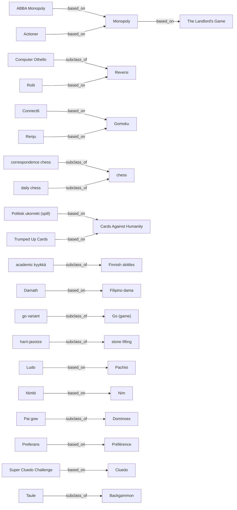

# Atlas of Game Worlds

Generated 2026-09-01T18:14:39+00:00. Source: Wikidata (CC0) + Wikipedia (CC BY-SA).

Every declared value below is `heuristic` unless a world's dossier says
otherwise: machine classification from source text, not a rules audit.
Claims about named commercial games stay HYPOTHESIZED until reviewed.

## Totals

| metric     | n    |
| ---------- | ---- |
| worlds     | 1188 |
| relations  | 189  |
| conditions | 914  |
| artifacts  | 2648 |
| ticks      | 15   |
| deepened   | 662  |
| specified  | 52   |

## Catalog ladder

| state      | n   |
| ---------- | --- |
| DEEPENED   | 662 |
| CATALOGUED | 474 |
| SPECIFIED  | 52  |

## Source ceiling

Enrichment reads English Wikipedia. A world with no article there can
only ever carry its Wikidata description (often just '2007 board game'),
so it is a limit of the source rather than a queue to work through.

| state                        | worlds | share |
| ---------------------------- | ------ | ----- |
| enriched from full article   | 712    | 60%   |
| awaiting enrichment          | 0      | 0%    |
| no English article (ceiling) | 501    | 42%   |

## Research items

662 of 1188 worlds carry a simulated trace (56% of all worlds, 93% of those with a source article).

| artifact      | n   |
| ------------- | --- |
| STATE_DIAGRAM | 662 |
| OBJECT_MODEL  | 662 |
| DOSSIER       | 662 |
| TURN_TRACE    | 636 |
| CLOCK_TRACE   | 26  |

## Declared-grid coverage

The point of the atlas. A value with 0 worlds is a hole in the
experimental design, not a missing title.
Values reachable only by hand review are filled via `crawl.py review`.

| field             | values seen | unclassified | empty values (gaps) |
| ----------------- | ----------- | ------------ | ------------------- |
| exogenous_process | 6/6         | 846          | --                  |
| loss_shape        | 5/5         | 969          | --                  |
| horizon           | 5/5         | 963          | --                  |
| scoring_shape     | 7/7         | 910          | --                  |
| information       | 5/5         | 1021         | --                  |
| interaction       | 8/8         | 775          | --                  |
| turn_structure    | 10/10       | 935          | --                  |
| tractability      | 4/4         | 0            | --                  |

### exogenous_process

| value              | n   |
| ------------------ | --- |
| IID                | 157 |
| DEPLETING_DECK     | 81  |
| NONE               | 74  |
| CONTINUOUS_TIME    | 25  |
| OPPONENT_GENERATED | 3   |
| HIDDEN_FIXED       | 2   |

### loss_shape

| value            | n  |
| ---------------- | -- |
| ELIMINATION      | 88 |
| OPPORTUNITY_ONLY | 69 |
| PARTIAL_DECAY    | 50 |
| TOTAL_RUIN       | 11 |
| NONE             | 1  |

### horizon

| value          | n   |
| -------------- | --- |
| VARIABLE       | 122 |
| OPEN_ENDED     | 46  |
| CLOCK_LIMITED  | 27  |
| RACE_TO_TARGET | 27  |
| FIXED          | 3   |

### scoring_shape

| value                 | n   |
| --------------------- | --- |
| SET_COLLECTION_CONVEX | 115 |
| RACE_POSITION         | 48  |
| LINEAR_ACCUMULATION   | 37  |
| SURVIVAL              | 29  |
| NONLINEAR             | 23  |
| WINNER_TAKE_ALL       | 20  |
| NEGATIVE_AVOIDANCE    | 6   |

### information

| value          | n  |
| -------------- | -- |
| PERFECT        | 69 |
| SIMULTANEOUS   | 41 |
| IMPERFECT      | 39 |
| ASYMMETRIC     | 15 |
| HIDDEN_PRIVATE | 3  |

### interaction

| value            | n   |
| ---------------- | --- |
| COMPETITIVE      | 246 |
| SOLITAIRE        | 64  |
| TEAM             | 34  |
| NEGOTIATION      | 27  |
| COOPERATIVE      | 26  |
| TRAITOR          | 14  |
| PARALLEL         | 1   |
| SEMI_COOPERATIVE | 1   |

### turn_structure

| value            | n  |
| ---------------- | -- |
| STRICT_TURN      | 92 |
| TRICK_ROUND      | 42 |
| PHASE_STRUCTURED | 41 |
| SIMULTANEOUS     | 37 |
| REAL_TIME        | 20 |
| AUCTION_ROUND    | 7  |
| PRIORITY_QUEUE   | 7  |
| TICK_BASED       | 5  |
| ACTION_POINT     | 1  |
| VARIABLE_ORDER   | 1  |

### tractability

| value          | n   |
| -------------- | --- |
| SAMPLING_ONLY  | 971 |
| EXACT_WITH_CUT | 189 |
| INTRACTABLE    | 16  |
| EXACT          | 12  |

## Epoch x medium

```
| epoch          | NORTH_AMERICA | EUROPE_WEST | EAST_ASIA | EUROPE_NORTH | EUROPE_EAST | SOUTH_AMERICA | AFRICA | WEST_ASIA | EUROPE_SOUTH | OCEANIA | SOUTHEAST_ASIA | SOUTH_ASIA |
| -------------- | ------------- | ----------- | --------- | ------------ | ----------- | ------------- | ------ | --------- | ------------ | ------- | -------------- | ---------- |
| CONTEMPORARY   | 14            | 27          | 12        | 2            | 6           | 5             | .      | 1         | 1            | 2       | 1              | .          |
| DIGITAL        | 34            | 11          | 2         | 4            | 1           | .             | .      | 2         | .            | .       | .              | .          |
| MODERN         | 5             | 2           | 1         | 5            | .           | .             | .      | .         | .            | .       | .              | .          |
| INDUSTRIAL     | .             | 3           | 2         | 2            | .           | .             | .      | .         | .            | .       | .              | .          |
| ANCIENT        | 1             | .           | .         | .            | .           | .             | 1      | .         | 1            | .       | .              | .          |
| DEEP_ANTIQUITY | .             | 1           | .         | .            | .           | .             | 2      | .         | .            | .       | .              | .          |
| MEDIEVAL       | .             | .           | .         | .            | .           | .             | .      | .         | .            | .       | .              | 1          |
```

## Interaction x exogenous process

```
| interaction      | IID | DEPLETING_DECK | NONE | CONTINUOUS_TIME | OPPONENT_GENERATED | HIDDEN_FIXED |
| ---------------- | --- | -------------- | ---- | --------------- | ------------------ | ------------ |
| COMPETITIVE      | 41  | 28             | 45   | 8               | 1                  | .            |
| SOLITAIRE        | 13  | 10             | 4    | 3               | .                  | 1            |
| TEAM             | 4   | 11             | 3    | 4               | .                  | .            |
| COOPERATIVE      | 5   | 3              | 4    | 2               | .                  | .            |
| NEGOTIATION      | 6   | 2              | 3    | 1               | 1                  | .            |
| TRAITOR          | 1   | 4              | .    | 1               | .                  | .            |
| PARALLEL         | .   | 1              | .    | .               | .                  | .            |
| SEMI_COOPERATIVE | 1   | .              | .    | .               | .                  | .            |
```

## Media

| value        | n   |
| ------------ | --- |
| BOARD        | 319 |
| VIDEO        | 220 |
| CARD         | 206 |
| DICE         | 88  |
| RPG          | 55  |
| PUZZLE       | 53  |
| COLLECTIBLE  | 46  |
| TRICK_TAKING | 45  |
| SPORT        | 43  |
| PARTY        | 41  |
| ABSTRACT     | 40  |
| TILE         | 39  |
| GAMBLING     | 37  |
| MANCALA      | 35  |
| WARGAME      | 23  |
| WORD         | 22  |
| PLAYGROUND   | 10  |
| MINIATURES   | 9   |

## Decision axes

| value        | n   |
| ------------ | --- |
| SELECT       | 113 |
| SPATIAL      | 102 |
| TRADE        | 78  |
| ORDER        | 54  |
| DISCARD      | 43  |
| COMMIT_BLIND | 37  |
| BID          | 29  |
| BLUFF        | 16  |
| TIMING       | 14  |
| ALLOCATE     | 9   |
| NEGOTIATE    | 4   |
| STOP         | 2   |

## Randomness sources

| value                 | n   |
| --------------------- | --- |
| DICE                  | 139 |
| NONE                  | 60  |
| DECK_SHUFFLE          | 55  |
| REAL_TIME_PHYSICAL    | 22  |
| SPINNER               | 12  |
| DECK_DEPLETING        | 9   |
| PROCEDURAL_GENERATION | 4   |
| HIDDEN_INFO           | 3   |
| SIMULTANEOUS_CHOICE   | 1   |
| TILE_BAG              | 1   |

## Strategies

| value                  | n  |
| ---------------------- | -- |
| set_collection         | 93 |
| spatial_packing        | 84 |
| signalling             | 35 |
| route_optimisation     | 27 |
| deduction              | 23 |
| probability_estimation | 22 |
| memory_recall          | 19 |
| bluffing               | 14 |
| opponent_modelling     | 13 |
| tempo                  | 12 |
| coalition_forming      | 11 |
| sacrifice              | 9  |
| area_control           | 8  |
| blocking               | 6  |
| tableau_building       | 4  |
| opening_theory         | 3  |
| engine_building        | 2  |
| push_your_luck         | 1  |

## Algorithms

| value                              | n |
| ---------------------------------- | - |
| opening_book                       | 4 |
| minimax                            | 2 |
| heuristic_evaluation               | 2 |
| exact_cover_dancing_links          | 1 |
| counterfactual_regret_minimisation | 1 |
| alpha_beta                         | 1 |
| alpha_zero_self_play               | 1 |

## Oldest catalogued

| world                              | year  | epoch          | region      |
| ---------------------------------- | ----- | -------------- | ----------- |
| Civilization (video game)          | -4000 | DEEP_ANTIQUITY | --          |
| stone kernoi                       | -3999 | DEEP_ANTIQUITY | --          |
| Draughts                           | -3000 | DEEP_ANTIQUITY | --          |
| Senet                              | -2620 | DEEP_ANTIQUITY | --          |
| Backgammon                         | -2600 | DEEP_ANTIQUITY | --          |
| Royal Game of Ur                   | -2400 | DEEP_ANTIQUITY | --          |
| Hounds and Jackals                 | -2000 | DEEP_ANTIQUITY | AFRICA      |
| Heavy Events                       | -1828 | DEEP_ANTIQUITY | EUROPE_WEST |
| Game of Hounds and Jackals         | -1810 | DEEP_ANTIQUITY | AFRICA      |
| Nine men's morris                  | -1400 | DEEP_ANTIQUITY | --          |
| Tic-tac-toe                        | -1300 | DEEP_ANTIQUITY | --          |
| Hounds and jackals game set-N 3043 | -1000 | ANCIENT        | AFRICA      |

## Newest catalogued

| world               | year | epoch        | region        |
| ------------------- | ---- | ------------ | ------------- |
| Market Fortune      | 2026 | CONTEMPORARY | --            |
| Session Cards       | 2026 | CONTEMPORARY | --            |
| Pinfall             | 2026 | CONTEMPORARY | EUROPE_WEST   |
| Tideward            | 2026 | CONTEMPORARY | NORTH_AMERICA |
| Ouba                | 2026 | CONTEMPORARY | --            |
| QuelMot             | 2026 | CONTEMPORARY | EUROPE_WEST   |
| Fuochino            | 2026 | CONTEMPORARY | EUROPE_SOUTH  |
| Casualties: Unknown | 2026 | CONTEMPORARY | --            |

## Highest information x novelty (next to deepen)

| world                   | novelty | complexity | info   | state    |
| ----------------------- | ------- | ---------- | ------ | -------- |
| Puerto Rico             | 0.934   | 0.6439     | 0.4875 | DEEPENED |
| Diplomacy (game)        | 0.8573  | 0.5941     | 0.2625 | DEEPENED |
| Roll for the Galaxy     | 0.8761  | 0.5527     | 0.3875 | DEEPENED |
| Match Attax             | 0.8808  | 0.5065     | 0.2125 | DEEPENED |
| Magic: The Gathering    | 0.6502  | 0.68       | 0.4    | DEEPENED |
| Colorforms              | 0.9623  | 0.4557     | 0.2625 | DEEPENED |
| 99 Nights in the Forest | 0.7529  | 0.5771     | 0.3375 | DEEPENED |
| Cego                    | 0.8526  | 0.505      | 0.325  | DEEPENED |
| Computer Othello        | 0.803   | 0.535      | 0.175  | DEEPENED |
| Secret Hitler           | 0.8144  | 0.5214     | 0.475  | DEEPENED |
| RoboRally               | 0.7631  | 0.5407     | 0.2875 | DEEPENED |
| Spoons (card game)      | 0.7743  | 0.5307     | 0.5375 | DEEPENED |
| Le Havre (board game)   | 0.9472  | 0.4313     | 0.2125 | DEEPENED |
| Europa                  | 0.7944  | 0.5049     | 0.1125 | DEEPENED |
| Pallanguzhi             | 0.8562  | 0.4661     | 0.2625 | DEEPENED |

## Conditions extracted

| kind      | n   |
| --------- | --- |
| WIN       | 238 |
| PENALTY   | 211 |
| TERMINATE | 192 |
| BOUNDARY  | 149 |
| ELIMINATE | 98  |
| LOSE      | 26  |

### Thresholded rules (machine-checkable)

| world                   | kind      | threshold   | effect | trigger                                                                    |
| ----------------------- | --------- | ----------- | ------ | -------------------------------------------------------------------------- |
| Mauscheln               | BOUNDARY  | 2 tricks    | --     | He takes over the game and has to take at least 2 tricks.                  |
| Spoons (card game)      | WIN       | 13 cards    | --     | Frey, the ancestor of pig was an old, four-player game called Vive l'Amour |
| Hoc Mazarin             | TERMINATE | 1 player    | --     | The game ends as soon as one player sheds all hand cards, thus becoming th |
| Capablanca random chess | BOUNDARY  | 1 piece     | --     | All pawns in the starting positions must be protected by at least one piec |
| Go-Stop                 | BOUNDARY  | 3 players   | --     | When a player accumulates at least three (for three players) or seven (for |
| Okey                    | PENALTY   | 101 penalty | --     | If a player discards the joker they receive a 101 penalty.                 |
| Ludus latrunculorum     | BOUNDARY  | 2 players   | --     | The two players agree about the number of pieces, at least 16, but not mor |
| Schnapsen               | BOUNDARY  | 1 trick     | --     | Players must have at least one trick before melding a pair or marriage (Zw |
| Okey                    | PENALTY   | 101 penalty | --     | If a player throws away a tile that can be added to a set that is already  |
| Mariáš                  | BOUNDARY  | 1 trick     | --     | Melds are added to the score if the melder took at least one trick.        |
| Madiao                  | BOUNDARY  | 3 tricks    | --     | Winning at least three tricks: 1 stake                                     |
| Gin rummy               | WIN       | 100 points  | --     | The objective in gin rummy is to be the first to reach an agreed-upon scor |
| spoof                   | BOUNDARY  | 5 players   | --     | Some variants also have a 'no bum shouts' or 'impossible call' rule whereb |
| Baseball                | PENALTY   | 2 strikes   | --     | Any pitch which does not pass through the strike zone is called a ball, un |

## Lineage graph



## Recent ticks

| tick | utc      | harvested | new | deepened |
| ---- | -------- | --------- | --- | -------- |
| 15   | 18:12:29 | 59        | 50  | 5        |
| 14   | 18:06:56 | 150       | 105 | 43       |
| 13   | 17:42:28 | 133       | 94  | 39       |
| 12   | 17:12:28 | 86        | 71  | 6        |
| 11   | 16:45:49 | 201       | 172 | 6        |
| 10   | 16:15:25 | 111       | 99  | 8        |
| 9    | 20:44:52 | 170       | 164 | 6        |
| 8    | 20:20:14 | 45        | 44  | 3        |
| 7    | 20:17:39 | 70        | 66  | 4        |
| 6    | 20:15:39 | 81        | 77  | 6        |
| 5    | 19:42:55 | 25        | 25  | 4        |
| 4    | 19:40:46 | 101       | 95  | 6        |
