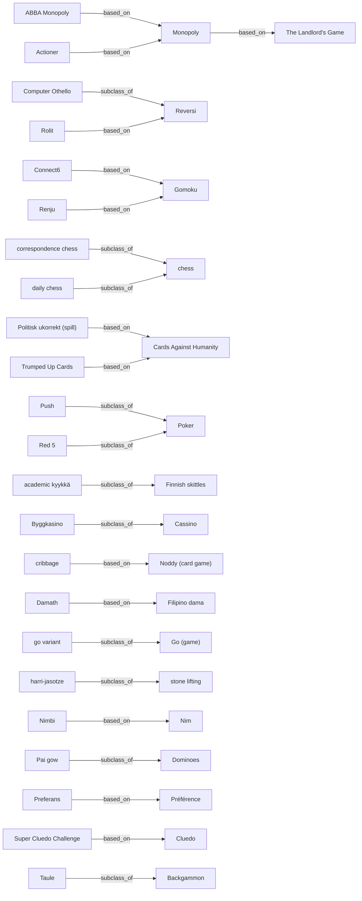

# Atlas of Game Worlds

Generated 2026-09-01T18:45:14+00:00. Source: Wikidata (CC0) + Wikipedia (CC BY-SA).

Every declared value below is `heuristic` unless a world's dossier says
otherwise: machine classification from source text, not a rules audit.
Claims about named commercial games stay HYPOTHESIZED until reviewed.

## Totals

| metric     | n    |
| ---------- | ---- |
| worlds     | 1338 |
| relations  | 206  |
| conditions | 984  |
| artifacts  | 2864 |
| ticks      | 16   |
| deepened   | 715  |
| specified  | 96   |

## Catalog ladder

| state      | n   |
| ---------- | --- |
| DEEPENED   | 715 |
| CATALOGUED | 527 |
| SPECIFIED  | 96  |

## Unreachable vocabulary (defect, not a gap)

No classifier rule can set these, so they can never leave the
'empty values' column and any coverage figure computed against the
full vocabulary understates itself. Either add a rule, drop the
value, or fill it by hand review — but do not read it as a gap in
what the atlas knows.

| field              | unreachable values |
| ------------------ | ------------------ |
| strategies         | 15                 |
| algorithms         | 10                 |
| media              | 2                  |
| solved_status      | 2                  |
| randomness_sources | 1                  |

<details><summary>full list</summary>

| field              | value                       |
| ------------------ | --------------------------- |
| algorithms         | iterative_deepening         |
| algorithms         | transposition_table         |
| algorithms         | backward_induction          |
| algorithms         | proof_number_search         |
| algorithms         | bandit_ucb                  |
| algorithms         | belief_state_tracking       |
| algorithms         | particle_filter             |
| algorithms         | sat_solving                 |
| algorithms         | linear_programming          |
| algorithms         | fictitious_play             |
| media              | LARP                        |
| media              | ESCAPE_ROOM                 |
| randomness_sources | EXTERNAL_WORLD              |
| solved_status      | UNSOLVED                    |
| solved_status      | NOT_APPLICABLE              |
| strategies         | initiative                  |
| strategies         | hate_drafting               |
| strategies         | position_evaluation         |
| strategies         | risk_of_ruin_management     |
| strategies         | expected_value_maximisation |
| strategies         | tempo_denial                |
| strategies         | resource_conversion         |
| strategies         | action_efficiency           |
| strategies         | pattern_matching            |
| strategies         | misdirection                |
| strategies         | endgame_conversion          |
| strategies         | tempo_race                  |
| strategies         | stop_loss                   |
| strategies         | kingmaking_avoidance        |
| strategies         | table_talk                  |

</details>

## Source ceiling

Enrichment reads English Wikipedia. A world with no article there can
only ever carry its Wikidata description (often just '2007 board game'),
so it is a limit of the source rather than a queue to work through.

| state                        | worlds | share |
| ---------------------------- | ------ | ----- |
| enriched from full article   | 809    | 60%   |
| awaiting enrichment          | 0      | 0%    |
| no English article (ceiling) | 554    | 41%   |

## Research items

716 of 1338 worlds carry a simulated trace (54% of all worlds, 89% of those with a source article).

| artifact      | n   |
| ------------- | --- |
| STATE_DIAGRAM | 716 |
| OBJECT_MODEL  | 716 |
| DOSSIER       | 716 |
| TURN_TRACE    | 690 |
| CLOCK_TRACE   | 26  |

## Declared-grid coverage

The point of the atlas. A value with 0 worlds is a hole in the
experimental design, not a missing title.
Values reachable only by hand review are filled via `crawl.py review`.

| field             | values seen | unclassified | empty values (gaps) |
| ----------------- | ----------- | ------------ | ------------------- |
| exogenous_process | 6/6         | 934          | --                  |
| loss_shape        | 5/5         | 1096         | --                  |
| horizon           | 5/5         | 1087         | --                  |
| scoring_shape     | 7/7         | 1025         | --                  |
| information       | 5/5         | 1144         | --                  |
| interaction       | 8/8         | 877          | --                  |
| turn_structure    | 10/10       | 1042         | --                  |
| tractability      | 4/4         | 0            | --                  |

### exogenous_process

| value              | n   |
| ------------------ | --- |
| IID                | 202 |
| DEPLETING_DECK     | 91  |
| NONE               | 81  |
| CONTINUOUS_TIME    | 24  |
| OPPONENT_GENERATED | 4   |
| HIDDEN_FIXED       | 2   |

### loss_shape

| value            | n  |
| ---------------- | -- |
| ELIMINATION      | 98 |
| OPPORTUNITY_ONLY | 74 |
| PARTIAL_DECAY    | 57 |
| TOTAL_RUIN       | 12 |
| NONE             | 1  |

### horizon

| value          | n   |
| -------------- | --- |
| VARIABLE       | 132 |
| OPEN_ENDED     | 61  |
| RACE_TO_TARGET | 28  |
| CLOCK_LIMITED  | 27  |
| FIXED          | 3   |

### scoring_shape

| value                 | n   |
| --------------------- | --- |
| SET_COLLECTION_CONVEX | 137 |
| RACE_POSITION         | 52  |
| LINEAR_ACCUMULATION   | 40  |
| SURVIVAL              | 31  |
| NONLINEAR             | 24  |
| WINNER_TAKE_ALL       | 22  |
| NEGATIVE_AVOIDANCE    | 7   |

### information

| value          | n  |
| -------------- | -- |
| PERFECT        | 75 |
| SIMULTANEOUS   | 47 |
| IMPERFECT      | 43 |
| ASYMMETRIC     | 24 |
| HIDDEN_PRIVATE | 5  |

### interaction

| value            | n   |
| ---------------- | --- |
| COMPETITIVE      | 282 |
| SOLITAIRE        | 68  |
| TEAM             | 36  |
| COOPERATIVE      | 29  |
| NEGOTIATION      | 29  |
| TRAITOR          | 15  |
| PARALLEL         | 1   |
| SEMI_COOPERATIVE | 1   |

### turn_structure

| value            | n   |
| ---------------- | --- |
| STRICT_TURN      | 101 |
| PHASE_STRUCTURED | 65  |
| TRICK_ROUND      | 46  |
| SIMULTANEOUS     | 43  |
| REAL_TIME        | 19  |
| AUCTION_ROUND    | 7   |
| PRIORITY_QUEUE   | 7   |
| TICK_BASED       | 5   |
| ACTION_POINT     | 2   |
| VARIABLE_ORDER   | 1   |

### tractability

| value          | n    |
| -------------- | ---- |
| SAMPLING_ONLY  | 1094 |
| EXACT_WITH_CUT | 214  |
| INTRACTABLE    | 18   |
| EXACT          | 12   |

## Epoch x medium

```
| epoch          | NORTH_AMERICA | EUROPE_WEST | EAST_ASIA | EUROPE_NORTH | EUROPE_EAST | SOUTH_AMERICA | AFRICA | WEST_ASIA | EUROPE_SOUTH | OCEANIA | SOUTHEAST_ASIA | SOUTH_ASIA |
| -------------- | ------------- | ----------- | --------- | ------------ | ----------- | ------------- | ------ | --------- | ------------ | ------- | -------------- | ---------- |
| CONTEMPORARY   | 19            | 27          | 12        | 2            | 6           | 5             | .      | 1         | 1            | 2       | 1              | .          |
| DIGITAL        | 37            | 11          | 2         | 4            | 1           | 1             | .      | 2         | .            | .       | .              | .          |
| MODERN         | 6             | 2           | 2         | 5            | .           | .             | .      | .         | .            | .       | .              | .          |
| INDUSTRIAL     | .             | 3           | 2         | 2            | .           | .             | .      | .         | .            | .       | .              | .          |
| ANCIENT        | 1             | .           | .         | .            | .           | .             | 1      | .         | 1            | .       | .              | .          |
| DEEP_ANTIQUITY | .             | 1           | .         | .            | .           | .             | 2      | .         | .            | .       | .              | .          |
| MEDIEVAL       | .             | .           | .         | .            | .           | .             | .      | .         | .            | .       | .              | 1          |
```

## Interaction x exogenous process

```
| interaction      | IID | DEPLETING_DECK | NONE | CONTINUOUS_TIME | OPPONENT_GENERATED | HIDDEN_FIXED |
| ---------------- | --- | -------------- | ---- | --------------- | ------------------ | ------------ |
| COMPETITIVE      | 60  | 34             | 49   | 7               | 2                  | .            |
| SOLITAIRE        | 15  | 12             | 4    | 3               | .                  | 1            |
| TEAM             | 4   | 11             | 3    | 4               | .                  | .            |
| COOPERATIVE      | 6   | 3              | 4    | 2               | .                  | .            |
| NEGOTIATION      | 7   | 3              | 3    | 1               | 1                  | .            |
| TRAITOR          | 2   | 4              | .    | 1               | .                  | .            |
| PARALLEL         | .   | 1              | .    | .               | .                  | .            |
| SEMI_COOPERATIVE | 1   | .              | .    | .               | .                  | .            |
```

## Media

| value        | n   |
| ------------ | --- |
| BOARD        | 407 |
| CARD         | 241 |
| VIDEO        | 221 |
| DICE         | 97  |
| WARGAME      | 71  |
| RPG          | 58  |
| PUZZLE       | 54  |
| TRICK_TAKING | 48  |
| SPORT        | 45  |
| COLLECTIBLE  | 45  |
| ABSTRACT     | 43  |
| TILE         | 41  |
| PARTY        | 41  |
| GAMBLING     | 39  |
| MANCALA      | 35  |
| WORD         | 22  |
| MINIATURES   | 11  |
| PLAYGROUND   | 10  |

## Decision axes

| value        | n   |
| ------------ | --- |
| SPATIAL      | 142 |
| SELECT       | 126 |
| TRADE        | 83  |
| ORDER        | 62  |
| DISCARD      | 47  |
| COMMIT_BLIND | 42  |
| BID          | 32  |
| BLUFF        | 17  |
| TIMING       | 17  |
| ALLOCATE     | 12  |
| NEGOTIATE    | 6   |
| STOP         | 2   |

## Randomness sources

| value                 | n   |
| --------------------- | --- |
| DICE                  | 186 |
| NONE                  | 67  |
| DECK_SHUFFLE          | 64  |
| PHYSICAL_EXECUTION    | 15  |
| SPINNER               | 12  |
| DECK_DEPLETING        | 9   |
| PROCEDURAL_GENERATION | 4   |
| HIDDEN_INFO           | 3   |
| REAL_TIME_PHYSICAL    | 1   |
| SIMULTANEOUS_CHOICE   | 1   |
| TILE_BAG              | 1   |

## Strategies

| value                  | n   |
| ---------------------- | --- |
| set_collection         | 114 |
| spatial_packing        | 96  |
| signalling             | 38  |
| deduction              | 27  |
| route_optimisation     | 26  |
| probability_estimation | 23  |
| memory_recall          | 20  |
| tempo                  | 15  |
| opponent_modelling     | 14  |
| bluffing               | 14  |
| coalition_forming      | 11  |
| area_control           | 9   |
| sacrifice              | 9   |
| tableau_building       | 6   |
| blocking               | 6   |
| opening_theory         | 3   |
| engine_building        | 2   |
| push_your_luck         | 1   |

## Algorithms

| value                              | n |
| ---------------------------------- | - |
| opening_book                       | 4 |
| minimax                            | 2 |
| heuristic_evaluation               | 2 |
| exact_cover_dancing_links          | 1 |
| counterfactual_regret_minimisation | 1 |
| alpha_beta                         | 1 |
| alpha_zero_self_play               | 1 |

## Oldest catalogued

| world                       | year  | epoch          | region      |
| --------------------------- | ----- | -------------- | ----------- |
| Civilization (video game)   | -4000 | DEEP_ANTIQUITY | --          |
| stone kernoi                | -3999 | DEEP_ANTIQUITY | --          |
| Draughts                    | -3000 | DEEP_ANTIQUITY | --          |
| Commands & Colors: Ancients | -3000 | DEEP_ANTIQUITY | --          |
| Senet                       | -2620 | DEEP_ANTIQUITY | --          |
| Backgammon                  | -2600 | DEEP_ANTIQUITY | --          |
| Royal Game of Ur            | -2400 | DEEP_ANTIQUITY | --          |
| Hounds and Jackals          | -2000 | DEEP_ANTIQUITY | AFRICA      |
| Heavy Events                | -1828 | DEEP_ANTIQUITY | EUROPE_WEST |
| Game of Hounds and Jackals  | -1810 | DEEP_ANTIQUITY | AFRICA      |
| Nine men's morris           | -1400 | DEEP_ANTIQUITY | --          |
| Tic-tac-toe                 | -1300 | DEEP_ANTIQUITY | --          |

## Newest catalogued

| world               | year | epoch        | region        |
| ------------------- | ---- | ------------ | ------------- |
| Market Fortune      | 2026 | CONTEMPORARY | --            |
| Session Cards       | 2026 | CONTEMPORARY | --            |
| Pinfall             | 2026 | CONTEMPORARY | EUROPE_WEST   |
| Tideward            | 2026 | CONTEMPORARY | NORTH_AMERICA |
| Ouba                | 2026 | CONTEMPORARY | --            |
| QuelMot             | 2026 | CONTEMPORARY | EUROPE_WEST   |
| Fuochino            | 2026 | CONTEMPORARY | EUROPE_SOUTH  |
| Casualties: Unknown | 2026 | CONTEMPORARY | --            |

## Highest information x novelty (next to deepen)

| world                   | novelty | complexity | info   | state    |
| ----------------------- | ------- | ---------- | ------ | -------- |
| Puerto Rico             | 0.9247  | 0.6539     | 0.5375 | DEEPENED |
| Diplomacy (game)        | 0.8573  | 0.5941     | 0.2625 | DEEPENED |
| Roll for the Galaxy     | 0.8646  | 0.5527     | 0.3875 | DEEPENED |
| Advanced Squad Leader   | 0.8026  | 0.5854     | 0.175  | DEEPENED |
| The Art of Siege        | 0.7914  | 0.5617     | 0.1125 | DEEPENED |
| Magic: The Gathering    | 0.6486  | 0.68       | 0.4    | DEEPENED |
| Colorforms              | 0.9629  | 0.4557     | 0.2625 | DEEPENED |
| 99 Nights in the Forest | 0.7532  | 0.5771     | 0.3375 | DEEPENED |
| Computer Othello        | 0.8066  | 0.535      | 0.175  | DEEPENED |
| Cego                    | 0.8522  | 0.505      | 0.325  | DEEPENED |
| Secret Hitler           | 0.8188  | 0.5214     | 0.475  | DEEPENED |
| Spoons (card game)      | 0.7733  | 0.5307     | 0.5375 | DEEPENED |
| Le Havre (board game)   | 0.9487  | 0.4313     | 0.2125 | DEEPENED |
| RoboRally               | 0.7571  | 0.5307     | 0.2375 | DEEPENED |
| Pallanguzhi             | 0.8616  | 0.4661     | 0.2625 | DEEPENED |

## Conditions extracted

| kind      | n   |
| --------- | --- |
| WIN       | 254 |
| PENALTY   | 231 |
| TERMINATE | 202 |
| BOUNDARY  | 165 |
| ELIMINATE | 104 |
| LOSE      | 28  |

### Thresholded rules (machine-checkable)

| world                | kind      | threshold   | effect | trigger                                                                    |
| -------------------- | --------- | ----------- | ------ | -------------------------------------------------------------------------- |
| Magic: The Gathering | BOUNDARY  | 4 cards     | --     | In general, this requires a minimum of sixty cards in the deck, and, excep |
| Russian Schnapsen    | BOUNDARY  | 1 trick     | --     | player has to have at least one trick taken before he / she can use marria |
| Mafia (party game)   | ELIMINATE | 1 player    | --     | At night, certain players secretly perform special actions; during day, pl |
| Farkle               | PENALTY   | 500 points  | --     | Penalties for repeated farkles, for example deduction of 500 points for th |
| Minishōgi            | LOSE      | 1 player    | --     | The only exception to this rule is when one player perpetually checks the  |
| Okey                 | PENALTY   | 202 penalty | --     | If they have not opened yet they automatically receive 202 penalty points  |
| Okey                 | PENALTY   | 101 penalty | --     | If a player throws away a tile that can be added to a set that is already  |
| Triominoes           | TERMINATE | 1 player    | --     | The round ends when no player can place a tile, whether or not all the fac |
| Circular chess       | BOUNDARY  | 4 points    | --     | Lewis lost his third-round game to tournament founder Reynolds, but the ot |
| Liubo                | BOUNDARY  | 1 set       | --     | In at least one case the game pieces are not distinguished by colour, but  |
| Pitch                | TERMINATE | 51 points   | --     | Play ends at 51 points rather than 32.                                     |
| Scrabble             | BOUNDARY  | 1 tile      | --     | Play at least one tile on the board, adding the value of all words formed  |
| Cucumber             | BOUNDARY  | 3 cards     | --     | Cards: the dealer chooses how many cards are dealt to each player, but the |
| Chratze              | BOUNDARY  | 1 trick     | --     | "with you") i.e. the player will play the current game aiming to make at l |

## Lineage graph



## Recent ticks

| tick | utc      | harvested | new | deepened |
| ---- | -------- | --------- | --- | -------- |
| 16   | 18:44:51 | 178       | 150 | 54       |
| 15   | 18:12:29 | 59        | 50  | 5        |
| 14   | 18:06:56 | 150       | 105 | 43       |
| 13   | 17:42:28 | 133       | 94  | 39       |
| 12   | 17:12:28 | 86        | 71  | 6        |
| 11   | 16:45:49 | 201       | 172 | 6        |
| 10   | 16:15:25 | 111       | 99  | 8        |
| 9    | 20:44:52 | 170       | 164 | 6        |
| 8    | 20:20:14 | 45        | 44  | 3        |
| 7    | 20:17:39 | 70        | 66  | 4        |
| 6    | 20:15:39 | 81        | 77  | 6        |
| 5    | 19:42:55 | 25        | 25  | 4        |
