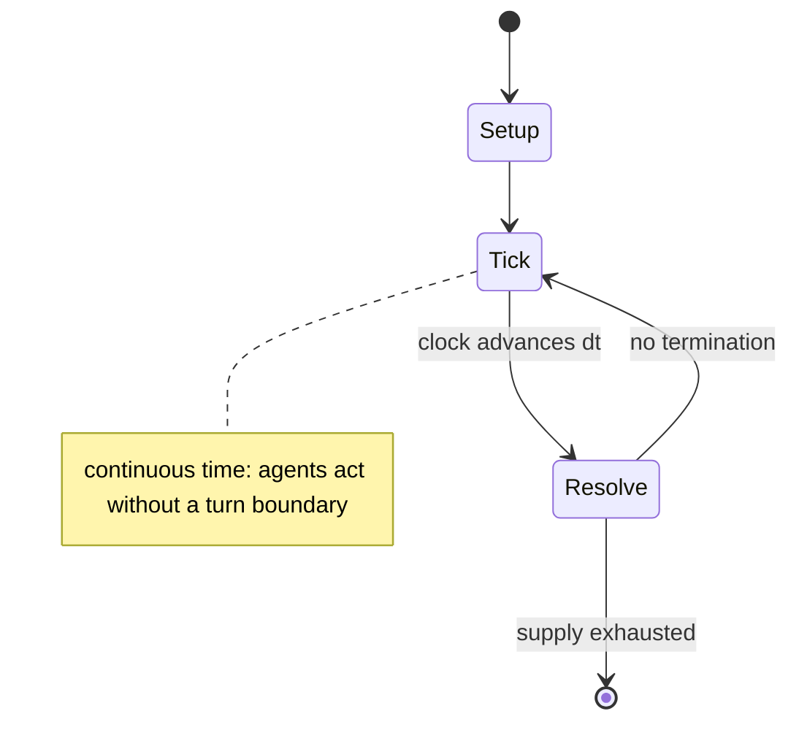

# 0 A.D.

*free and open-source real-time strategy video game*

`0_a_d` &nbsp; state: **DEEPENED** &nbsp; method: **heuristic**

## Found layer (recorded, not trusted)

| field | value |
| --- | --- |
| wikidata | Q161234 |
| wikipedia | 0 A.D. (video game) |
| genres (source) | historical video game, real-time strategy |
| instance of (source) | free software, video game |
| country of origin | United States |

## Declared layer (orders bench work)

| field | value |
| --- | --- |
| year created | -500 |
| epoch | ANCIENT |
| region | NORTH_AMERICA |
| media | VIDEO |
| players | -- |
| age band | -- |
| exogenous process | CONTINUOUS_TIME |
| loss shape | -- |
| live axes | - |
| horizon | -- |
| scoring shape | -- |
| information | -- |
| interaction | -- |
| turn structure | REAL_TIME |
| tractability | SAMPLING_ONLY |
| randomness | REAL_TIME_PHYSICAL |
| luck factor | 0.3 |
| rules complexity | 1.7 |
| strategic depth | 2.25 |
| novelty | 0.6542 |
| solved status | -- |
| strategies | route_optimisation |
| algorithms | -- |

## Object model

```
Episode
  players      : ?
  turn_structure: REAL_TIME
  horizon       : ?
  scoring       : ?

WorldState     -- simulation state advanced by the engine
Avatar         -- player-controlled agent
Clock          -- frame or tick counter
```

## State transition diagram



## Research item -- clock trace

```
# 0 A.D. -- simulated clock trace (no turn boundary)
# generated from the DECLARED vector, not from a rulebook.
# structure: exo=CONTINUOUS_TIME loss=None horizon=None scoring=None axes=-

clk=0.000s  START        agents=4  clock=free running
clk=1.321s  ACTION       a4 acts continuously; no turn boundary crossed
clk=3.731s  SCORE        a2 scores (+2)
clk=4.586s  SCORE        a2 scores (+3)
clk=7.509s  INFRACTION   a1 commits infraction (count=1)
clk=8.104s  ACTION       a3 acts continuously; no turn boundary crossed
clk=9.430s  STOPPAGE     clock halts; state frozen
clk=9.655s  ACTION       a1 acts continuously; no turn boundary crossed
clk=10.020s  STOPPAGE     clock halts; state frozen
clk=10.735s  ACTION       a2 acts continuously; no turn boundary crossed
clk=11.084s  CONTEST      a2 and a3 contend for the same resource
clk=13.053s  STOPPAGE     clock halts; state frozen
clk=13.762s  ACTION       a2 acts continuously; no turn boundary crossed
clk=15.113s  STOPPAGE     clock halts; state frozen
clk=17.565s  ACTION       a1 acts continuously; no turn boundary crossed
clk=20.250s  ACTION       a2 acts continuously; no turn boundary crossed
clk=23.249s  CONTEST      a1 and a2 contend for the same resource
clk=25.768s  ACTION       a4 acts continuously; no turn boundary crossed
clk=26.058s  STOPPAGE     clock halts; state frozen
clk=27.385s  SCORE        a2 scores (+3)
clk=29.218s  SCORE        a4 scores (+3)
clk=30.923s  CONTEST      a3 and a4 contend for the same resource
clk=33.257s  INFRACTION   a2 commits infraction (count=1)
clk=34.682s  ACTION       a4 acts continuously; no turn boundary crossed
clk=37.621s  SCORE        a4 scores (+1)
clk=38.437s  SCORE        a3 scores (+3)
clk=40.044s  ACTION       a1 acts continuously; no turn boundary crossed

note: elapsed time, not move count, is the episode's ordering variable.
```

## Source extract

0 A.D. is a real-time strategy video game under development by Wildfire Games. It is a
historical war and economy game focusing on the years between 500 BC and 1 BC, with the years
between 1 AD and 500 AD planned to be developed in the future. The game is cross-platform,
playable on Windows, macOS, Linux, FreeBSD, and OpenBSD. It is free and open-source, composed
entirely of free software and free media, using the GNU GPLv2 (or later) license for the game
engine source code, and the CC BY-SA license for the game art and music.   == Gameplay ==  0
A.D. features the traditional real-time strategy gameplay components of building a base,
developing an economy, training an army, engaging in combat, and researching new technologies.
The game includes multiple units and buildings specific to each civilization as well as both
land and naval units. During the game, the player advances from "village phase", to "town
phase", to "city phase". The phases represent the sizes of settlements in history, and every
phase unlocks new units, buildings, and technologies. Multiplayer functionality is implemented
using peer-to-peer networking, without a central server.   == Development == 0 A.D. originat

<sub>Wikipedia, CC BY-SA. Retained as evidence for the structural
classification above. Every rule inferred from it is HYPOTHESIZED
until audited against a rulebook.</sub>
