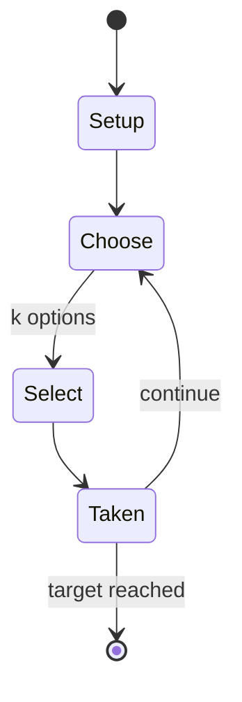

# 1001

*card game*

`1001` &nbsp; state: **DEEPENED** &nbsp; method: **heuristic**

## Found layer (recorded, not trusted)

| field | value |
| --- | --- |
| wikidata | Q113461628 |
| wikipedia | 1001 (card game) |
| genres (source) | -- |
| instance of (source) | card game |
| country of origin | Germany |

## Declared layer (orders bench work)

| field | value |
| --- | --- |
| year created | -- |
| epoch | -- |
| region | EUROPE_WEST |
| media | CARD, TRICK_TAKING |
| players | 2 |
| age band | -- |
| exogenous process | -- |
| loss shape | -- |
| live axes | SELECT |
| horizon | RACE_TO_TARGET |
| scoring shape | -- |
| information | -- |
| interaction | -- |
| turn structure | PHASE_STRUCTURED |
| tractability | SAMPLING_ONLY |
| randomness | -- |
| luck factor | 0.35 |
| rules complexity | 3.15 |
| strategic depth | 2.25 |
| novelty | 0.65 |
| solved status | -- |
| strategies | spatial_packing |
| algorithms | -- |

## Object model

```
Episode
  players      : 2
  turn_structure: PHASE_STRUCTURED
  horizon       : RACE_TO_TARGET
  scoring       : ?

Deck           -- ordered multiset, drawn without replacement
Hand           -- private multiset held by one player
DiscardPile    -- public accumulation of spent cards
Trick          -- one card per player; a winner is determined
Trump          -- suit that dominates the ordering
OptionSet      -- the choices available after an exogenous draw
```

## State transition diagram



## Research item -- turn trace

```
# 1001 -- simulated turn events
# generated from the DECLARED vector, not from a rulebook.
# structure: exo=None loss=None horizon=RACE_TO_TARGET scoring=None axes=SELECT

t=0    SETUP        players=2  pot=0  capacity=6
t=1    SELECT       p1 2 options; take #2  (pot_gain=+1.2, capacity=-1)
t=2    SELECT       p1 2 options; take #2  (pot_gain=+1.1, capacity=-1)
t=3    SELECT       p1 2 options; take #2  (pot_gain=+2.8, capacity=-0)
t=4    SELECT       p1 1 options; take #1  (pot_gain=+1.8, capacity=-1)
t=5    SELECT       p1 2 options; take #2  (pot_gain=+2.4, capacity=-2)
t=6    ENDTURN      turn passes to p2
t=7    SELECT       p2 3 options; take #3  (pot_gain=+3.1, capacity=-1)
t=8    ENDTURN      turn passes to p1
t=9    SELECT       p1 2 options; take #2  (pot_gain=+1.7, capacity=-1)
t=10   SELECT       p1 3 options; take #2  (pot_gain=+1.7, capacity=-2)
t=11   SELECT       p1 2 options; take #1  (pot_gain=+0.8, capacity=-0)
t=12   SELECT       p1 2 options; take #1  (pot_gain=+2.9, capacity=-1)
t=13   SELECT       p1 4 options; take #3  (pot_gain=+3.2, capacity=-2)
t=14   SELECT       p1 4 options; take #3  (pot_gain=+2.0, capacity=-1)
t=15   SELECT       p1 3 options; take #3  (pot_gain=+1.2, capacity=-2)
t=16   ENDTURN      turn passes to p2
t=17   SELECT       p2 3 options; take #1  (pot_gain=+2.7, capacity=-1)
t=18   ENDTURN      turn passes to p1
t=19   SELECT       p1 2 options; take #2  (pot_gain=+1.1, capacity=-0)
t=20   SELECT       p1 2 options; take #1  (pot_gain=+2.1, capacity=-2)
t=21   SELECT       p1 3 options; take #2  (pot_gain=+1.7, capacity=-2)
t=22   SELECT       p1 1 options; take #1  (pot_gain=+2.2, capacity=-1)
t=23   SELECT       p1 1 options; take #1  (pot_gain=+2.4, capacity=-2)
t=24   SELECT       p1 3 options; take #2  (pot_gain=+1.0, capacity=-2)
t=25   SELECT       p1 4 options; take #4  (pot_gain=+0.9, capacity=-1)
t=26   SELECT       p1 4 options; take #4  (pot_gain=+3.3, capacity=-1)

terminal: RACE_TO_TARGET
```

## Conditions

| kind | threshold | effect | trigger |
| --- | --- | --- | --- |
| WIN | 1001 points | -- | The winner is the first to score 1001 points. |
| BOUNDARY | 120 points | -- | There are 120 points in the game and, potentially, a further 280 in trump declarations, making a maximum of 400 points per deal. |
| WIN | -- | -- | The winner is the first to score over 1000. |

## Source extract

1001 is a point-trick card game of German origin for two players that is similar to sixty-six.
It is known in German as Tausendundeins and Tausendeins ("1001") or Kiautschou. The winner is
the first to 1001 points, hence the name. Hülsemann describes the game as "one of the most
stimulating for two players", one that must be played "fast and freely".   == History and name
== The first rules were published in 1930 by Robert Hülsemann (1868–1950) who says the game is
thought to have been devised by soldiers serving in the German overseas territory of Kiaochow
(German: Kiautschou), hence one of its alternative names. This dates its invention to the period
1898–1914. Hülsemann describes the game as "one of the most stimulating for two players" and a
game that must be played "fast and freely".   == Rules == The following rules are based on
Hülsemann (1930), supplemented by other sources where shown:   === Overview === The game is for
two players who require 24 cards from a French-suited pack; from 9 to A in each suit. The cards
have the usual ace–ten values and ranking as per the table:  There are initially no trumps.
However, during play, a player on lead who has a K-Q pair in the same

<sub>Wikipedia, CC BY-SA. Retained as evidence for the structural
classification above. Every rule inferred from it is HYPOTHESIZED
until audited against a rulebook.</sub>
