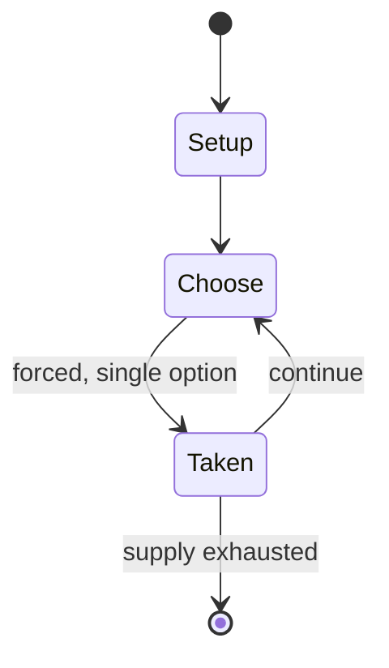

# 1861 Melbourne Cup

*annual horse race in Melbourne, Victoria, Australia*

`1861_melbourne_cup` &nbsp; state: **DEEPENED** &nbsp; method: **heuristic**

## Found layer (recorded, not trusted)

| field | value |
| --- | --- |
| wikidata | Q100998848 |
| wikipedia | 1861 Melbourne Cup |
| genres (source) | -- |
| instance of (source) | horse race, recurring sporting event edition |
| country of origin | -- |

## Declared layer (orders bench work)

| field | value |
| --- | --- |
| year created | -- |
| epoch | -- |
| region | -- |
| media | - |
| players | -- |
| age band | -- |
| exogenous process | -- |
| loss shape | -- |
| live axes | - |
| horizon | -- |
| scoring shape | RACE_POSITION |
| information | -- |
| interaction | -- |
| turn structure | -- |
| tractability | SAMPLING_ONLY |
| randomness | -- |
| luck factor | 0.35 |
| rules complexity | 1.8 |
| strategic depth | 2.25 |
| novelty | 0.4894 |
| solved status | -- |
| strategies | spatial_packing |
| algorithms | -- |

## Object model

```
Episode
  players      : ?
  turn_structure: ?
  horizon       : ?
  scoring       : RACE_POSITION

State          -- opaque; no medium or axis evidence was found
Player         -- an agent that selects among legal successors
```

## State transition diagram



## Research item -- turn trace

```
# 1861 Melbourne Cup -- simulated turn events
# generated from the DECLARED vector, not from a rulebook.
# structure: exo=None loss=None horizon=None scoring=RACE_POSITION axes=-

t=0    SETUP        players=2  pot=0  capacity=5
t=1    FORCED       p1 single legal option taken (pot_gain=+1.9)
t=2    ENDTURN      turn passes to p2
t=3    FORCED       p2 single legal option taken (pot_gain=+1.9)
t=4    FORCED       p2 single legal option taken (pot_gain=+1.7)
t=5    FORCED       p2 single legal option taken (pot_gain=+1.5)
t=6    FORCED       p2 single legal option taken (pot_gain=+0.8)
t=7    ENDTURN      turn passes to p1
t=8    FORCED       p1 single legal option taken (pot_gain=+1.2)
t=9    FORCED       p1 single legal option taken (pot_gain=+0.7)
t=10   FORCED       p1 single legal option taken (pot_gain=+1.1)
t=11   ENDTURN      turn passes to p2
t=12   FORCED       p2 single legal option taken (pot_gain=+1.4)
t=13   FORCED       p2 single legal option taken (pot_gain=+1.2)
t=14   FORCED       p2 single legal option taken (pot_gain=+1.2)
t=15   FORCED       p2 single legal option taken (pot_gain=+1.3)
t=16   ENDTURN      turn passes to p1
t=17   FORCED       p1 single legal option taken (pot_gain=+1.6)
t=18   FORCED       p1 single legal option taken (pot_gain=+0.7)
t=19   FORCED       p1 single legal option taken (pot_gain=+1.0)
t=20   FORCED       p1 single legal option taken (pot_gain=+0.8)
t=21   FORCED       p1 single legal option taken (pot_gain=+1.9)
t=22   ENDTURN      turn passes to p2
t=23   FORCED       p2 single legal option taken (pot_gain=+1.5)
t=24   FORCED       p2 single legal option taken (pot_gain=+0.8)
t=25   FORCED       p2 single legal option taken (pot_gain=+1.1)
t=26   FORCED       p2 single legal option taken (pot_gain=+1.2)

terminal: VARIABLE
```

## Source extract

The 1861 Melbourne Cup was a two-mile handicap horse race which took place on Thursday, 7
November 1861. The race was organised by the Victoria Turf Club and held at the Flemington
Racecourse (then known as the Melbourne Racecourse). This year was the first running of the
Melbourne Cup. Billed as "one of the finest races ever seen upon the course," 57 horses were
nominated and there were 20 acceptances. Three were scratched on race day, leaving 17 starters.
After one false start, three horses fell due to congestion on the first turn, resulting in
deaths to two runners Despatch and Medora. One jockey was knocked unconscious and Joe Morrison
sustained a compound fracture to his arm after coming off Despatch. The fall led to changes to
the track at Flemington, including lengthening the straight. Mormon led the remaining runners
down the river side of the course, with Prince and Flatcatcher falling back from the leader due
to the pace, while Antonelli and the two de Mestre runners moved forward. Archer took the lead
ahead of Antonelli at the far turn and by the time Archer led the field into the straight its
lead was so great that the race was only on for second place. Mormon eventuall

<sub>Wikipedia, CC BY-SA. Retained as evidence for the structural
classification above. Every rule inferred from it is HYPOTHESIZED
until audited against a rulebook.</sub>
