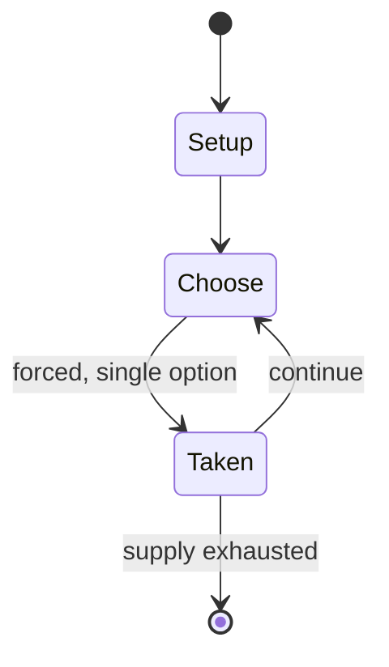

# 1862 Melbourne Cup

*annual horse race in Melbourne,Victoria, Australia*

`1862_melbourne_cup` &nbsp; state: **DEEPENED** &nbsp; method: **heuristic**

## Found layer (recorded, not trusted)

| field | value |
| --- | --- |
| wikidata | Q100998851 |
| wikipedia | 1862 Melbourne Cup |
| genres (source) | -- |
| instance of (source) | horse race, recurring sporting event edition |
| country of origin | -- |

## Declared layer (orders bench work)

| field | value |
| --- | --- |
| year created | -- |
| epoch | -- |
| region | -- |
| media | - |
| players | -- |
| age band | -- |
| exogenous process | -- |
| loss shape | -- |
| live axes | - |
| horizon | -- |
| scoring shape | RACE_POSITION |
| information | -- |
| interaction | -- |
| turn structure | -- |
| tractability | SAMPLING_ONLY |
| randomness | -- |
| luck factor | 0.35 |
| rules complexity | 1.7 |
| strategic depth | 2.0 |
| novelty | 0.4884 |
| solved status | -- |
| strategies | -- |
| algorithms | -- |

## Object model

```
Episode
  players      : ?
  turn_structure: ?
  horizon       : ?
  scoring       : RACE_POSITION

State          -- opaque; no medium or axis evidence was found
Player         -- an agent that selects among legal successors
```

## State transition diagram



## Research item -- turn trace

```
# 1862 Melbourne Cup -- simulated turn events
# generated from the DECLARED vector, not from a rulebook.
# structure: exo=None loss=None horizon=None scoring=RACE_POSITION axes=-

t=0    SETUP        players=2  pot=0  capacity=5
t=1    FORCED       p1 single legal option taken (pot_gain=+1.7)
t=2    ENDTURN      turn passes to p2
t=3    FORCED       p2 single legal option taken (pot_gain=+1.0)
t=4    FORCED       p2 single legal option taken (pot_gain=+2.0)
t=5    FORCED       p2 single legal option taken (pot_gain=+0.8)
t=6    ENDTURN      turn passes to p1
t=7    FORCED       p1 single legal option taken (pot_gain=+0.6)
t=8    FORCED       p1 single legal option taken (pot_gain=+0.8)
t=9    FORCED       p1 single legal option taken (pot_gain=+1.1)
t=10   FORCED       p1 single legal option taken (pot_gain=+0.7)
t=11   FORCED       p1 single legal option taken (pot_gain=+1.6)
t=12   FORCED       p1 single legal option taken (pot_gain=+0.8)
t=13   FORCED       p1 single legal option taken (pot_gain=+1.3)
t=14   FORCED       p1 single legal option taken (pot_gain=+1.4)
t=15   FORCED       p1 single legal option taken (pot_gain=+1.7)
t=16   FORCED       p1 single legal option taken (pot_gain=+0.8)
t=17   FORCED       p1 single legal option taken (pot_gain=+1.8)
t=18   FORCED       p1 single legal option taken (pot_gain=+1.8)
t=19   FORCED       p1 single legal option taken (pot_gain=+1.2)
t=20   FORCED       p1 single legal option taken (pot_gain=+1.1)
t=21   FORCED       p1 single legal option taken (pot_gain=+1.7)
t=22   FORCED       p1 single legal option taken (pot_gain=+1.1)
t=23   FORCED       p1 single legal option taken (pot_gain=+0.9)
t=24   FORCED       p1 single legal option taken (pot_gain=+1.8)
t=25   ENDTURN      turn passes to p2
t=26   FORCED       p2 single legal option taken (pot_gain=+1.8)

terminal: VARIABLE
```

## Source extract

The 1862 Melbourne Cup was a two-mile  handicap horse race which took place on Thursday, 13
November 1862. This year was the second running of the Melbourne Cup and Archer's back-to-back
wins would not be repeated again for over 100 years, until Rain Lover's wins. On a sunny spring
afternoon at Flemington, 20 horses started the race after Shadow had broken down the previous
day. 1861 winner Archer started as favourite. Following the fall in the race the previous year,
the starting point on the course had been shifted further along the main straight in front of
the grandstand. After the field spread down the riverside straight, Archer took the lead of the
race before the final turn, winning by a reported six to eight lengths from Morman, with Camden
in third place. It was reported that the unplaced finisher Dun Dolo pulled up lame following the
race.   == Full results == This is the list of placegetters for the 1862 Melbourne Cup.  Note:
Runners were listed in approximate finishing order where not known.   == Prizemoney == First
prize £810, second prize £20.    == See also ==  Melbourne Cup List of Melbourne Cup winners
Victoria Racing Club   == References ==

<sub>Wikipedia, CC BY-SA. Retained as evidence for the structural
classification above. Every rule inferred from it is HYPOTHESIZED
until audited against a rulebook.</sub>
