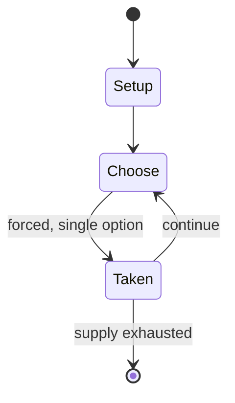

# 1942

*board game*

`1942` &nbsp; state: **DEEPENED** &nbsp; method: **heuristic**

## Found layer (recorded, not trusted)

| field | value |
| --- | --- |
| wikidata | Q110800088 |
| wikipedia | 1942 (board game) |
| genres (source) | -- |
| instance of (source) | board wargame |
| country of origin | -- |

## Declared layer (orders bench work)

| field | value |
| --- | --- |
| year created | 1978 |
| epoch | DIGITAL |
| region | -- |
| media | BOARD, WARGAME |
| players | -- |
| age band | -- |
| exogenous process | -- |
| loss shape | -- |
| live axes | ORDER, SPATIAL |
| horizon | -- |
| scoring shape | SURVIVAL |
| information | -- |
| interaction | -- |
| turn structure | PHASE_STRUCTURED |
| tractability | SAMPLING_ONLY |
| randomness | -- |
| luck factor | -- |
| rules complexity | 4.21 |
| strategic depth | 2.0 |
| novelty | 0.6437 |
| solved status | -- |
| strategies | -- |
| algorithms | -- |

## Object model

```
Episode
  players      : ?
  turn_structure: PHASE_STRUCTURED
  horizon       : ?
  scoring       : SURVIVAL

Board          -- spatial substrate; cells carry position and occupancy
Piece          -- movable token owned by a player
Sequence       -- the permutation under the player's control
Placement      -- position subject to geometric legality
```

## State transition diagram



## Research item -- turn trace

```
# 1942 -- simulated turn events
# generated from the DECLARED vector, not from a rulebook.
# structure: exo=None loss=None horizon=None scoring=SURVIVAL axes=ORDER,SPATIAL

t=0    SETUP        players=2  pot=0  capacity=7
t=1    FORCED       p1 single legal option taken (pot_gain=+1.0)
t=2    SPATIAL      p1 places at (5,3); adjacency legal
t=3    ENDTURN      turn passes to p2
t=4    FORCED       p2 single legal option taken (pot_gain=+0.8)
t=5    FORCED       p2 single legal option taken (pot_gain=+1.2)
t=6    ENDTURN      turn passes to p1
t=7    FORCED       p1 single legal option taken (pot_gain=+1.7)
t=8    SPATIAL      p1 places at (6,5); adjacency legal
t=9    FORCED       p1 single legal option taken (pot_gain=+0.8)
t=10   ENDTURN      turn passes to p2
t=11   FORCED       p2 single legal option taken (pot_gain=+2.0)
t=12   ENDTURN      turn passes to p1
t=13   FORCED       p1 single legal option taken (pot_gain=+1.8)
t=14   SPATIAL      p1 places at (2,0); adjacency legal
t=15   FORCED       p1 single legal option taken (pot_gain=+1.1)
t=16   SPATIAL      p1 places at (0,6); adjacency legal
t=17   ENDTURN      turn passes to p2
t=18   FORCED       p2 single legal option taken (pot_gain=+1.1)
t=19   SPATIAL      p2 places at (0,1); adjacency legal
t=20   FORCED       p2 single legal option taken (pot_gain=+0.7)
t=21   FORCED       p2 single legal option taken (pot_gain=+1.5)
t=22   SPATIAL      p2 places at (5,5); adjacency legal
t=23   FORCED       p2 single legal option taken (pot_gain=+0.9)
t=24   ENDTURN      turn passes to p1
t=25   FORCED       p1 single legal option taken (pot_gain=+1.3)
t=26   FORCED       p1 single legal option taken (pot_gain=+1.3)

terminal: VARIABLE
```

## Conditions

| kind | threshold | effect | trigger |
| --- | --- | --- | --- |
| WIN | -- | -- | Faced with a powerful Japanese offensive, the Allied player must play a defensive game and try to prevent the Japanese player from gaining the geographical objectives it needs to win the game. |

## Source extract

1942 is a board wargame published by Game Designers Workshop (GDW) in 1978 that is a strategic
simulation of Japan's invasion of the Philippines, Indonesia, and Indochina in 1942.   ==
Description == 1942 is a two-player "Series 120" game, part of a series of GDW microgames that
had only 120 counters and could be played in 120 minutes. The game covers December 1941–May
1942, when Japan rapidly struck out on multiple fronts against Dutch, British, Australian and
American holdings in the Pacific theatre. Faced with a powerful Japanese offensive, the Allied
player must play a defensive game and try to prevent the Japanese player from gaining the
geographical objectives it needs to win the game.   === Components === The game box (or ziplock
bag) contains:  17 in × 22 in (43 cm × 56 cm) paper hex grid map scaled at 85 nautical miles
(158 km) per hex 16-page rulebook 120 counters errata sheet   === Gameplay === The turn sequence
uses the traditional "IGOUGO" (I go, You go) structure except for a special start to the game,
when the Japanese player is given a "surprise" turn representing actions taken in December 1941.
Thereafter, the game lasts 10 turns, representing the first five months

<sub>Wikipedia, CC BY-SA. Retained as evidence for the structural
classification above. Every rule inferred from it is HYPOTHESIZED
until audited against a rulebook.</sub>
