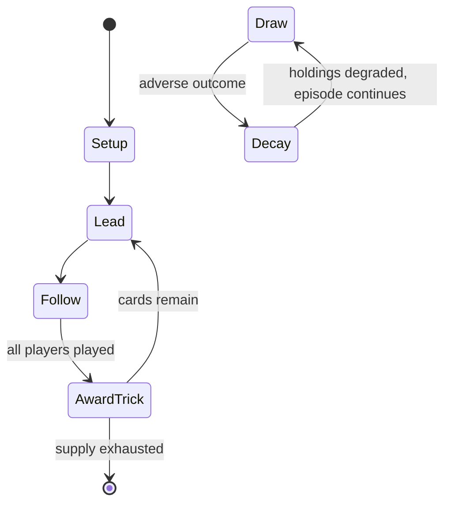

# 304

*card game*

`304` &nbsp; state: **DEEPENED** &nbsp; method: **heuristic**

## Found layer (recorded, not trusted)

| field | value |
| --- | --- |
| wikidata | Q3534741 |
| wikipedia | 304 (card game) |
| genres (source) | -- |
| instance of (source) | trick-taking game |
| country of origin | -- |

## Declared layer (orders bench work)

| field | value |
| --- | --- |
| year created | -- |
| epoch | -- |
| region | -- |
| media | CARD, TRICK_TAKING |
| players | 3 |
| age band | -- |
| exogenous process | DEPLETING_DECK |
| loss shape | PARTIAL_DECAY |
| live axes | BID, TRADE |
| horizon | -- |
| scoring shape | SET_COLLECTION_CONVEX |
| information | -- |
| interaction | TEAM |
| turn structure | TRICK_ROUND |
| tractability | EXACT_WITH_CUT |
| randomness | DECK_DEPLETING, DECK_SHUFFLE |
| luck factor | 0.48 |
| rules complexity | 3.0 |
| strategic depth | 2.25 |
| novelty | 0.8745 |
| solved status | -- |
| strategies | set_collection |
| algorithms | -- |

## Object model

```
Episode
  players      : 3
  turn_structure: TRICK_ROUND
  horizon       : ?
  scoring       : SET_COLLECTION_CONVEX

Deck           -- ordered multiset, drawn without replacement
Hand           -- private multiset held by one player
DiscardPile    -- public accumulation of spent cards
Trick          -- one card per player; a winner is determined
Trump          -- suit that dominates the ordering
Auction        -- priced competition resolving to one winner
Offer          -- proposed exchange between two agents
```

## State transition diagram



## Research item -- turn trace

```
# 304 -- simulated turn events
# generated from the DECLARED vector, not from a rulebook.
# structure: exo=DEPLETING_DECK loss=PARTIAL_DECAY horizon=None scoring=SET_COLLECTION_CONVEX axes=BID,TRADE

t=0    SETUP        players=3  pot=0  capacity=7
t=1    DRAW         p1 draw from deck -> outcome #3  (p=0.127)
t=2    FORCED       p1 single legal option taken (pot_gain=+1.8)
t=3    DRAW         p1 draw from deck -> outcome #3  (p=0.001)
t=4    FORCED       p1 single legal option taken (pot_gain=+1.2)
t=5    BID          p1 sealed bid of 6 against 2 rivals
t=6    TRADE        p1 offers 2:1 exchange to p2
t=7    DRAW         p1 draw from deck -> outcome #3  (p=0.021)
t=8    FORCED       p1 single legal option taken (pot_gain=+1.5)
t=9    BID          p1 sealed bid of 1 against 2 rivals
t=10   ENDTURN      turn passes to p2
t=11   DRAW         p2 draw from deck -> outcome #1  (p=0.166)
t=12   FORCED       p2 single legal option taken (pot_gain=+1.3)
t=13   ENDTURN      turn passes to p3
t=14   DRAW         p3 draw from deck -> outcome #4  (p=0.290)
t=15   FORCED       p3 single legal option taken (pot_gain=+1.0)
t=16   BID          p3 sealed bid of 9 against 2 rivals
t=17   DRAW         p3 draw from deck -> outcome #6  (p=0.247)
t=18   FORCED       p3 single legal option taken (pot_gain=+0.6)
t=19   BID          p3 sealed bid of 8 against 2 rivals
t=20   DRAW         p3 draw from deck -> outcome #3  (p=0.140)
t=21   FORCED       p3 single legal option taken (pot_gain=+0.7)
t=22   TRADE        p3 offers 2:1 exchange to p1
t=23   DRAW         p3 draw from deck -> outcome #2  (p=0.065)
t=24   FORCED       p3 single legal option taken (pot_gain=+1.3)
t=25   ENDTURN      turn passes to p1
t=26   DRAW         p1 draw from deck -> outcome #2  (p=0.237)
t=27   FORCED       p1 single legal option taken (pot_gain=+1.9)
t=28   TRADE        p1 offers 2:1 exchange to p2

terminal: VARIABLE
```

## Conditions

| kind | threshold | effect | trigger |
| --- | --- | --- | --- |
| BOUNDARY | 6 players | -- | In case of six players, "3" is inducted as the card with the maximum points - 50, while J, 9, A, etc. retain the same values. |
| BOUNDARY | 20 points | -- | Sometimes a minimum bidding value is established (generally 160) and every twenty points the number of cards given to the winning team is increased by one until the maximum give out reach four cards. |
| BOUNDARY | -- | -- | A player may bid anything from 160 through 304, the maximum points that can be made in a game. |

## Source extract

304, pronounced three-nought-four, is a trick-taking card game popular in Sri Lanka, coastal
Karnataka, Tamil Nadu and Maharashtra, in the Indian subcontinent. The game is played by two
teams of two using a subset (7 through Ace of all suits) of the 52 standard playing cards so
that there are 32 cards in play. The game twenty-eight is thought to be descended from it.   ==
Rules == The cards are dealt by the dealer to all four players in a counter-clockwise manner
(unlike most Anglo-American games in which deal and play are clockwise), each getting four cards
in the first round. Eldest hand (right of the dealer) picks out a trump card from their hand and
places it face down on the table. They then call a target score for their team, which they
expect to be able to win judging by the cards in their own hand. A member of the opposing team
has the opportunity to then pick their own trump, by calling a target score higher than the
first player's. The rest of the cards are distributed and the game is started. The game is
played as a trick-taker, where the players follow the suit led. If they do not have the led
suit, then they can try to guess the trump by passing a face down card to the

<sub>Wikipedia, CC BY-SA. Retained as evidence for the structural
classification above. Every rule inferred from it is HYPOTHESIZED
until audited against a rulebook.</sub>
