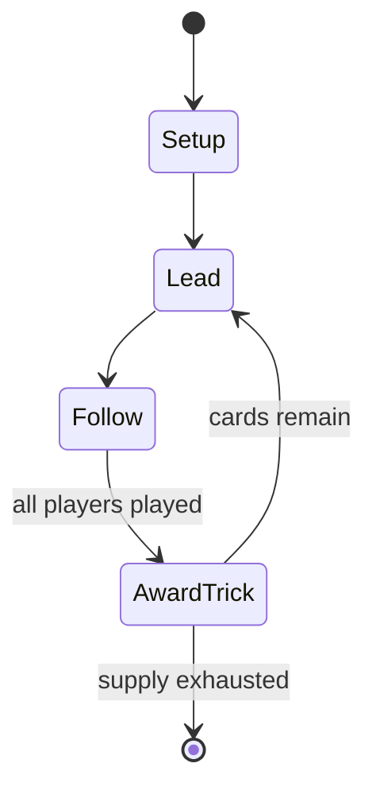

# 3-2-5

*popular card game*

`3_2_5` &nbsp; state: **DEEPENED** &nbsp; method: **heuristic**

## Found layer (recorded, not trusted)

| field | value |
| --- | --- |
| wikidata | Q4634103 |
| wikipedia | 3-2-5 |
| genres (source) | -- |
| instance of (source) | card game |
| country of origin | Pakistan |

## Declared layer (orders bench work)

| field | value |
| --- | --- |
| year created | -- |
| epoch | -- |
| region | SOUTH_ASIA |
| media | CARD, TRICK_TAKING |
| players | -- |
| age band | -- |
| exogenous process | -- |
| loss shape | -- |
| live axes | - |
| horizon | -- |
| scoring shape | -- |
| information | -- |
| interaction | -- |
| turn structure | TRICK_ROUND |
| tractability | SAMPLING_ONLY |
| randomness | -- |
| luck factor | 0.35 |
| rules complexity | 1.68 |
| strategic depth | 2.25 |
| novelty | 0.4763 |
| solved status | -- |
| strategies | spatial_packing |
| algorithms | -- |

## Object model

```
Episode
  players      : ?
  turn_structure: TRICK_ROUND
  horizon       : ?
  scoring       : ?

Deck           -- ordered multiset, drawn without replacement
Hand           -- private multiset held by one player
DiscardPile    -- public accumulation of spent cards
Trick          -- one card per player; a winner is determined
Trump          -- suit that dominates the ordering
```

## State transition diagram



## Research item -- turn trace

```
# 3-2-5 -- simulated turn events
# generated from the DECLARED vector, not from a rulebook.
# structure: exo=None loss=None horizon=None scoring=None axes=-

t=0    SETUP        players=2  pot=0  capacity=5
t=1    FORCED       p1 single legal option taken (pot_gain=+1.2)
t=2    FORCED       p1 single legal option taken (pot_gain=+1.7)
t=3    FORCED       p1 single legal option taken (pot_gain=+1.1)
t=4    FORCED       p1 single legal option taken (pot_gain=+1.8)
t=5    FORCED       p1 single legal option taken (pot_gain=+1.4)
t=6    ENDTURN      turn passes to p2
t=7    FORCED       p2 single legal option taken (pot_gain=+0.6)
t=8    FORCED       p2 single legal option taken (pot_gain=+1.1)
t=9    FORCED       p2 single legal option taken (pot_gain=+1.1)
t=10   FORCED       p2 single legal option taken (pot_gain=+1.0)
t=11   ENDTURN      turn passes to p1
t=12   FORCED       p1 single legal option taken (pot_gain=+0.8)
t=13   FORCED       p1 single legal option taken (pot_gain=+0.5)
t=14   FORCED       p1 single legal option taken (pot_gain=+1.0)
t=15   FORCED       p1 single legal option taken (pot_gain=+1.1)
t=16   ENDTURN      turn passes to p2
t=17   FORCED       p2 single legal option taken (pot_gain=+0.6)
t=18   ENDTURN      turn passes to p1
t=19   FORCED       p1 single legal option taken (pot_gain=+0.7)
t=20   FORCED       p1 single legal option taken (pot_gain=+1.4)
t=21   FORCED       p1 single legal option taken (pot_gain=+1.7)
t=22   FORCED       p1 single legal option taken (pot_gain=+1.1)
t=23   FORCED       p1 single legal option taken (pot_gain=+1.5)
t=24   ENDTURN      turn passes to p2
t=25   FORCED       p2 single legal option taken (pot_gain=+0.6)
t=26   FORCED       p2 single legal option taken (pot_gain=+1.1)
t=27   ENDTURN      turn passes to p1

terminal: VARIABLE
```

## Source extract

The trick-taking genre of card games is one of the most common varieties, found in every part of
the world. The following is a list of trick-taking games by type of pack:   == 52-card French-
suited pack ==   == 32- or 36-card French-suited packs ==   == German-suited packs == The
following games are played with German-suited packs of 32, 33 or 36 cards. Some are played with
shortened packs e.g. Schnapsen. German-suited packs are common, not just in Germany, but in
Austria and Eastern Europe.   == Italian-suited cards ==   == Spanish-suited cards == The
following games are played with 40- or 48-card Spanish-suited packs.   == Tarock pack == Tarot
card games are played with a Tarock pack, usually of 54 or 78 cards comprising four French suits
and a special trump suit of Tarots or Tarocks. The following games are played with such packs:
== Dedicated deck == The following games use a dedicated deck of cards to play.   == External
links == Classification of trick taking games at Pagat.com

<sub>Wikipedia, CC BY-SA. Retained as evidence for the structural
classification above. Every rule inferred from it is HYPOTHESIZED
until audited against a rulebook.</sub>
