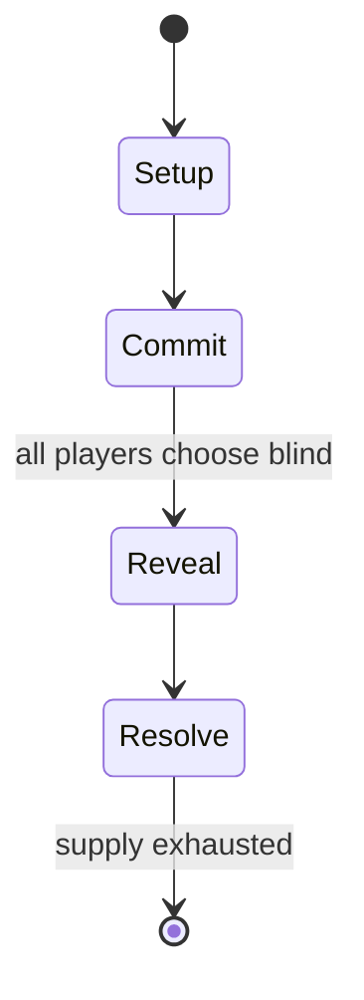

# 3D Construction Kit II

*1992 video game*

`3d_construction_kit_ii` &nbsp; state: **DEEPENED** &nbsp; method: **heuristic**

## Found layer (recorded, not trusted)

| field | value |
| --- | --- |
| wikidata | Q4636278 |
| wikipedia | 3D Construction Kit II |
| genres (source) | -- |
| instance of (source) | video game |
| country of origin | United Kingdom |

## Declared layer (orders bench work)

| field | value |
| --- | --- |
| year created | 1992 |
| epoch | DIGITAL |
| region | EUROPE_WEST |
| media | VIDEO |
| players | -- |
| age band | -- |
| exogenous process | -- |
| loss shape | -- |
| live axes | COMMIT_BLIND |
| horizon | -- |
| scoring shape | -- |
| information | SIMULTANEOUS |
| interaction | -- |
| turn structure | SIMULTANEOUS |
| tractability | SAMPLING_ONLY |
| randomness | SIMULTANEOUS_CHOICE |
| luck factor | 0.3 |
| rules complexity | 2.02 |
| strategic depth | 2.25 |
| novelty | 0.6276 |
| solved status | -- |
| strategies | spatial_packing |
| algorithms | -- |

## Object model

```
Episode
  players      : ?
  turn_structure: SIMULTANEOUS
  horizon       : ?
  scoring       : ?

WorldState     -- simulation state advanced by the engine
Avatar         -- player-controlled agent
Clock          -- frame or tick counter
SealedChoice   -- irrevocable choice made without observation
```

## State transition diagram



## Research item -- turn trace

```
# 3D Construction Kit II -- simulated turn events
# generated from the DECLARED vector, not from a rulebook.
# structure: exo=None loss=None horizon=None scoring=None axes=COMMIT_BLIND

t=0    SETUP        players=2  pot=0  capacity=5
t=1    FORCED       p1 single legal option taken (pot_gain=+1.2)
t=2    FORCED       p1 single legal option taken (pot_gain=+2.0)
t=3    ENDTURN      turn passes to p2
t=4    FORCED       p2 single legal option taken (pot_gain=+1.9)
t=5    ENDTURN      turn passes to p1
t=6    FORCED       p1 single legal option taken (pot_gain=+1.3)
t=7    FORCED       p1 single legal option taken (pot_gain=+1.4)
t=8    FORCED       p1 single legal option taken (pot_gain=+0.5)
t=9    FORCED       p1 single legal option taken (pot_gain=+1.8)
t=10   FORCED       p1 single legal option taken (pot_gain=+1.6)
t=11   FORCED       p1 single legal option taken (pot_gain=+1.8)
t=12   FORCED       p1 single legal option taken (pot_gain=+1.4)
t=13   FORCED       p1 single legal option taken (pot_gain=+0.7)
t=14   FORCED       p1 single legal option taken (pot_gain=+1.8)
t=15   FORCED       p1 single legal option taken (pot_gain=+2.0)
t=16   FORCED       p1 single legal option taken (pot_gain=+0.9)
t=17   FORCED       p1 single legal option taken (pot_gain=+0.6)
t=18   FORCED       p1 single legal option taken (pot_gain=+0.8)
t=19   ENDTURN      turn passes to p2
t=20   FORCED       p2 single legal option taken (pot_gain=+1.3)
t=21   FORCED       p2 single legal option taken (pot_gain=+0.6)
t=22   FORCED       p2 single legal option taken (pot_gain=+0.8)
t=23   FORCED       p2 single legal option taken (pot_gain=+1.1)
t=24   ENDTURN      turn passes to p1
t=25   FORCED       p1 single legal option taken (pot_gain=+1.3)
t=26   ENDTURN      turn passes to p2

terminal: VARIABLE
```

## Source extract

3D Construction Kit II (released in North America as Virtual Reality Studio 2.0), is a utility
for creating 3D virtual worlds in Freescape. Developed by Incentive Software and published by
Domark, it was released on November 10, 1992 as a sequel to 3D Construction Kit. Unlike its
predecessor, 3D Construction Kit II was released simultaneously on three platforms: Amiga, Atari
ST and MS-DOS.   == Features == 3D Construction Kit II takes advantage of the refined Freescape
III engine for its 3D graphics. Compared to the original, 3D Construction Kit II has double the
number of controls and commands for added complexity and flexibility. Transparent objects can be
created and ones that fade over time. The game supports rounded objects such as "flexicubes" and
spheres, which were not possible in the original 3D Construction Kit. This feature is emphasised
in the modified cover art. The sound effects editor is improved, allowing players to add sounds
and music to their virtual creations. The program comes with a library of predesigned 3D
"clipart" aimed at novice users who may not know how to create more complex structures
themselves. As in the previous version game files may be compiled i

<sub>Wikipedia, CC BY-SA. Retained as evidence for the structural
classification above. Every rule inferred from it is HYPOTHESIZED
until audited against a rulebook.</sub>
