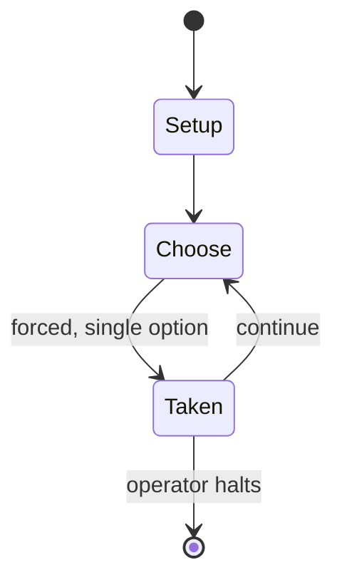

# 8th Army

*WWII board wargame*

`8th_army` &nbsp; state: **DEEPENED** &nbsp; method: **heuristic**

## Found layer (recorded, not trusted)

| field | value |
| --- | --- |
| wikidata | Q110263364 |
| wikipedia | 8th Army (board game) |
| genres (source) | -- |
| instance of (source) | board game, wargame |
| country of origin | -- |

## Declared layer (orders bench work)

| field | value |
| --- | --- |
| year created | -- |
| epoch | -- |
| region | -- |
| media | BOARD, WARGAME |
| players | 2 |
| age band | -- |
| exogenous process | -- |
| loss shape | -- |
| live axes | SPATIAL |
| horizon | OPEN_ENDED |
| scoring shape | -- |
| information | ASYMMETRIC |
| interaction | -- |
| turn structure | PHASE_STRUCTURED |
| tractability | SAMPLING_ONLY |
| randomness | -- |
| luck factor | -- |
| rules complexity | 4.29 |
| strategic depth | 2.0 |
| novelty | 0.7103 |
| solved status | -- |
| strategies | -- |
| algorithms | -- |

## Object model

```
Episode
  players      : 2
  turn_structure: PHASE_STRUCTURED
  horizon       : OPEN_ENDED
  scoring       : ?

Board          -- spatial substrate; cells carry position and occupancy
Piece          -- movable token owned by a player
Placement      -- position subject to geometric legality
```

## State transition diagram



## Research item -- turn trace

```
# 8th Army -- simulated turn events
# generated from the DECLARED vector, not from a rulebook.
# structure: exo=None loss=None horizon=OPEN_ENDED scoring=None axes=SPATIAL

t=0    SETUP        players=2  pot=0  capacity=4
t=1    FORCED       p1 single legal option taken (pot_gain=+0.7)
t=2    ENDTURN      turn passes to p2
t=3    FORCED       p2 single legal option taken (pot_gain=+1.4)
t=4    FORCED       p2 single legal option taken (pot_gain=+1.3)
t=5    SPATIAL      p2 places at (6,5); adjacency legal
t=6    ENDTURN      turn passes to p1
t=7    FORCED       p1 single legal option taken (pot_gain=+1.9)
t=8    FORCED       p1 single legal option taken (pot_gain=+0.6)
t=9    FORCED       p1 single legal option taken (pot_gain=+1.6)
t=10   FORCED       p1 single legal option taken (pot_gain=+0.7)
t=11   SPATIAL      p1 places at (3,4); adjacency legal
t=12   FORCED       p1 single legal option taken (pot_gain=+0.9)
t=13   FORCED       p1 single legal option taken (pot_gain=+0.9)
t=14   ENDTURN      turn passes to p2
t=15   FORCED       p2 single legal option taken (pot_gain=+1.9)
t=16   FORCED       p2 single legal option taken (pot_gain=+1.8)
t=17   FORCED       p2 single legal option taken (pot_gain=+1.5)
t=18   FORCED       p2 single legal option taken (pot_gain=+1.4)
t=19   SPATIAL      p2 places at (0,0); adjacency legal
t=20   ENDTURN      turn passes to p1
t=21   FORCED       p1 single legal option taken (pot_gain=+1.8)
t=22   FORCED       p1 single legal option taken (pot_gain=+0.9)
t=23   SPATIAL      p1 places at (1,3); adjacency legal
t=24   FORCED       p1 single legal option taken (pot_gain=+1.7)
t=25   SPATIAL      p1 places at (1,1); adjacency legal
t=26   ENDTURN      turn passes to p2

terminal: OPEN_ENDED
```

## Source extract

8th Army is a board wargame published by the British games company Attactix Adventure Games in
1982 that simulates the North African campaign during World War II.   == Background == Between
December 1940 and January 1943, German-Italian forces fought for control of northwest Africa and
the vital Suez Canal against Allied forces, notably the British Eighth Army.   == Description ==
8th Army is a 2-player wargame game in which one player controls Allied forces while the other
player controls Axis forces. The various phases of the North African campaign from December 1940
to January 1943 are depicted.  The game has basic rules for beginners and more advanced rules
for experienced players. While ground clashes occur on a large hex grid map, an additional mini-
map simulates Mediterranean supply convoys and air movements. The game is not complex and has
been characterized as an introductory war game suitable for beginners.    == Publication history
== Shaun Carter designed 8th Army and it was published by the British games company Attactix
Adventure Games in 1982.   == Reception == In Issue 17 of the French games magazine Casus Belli,
Frederic Blayo commented, "The game is balanced and f

<sub>Wikipedia, CC BY-SA. Retained as evidence for the structural
classification above. Every rule inferred from it is HYPOTHESIZED
until audited against a rulebook.</sub>
