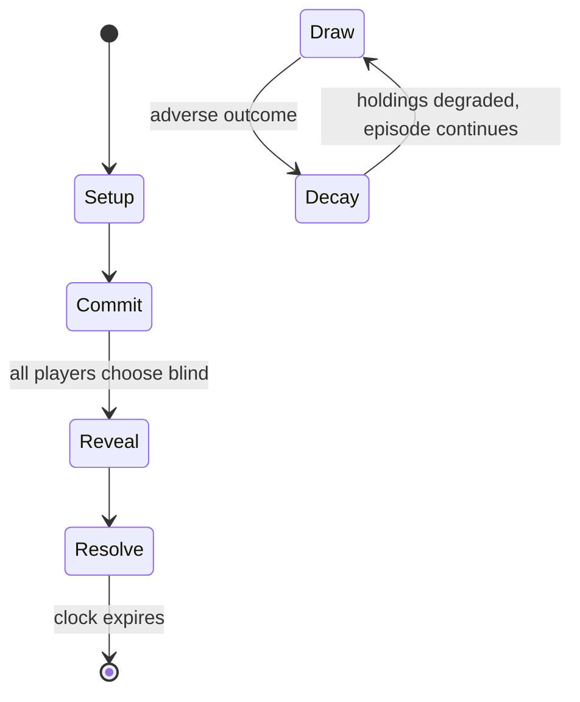

# 99 Nights in the Forest

*2025 Roblox game*

`99_nights_in_the_forest` &nbsp; state: **DEEPENED** &nbsp; method: **heuristic**

## Found layer (recorded, not trusted)

| field | value |
| --- | --- |
| wikidata | Q140312601 |
| wikipedia | 99 Nights in the Forest |
| genres (source) | horror video game, survival game, survival horror |
| instance of (source) | video game |
| country of origin | -- |

## Declared layer (orders bench work)

| field | value |
| --- | --- |
| year created | 2015 |
| epoch | CONTEMPORARY |
| region | -- |
| media | RPG, VIDEO |
| players | -- |
| age band | CHILD |
| exogenous process | -- |
| loss shape | PARTIAL_DECAY |
| live axes | COMMIT_BLIND, SELECT, TRADE |
| horizon | CLOCK_LIMITED |
| scoring shape | SURVIVAL |
| information | SIMULTANEOUS |
| interaction | SOLITAIRE |
| turn structure | SIMULTANEOUS |
| tractability | SAMPLING_ONLY |
| randomness | DICE, SIMULTANEOUS_CHOICE |
| luck factor | 0.58 |
| rules complexity | 4.5 |
| strategic depth | 2.12 |
| novelty | 0.6934 |
| solved status | -- |
| strategies | deduction |
| algorithms | -- |

## Object model

```
Episode
  players      : ?
  turn_structure: SIMULTANEOUS
  horizon       : CLOCK_LIMITED
  scoring       : SURVIVAL

Character      -- persistent stat block owned by a player
GameMaster     -- adjudicating agent outside the scoring loop
Scenario       -- authored state the players traverse
WorldState     -- simulation state advanced by the engine
Avatar         -- player-controlled agent
Clock          -- frame or tick counter
SealedChoice   -- irrevocable choice made without observation
OptionSet      -- the choices available after an exogenous draw
Offer          -- proposed exchange between two agents
```

## State transition diagram



## Research item -- turn trace

```
# 99 Nights in the Forest -- simulated turn events
# generated from the DECLARED vector, not from a rulebook.
# structure: exo=None loss=PARTIAL_DECAY horizon=CLOCK_LIMITED scoring=SURVIVAL axes=COMMIT_BLIND,SELECT,TRADE

t=0    SETUP        players=2  pot=0  capacity=7
t=1    SELECT       p1 2 options; take #1  (pot_gain=+3.5, capacity=-2)
t=2    TRADE        p1 offers 2:1 exchange to p2
t=3    SELECT       p1 4 options; take #2  (pot_gain=+0.7, capacity=-0)
t=4    SELECT       p1 3 options; take #1  (pot_gain=+1.5, capacity=-2)
t=5    TRADE        p1 offers 2:1 exchange to p2
t=6    SELECT       p1 4 options; take #2  (pot_gain=+1.7, capacity=-1)
t=7    TRADE        p1 offers 2:1 exchange to p2
t=8    SELECT       p1 2 options; take #1  (pot_gain=+2.9, capacity=-0)
t=9    SELECT       p1 2 options; take #1  (pot_gain=+1.7, capacity=-1)
t=10   TRADE        p1 offers 2:1 exchange to p2
t=11   SELECT       p1 4 options; take #2  (pot_gain=+1.0, capacity=-0)
t=12   TRADE        p1 offers 2:1 exchange to p2
t=13   SELECT       p1 4 options; take #1  (pot_gain=+2.1, capacity=-0)
t=14   SELECT       p1 4 options; take #1  (pot_gain=+3.2, capacity=-0)
t=15   SELECT       p1 4 options; take #3  (pot_gain=+3.4, capacity=-2)
t=16   TRADE        p1 offers 2:1 exchange to p2
t=17   SELECT       p1 3 options; take #2  (pot_gain=+1.5, capacity=-2)
t=18   TRADE        p1 offers 2:1 exchange to p2
t=19   SELECT       p1 3 options; take #2  (pot_gain=+2.8, capacity=-1)
t=20   SELECT       p1 1 options; take #1  (pot_gain=+1.2, capacity=-0)
t=21   SELECT       p1 3 options; take #3  (pot_gain=+2.3, capacity=-1)
t=22   SELECT       p1 4 options; take #2  (pot_gain=+3.3, capacity=-1)
t=23   TRADE        p1 offers 2:1 exchange to p2
t=24   SELECT       p1 2 options; take #2  (pot_gain=+2.2, capacity=-1)
t=25   SELECT       p1 4 options; take #2  (pot_gain=+2.8, capacity=-2)
t=26   TRADE        p1 offers 2:1 exchange to p2

terminal: CLOCK_LIMITED
```

## Conditions

| kind | threshold | effect | trigger |
| --- | --- | --- | --- |
| TERMINATE | 1 player | -- | One player is selected to be a murderer, who must kill everyone before the round ends. |
| ELIMINATE | -- | -- | Set in the BoBoiBoy universe, players can level up by eliminating a legion of bad robots and collect coins by exploring the Kota Hilir town. |
| BOUNDARY | -- | -- | The game is known for breaking multiple concurrent user (CCU) records, with at least 22.3 million players having been online on August 23, 2025. |

## Source extract

The online video game platform and game creation system Roblox has millions of games (officially
referred to as "experiences" from 2021 to 2026) created by users of its creation tool, Roblox
Studio. Due to Roblox's popularity, various games created on the site have grown in popularity,
with some games having millions of monthly active players and 5,000 games having over a million
visits. The rate of games reaching high player counts has increased annually, with it being
reported that over seventy games reached a billion visits in 2022 alone, compared to the decade
it took for the first ten games with that achievement to reach that number.   == Original games
==   === 99 Nights in the Forest === 99 Nights in the Forest is a survival horror game developed
by Alec Kieft, Cameron Angland, and Matthew Hufton. The objective is to survive by defending a
campfire against NPCs known as The Deer and cultists. Players also have to burn wood in the
campfire to make sure it is lit. In order to help defend the campfire, players are able to craft
defenses while simultaneously focusing on rescuing four missing kids located in caves. By
killing a set amount of wolves or bears, players are able to g

<sub>Wikipedia, CC BY-SA. Retained as evidence for the structural
classification above. Every rule inferred from it is HYPOTHESIZED
until audited against a rulebook.</sub>
