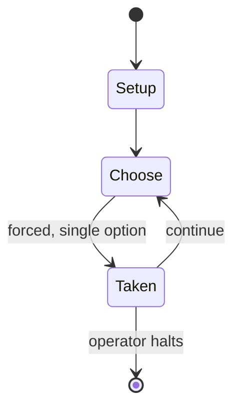

# A House Divided

*board game*

`a_house_divided` &nbsp; state: **DEEPENED** &nbsp; method: **heuristic**

## Found layer (recorded, not trusted)

| field | value |
| --- | --- |
| wikidata | Q3602522 |
| wikipedia | A House Divided (board game) |
| genres (source) | board wargame |
| instance of (source) | board game |
| country of origin | -- |

## Declared layer (orders bench work)

| field | value |
| --- | --- |
| year created | 1981 |
| epoch | DIGITAL |
| region | -- |
| media | BOARD, WARGAME |
| players | 2 |
| age band | -- |
| exogenous process | -- |
| loss shape | -- |
| live axes | - |
| horizon | OPEN_ENDED |
| scoring shape | -- |
| information | -- |
| interaction | COMPETITIVE |
| turn structure | PHASE_STRUCTURED |
| tractability | SAMPLING_ONLY |
| randomness | -- |
| luck factor | 0.35 |
| rules complexity | 4.13 |
| strategic depth | 2.0 |
| novelty | 0.6225 |
| solved status | -- |
| strategies | -- |
| algorithms | -- |

## Object model

```
Episode
  players      : 2
  turn_structure: PHASE_STRUCTURED
  horizon       : OPEN_ENDED
  scoring       : ?

Board          -- spatial substrate; cells carry position and occupancy
Piece          -- movable token owned by a player
```

## State transition diagram



## Research item -- turn trace

```
# A House Divided -- simulated turn events
# generated from the DECLARED vector, not from a rulebook.
# structure: exo=None loss=None horizon=OPEN_ENDED scoring=None axes=-

t=0    SETUP        players=2  pot=0  capacity=6
t=1    FORCED       p1 single legal option taken (pot_gain=+0.9)
t=2    FORCED       p1 single legal option taken (pot_gain=+0.6)
t=3    FORCED       p1 single legal option taken (pot_gain=+1.7)
t=4    FORCED       p1 single legal option taken (pot_gain=+1.4)
t=5    FORCED       p1 single legal option taken (pot_gain=+1.6)
t=6    ENDTURN      turn passes to p2
t=7    FORCED       p2 single legal option taken (pot_gain=+2.0)
t=8    ENDTURN      turn passes to p1
t=9    FORCED       p1 single legal option taken (pot_gain=+1.0)
t=10   FORCED       p1 single legal option taken (pot_gain=+1.7)
t=11   FORCED       p1 single legal option taken (pot_gain=+1.4)
t=12   FORCED       p1 single legal option taken (pot_gain=+1.6)
t=13   FORCED       p1 single legal option taken (pot_gain=+1.8)
t=14   FORCED       p1 single legal option taken (pot_gain=+0.9)
t=15   ENDTURN      turn passes to p2
t=16   FORCED       p2 single legal option taken (pot_gain=+0.6)
t=17   FORCED       p2 single legal option taken (pot_gain=+1.7)
t=18   FORCED       p2 single legal option taken (pot_gain=+0.7)
t=19   FORCED       p2 single legal option taken (pot_gain=+1.8)
t=20   FORCED       p2 single legal option taken (pot_gain=+0.9)
t=21   FORCED       p2 single legal option taken (pot_gain=+1.1)
t=22   FORCED       p2 single legal option taken (pot_gain=+1.3)
t=23   FORCED       p2 single legal option taken (pot_gain=+0.9)
t=24   FORCED       p2 single legal option taken (pot_gain=+0.8)
t=25   FORCED       p2 single legal option taken (pot_gain=+0.7)
t=26   FORCED       p2 single legal option taken (pot_gain=+1.6)

terminal: OPEN_ENDED
```

## Conditions

| kind | threshold | effect | trigger |
| --- | --- | --- | --- |
| BOUNDARY | -- | -- | Captures enough recruitment cities to make the Confederacy Army Maximum greater than the Union Army Maximum (immediate victory) |
| BOUNDARY | -- | -- | All the necessary elements are accounted for in only four pages of rules, and even a game lasting the 40-turn maximum takes less than a full evening of gaming. |

## Source extract

A House Divided is a strategic level board wargame set in the American Civil War for two
players, featuring  point-to-point movement, low-complexity rules, and relatively few counters
to maneuver. It was designed by Frank Chadwick and published in 1981 by Game Designers Workshop
(GDW).   == Gameplay == A House Divided owes much of its popularity to its relatively simple
rules, with more advanced rules for experienced players, and features a playing board covering
most of the United States mainland. Play is turnbased, and the players play the Union and
Confederacy armies respectively. The game is played over a series of up to 40 game turns, each
game turn being divided in two player turns. The Union player has the first player turn every
turn. The first game turn is July 1861, and the game culminates in June 1865. The pieces
represent infantry and cavalry units, each unit containing from 10,000 to 15,000 infantry or
from 7,000 to 10,000 cavalry. Each game turn represents one or two months, depending on the time
of year. In all versions, the pieces are represented with three ranks; Militia, Veteran and
Crack. All new units are Militia units, and promotions happen at the end of victor

<sub>Wikipedia, CC BY-SA. Retained as evidence for the structural
classification above. Every rule inferred from it is HYPOTHESIZED
until audited against a rulebook.</sub>
