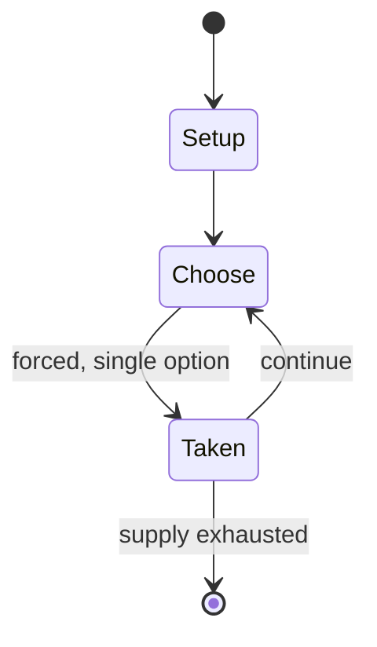

# Abaku

*abstract number board game and browser game*

`abaku` &nbsp; state: **DEEPENED** &nbsp; method: **heuristic**

## Found layer (recorded, not trusted)

| field | value |
| --- | --- |
| wikidata | Q140197765 |
| wikipedia | Abaku |
| genres (source) | abstract strategy game |
| instance of (source) | board game, browser game |
| country of origin | Czech Republic |

## Declared layer (orders bench work)

| field | value |
| --- | --- |
| year created | -- |
| epoch | -- |
| region | EUROPE_EAST |
| media | BOARD, TILE |
| players | -- |
| age band | -- |
| exogenous process | -- |
| loss shape | -- |
| live axes | ORDER |
| horizon | -- |
| scoring shape | -- |
| information | -- |
| interaction | COMPETITIVE |
| turn structure | -- |
| tractability | SAMPLING_ONLY |
| randomness | -- |
| luck factor | 0.35 |
| rules complexity | 2.13 |
| strategic depth | 2.0 |
| novelty | 0.3528 |
| solved status | -- |
| strategies | -- |
| algorithms | -- |

## Object model

```
Episode
  players      : ?
  turn_structure: ?
  horizon       : ?
  scoring       : ?

Board          -- spatial substrate; cells carry position and occupancy
Piece          -- movable token owned by a player
TileBag        -- unordered draw source
Layout         -- placed tiles and their adjacencies
Sequence       -- the permutation under the player's control
```

## State transition diagram



## Research item -- turn trace

```
# Abaku -- simulated turn events
# generated from the DECLARED vector, not from a rulebook.
# structure: exo=None loss=None horizon=None scoring=None axes=ORDER

t=0    SETUP        players=2  pot=0  capacity=5
t=1    FORCED       p1 single legal option taken (pot_gain=+1.7)
t=2    FORCED       p1 single legal option taken (pot_gain=+1.0)
t=3    FORCED       p1 single legal option taken (pot_gain=+1.4)
t=4    FORCED       p1 single legal option taken (pot_gain=+1.2)
t=5    FORCED       p1 single legal option taken (pot_gain=+1.4)
t=6    FORCED       p1 single legal option taken (pot_gain=+1.6)
t=7    FORCED       p1 single legal option taken (pot_gain=+0.5)
t=8    FORCED       p1 single legal option taken (pot_gain=+1.6)
t=9    FORCED       p1 single legal option taken (pot_gain=+1.4)
t=10   FORCED       p1 single legal option taken (pot_gain=+1.2)
t=11   FORCED       p1 single legal option taken (pot_gain=+1.0)
t=12   FORCED       p1 single legal option taken (pot_gain=+1.9)
t=13   ENDTURN      turn passes to p2
t=14   FORCED       p2 single legal option taken (pot_gain=+1.9)
t=15   ENDTURN      turn passes to p1
t=16   FORCED       p1 single legal option taken (pot_gain=+1.3)
t=17   ENDTURN      turn passes to p2
t=18   FORCED       p2 single legal option taken (pot_gain=+0.7)
t=19   ENDTURN      turn passes to p1
t=20   FORCED       p1 single legal option taken (pot_gain=+1.1)
t=21   FORCED       p1 single legal option taken (pot_gain=+1.9)
t=22   FORCED       p1 single legal option taken (pot_gain=+0.6)
t=23   FORCED       p1 single legal option taken (pot_gain=+1.4)
t=24   FORCED       p1 single legal option taken (pot_gain=+1.9)
t=25   FORCED       p1 single legal option taken (pot_gain=+1.3)
t=26   FORCED       p1 single legal option taken (pot_gain=+0.8)
t=27   ENDTURN      turn passes to p2

terminal: VARIABLE
```

## Source extract

Abaku is a Czech number-based board game and browser game used in mathematics education. In the
game, players place digit tiles on a board to form valid arithmetic operations without writing
mathematical symbols. Czech media have described Abaku as a numerical game comparable in
principle to word-based tile-placement games such as Scrabble, and have reported on both its
physical and online forms.   == Independent media coverage == Czech Television covered Abaku in
a 2013 ČT24 article, describing it as an original Czech numerical game with both computer and
board-game versions and discussing its use in schools. In 2015, Lidovky.cz published an article
about Abaku as a Czech social game used in mathematics teaching, including an interview with
Vladimír Tesař about the game and its principles. Czech Television also covered Abaku in
children's programming. In 2016, Planeta Yó broadcast a board-game review of Abaku. The same
programme separately broadcast a report about the Abaku school league. The Czech Television
programme Wifina also featured Abaku in a segment on leisure activities. Czech Radio Ostrava
broadcast a 2024 report about an Abaku tournament in Ostrava, describing Abaku as

<sub>Wikipedia, CC BY-SA. Retained as evidence for the structural
classification above. Every rule inferred from it is HYPOTHESIZED
until audited against a rulebook.</sub>
