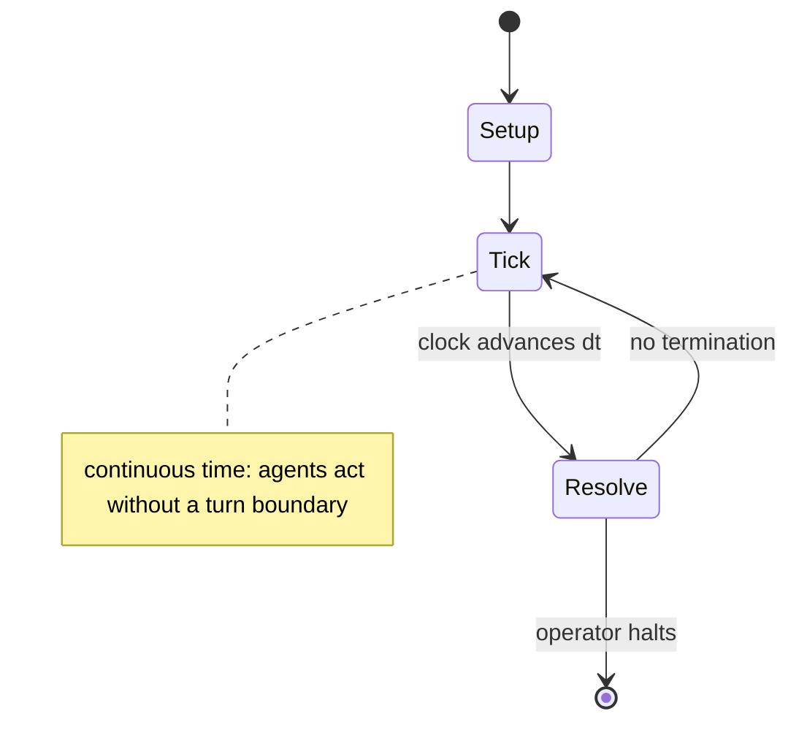

# Abalone (board game)

`abalone_board_game` &nbsp; state: **DEEPENED** &nbsp; method: **heuristic**

## Found layer (recorded, not trusted)

| field | value |
| --- | --- |
| wikidata | Q17247 |
| wikipedia | Abalone (board game) |
| genres (source) | -- |
| instance of (source) | -- |
| country of origin | -- |

## Declared layer (orders bench work)

| field | value |
| --- | --- |
| year created | 1990 |
| epoch | DIGITAL |
| region | -- |
| media | BOARD |
| players | -- |
| age band | -- |
| exogenous process | CONTINUOUS_TIME |
| loss shape | OPPORTUNITY_ONLY |
| live axes | SELECT |
| horizon | OPEN_ENDED |
| scoring shape | -- |
| information | IMPERFECT |
| interaction | COMPETITIVE |
| turn structure | REAL_TIME |
| tractability | SAMPLING_ONLY |
| randomness | REAL_TIME_PHYSICAL, SIMULTANEOUS_CHOICE |
| luck factor | 0.3 |
| rules complexity | 2.44 |
| strategic depth | 2.25 |
| novelty | 0.7123 |
| solved status | -- |
| strategies | deduction |
| algorithms | -- |

## Object model

```
Episode
  players      : ?
  turn_structure: REAL_TIME
  horizon       : OPEN_ENDED
  scoring       : ?

Board          -- spatial substrate; cells carry position and occupancy
Piece          -- movable token owned by a player
OptionSet      -- the choices available after an exogenous draw
```

## State transition diagram



## Research item -- clock trace

```
# Abalone (board game) -- simulated clock trace (no turn boundary)
# generated from the DECLARED vector, not from a rulebook.
# structure: exo=CONTINUOUS_TIME loss=OPPORTUNITY_ONLY horizon=OPEN_ENDED scoring=None axes=SELECT

clk=0.000s  START        agents=4  clock=free running
clk=2.340s  ACTION       a3 acts continuously; no turn boundary crossed
clk=2.973s  CONTEST      a1 and a2 contend for the same resource
clk=5.814s  ACTION       a4 acts continuously; no turn boundary crossed
clk=6.889s  ACTION       a1 acts continuously; no turn boundary crossed
clk=9.834s  CONTEST      a3 and a4 contend for the same resource
clk=10.116s  SCORE        a3 scores (+1)
clk=12.539s  STOPPAGE     clock halts; state frozen
clk=14.639s  SCORE        a3 scores (+2)
clk=15.265s  CONTEST      a1 and a2 contend for the same resource
clk=15.923s  ACTION       a3 acts continuously; no turn boundary crossed
clk=16.799s  CONTEST      a3 and a4 contend for the same resource
clk=19.069s  SCORE        a3 scores (+2)
clk=19.357s  ACTION       a3 acts continuously; no turn boundary crossed
clk=20.020s  INFRACTION   a2 commits infraction (count=1)
clk=20.326s  SCORE        a1 scores (+1)
clk=22.674s  ACTION       a4 acts continuously; no turn boundary crossed
clk=23.223s  SCORE        a3 scores (+2)
clk=24.493s  ACTION       a4 acts continuously; no turn boundary crossed
clk=26.510s  CONTEST      a3 and a4 contend for the same resource
clk=27.316s  ACTION       a1 acts continuously; no turn boundary crossed
clk=28.305s  ACTION       a1 acts continuously; no turn boundary crossed
clk=28.630s  CONTEST      a4 and a1 contend for the same resource
clk=30.839s  ACTION       a3 acts continuously; no turn boundary crossed
clk=33.527s  ACTION       a1 acts continuously; no turn boundary crossed
clk=34.353s  ACTION       a1 acts continuously; no turn boundary crossed
clk=36.352s  STOPPAGE     clock halts; state frozen

note: elapsed time, not move count, is the episode's ordering variable.
```

## Conditions

| kind | threshold | effect | trigger |
| --- | --- | --- | --- |
| ELIMINATE | -- | ejected | Requires additional coordinate labels when a marble is ejected: e.g. e5h8 in Nacre becomes e5j10 (i9 is pushed to j10), c3a1 becomes c300 (a1 is pushed to 00). |
| ELIMINATE | -- | -- | All moves: the same as extended Nacre, except that an in-line move featuring an ejection sees its second coordinate replaced by the coordinate of the departure of the ejected marble (rather than its destination), precede |

## Source extract

Abalone is a two-player abstract strategy board game designed by Michel Lalet and Laurent Lévi
in 1987. Players are represented by opposing black and white marbles on a hexagonal board with
the objective of pushing six of the opponent's marbles off the edge of the board. Abalone was
published in 1990 and has sold more than 4.5 million units. The year it was published it
received one of the first Mensa Select awards. As of 2011, it is sold in more than thirty
countries.   == Gameplay ==   === Rules === The board consists of 61 circular spaces arranged in
a hexagon, five on a side. Each player has 14 marbles that rest in the spaces and are initially
arranged as shown below, on the left image. The players take turns with the black marbles moving
first. For each move, a player moves a straight line of one, two or three marbles of one color
by one space in one of six directions. The move can be either broadside / arrow-like (parallel
to the line of marbles) or in-line / in a line (serial in respect to the line of marbles), as
illustrated below.  A player can push their opponent's marbles (a "sumito") that are in a line
to their own with an in-line move only. They can only push if the pu

<sub>Wikipedia, CC BY-SA. Retained as evidence for the structural
classification above. Every rule inferred from it is HYPOTHESIZED
until audited against a rulebook.</sub>
