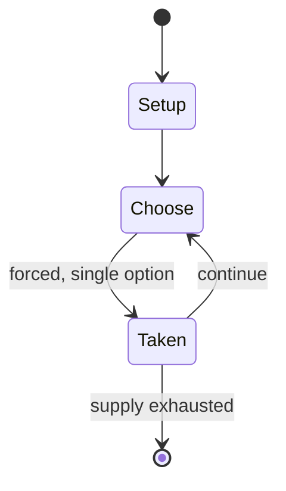

# Abbia (game)

`abbia_game` &nbsp; state: **DEEPENED** &nbsp; method: **heuristic**

## Found layer (recorded, not trusted)

| field | value |
| --- | --- |
| wikidata | Q4664129 |
| wikipedia | Abbia (game) |
| genres (source) | -- |
| instance of (source) | -- |
| country of origin | -- |

## Declared layer (orders bench work)

| field | value |
| --- | --- |
| year created | -- |
| epoch | -- |
| region | -- |
| media | GAMBLING |
| players | -- |
| age band | -- |
| exogenous process | -- |
| loss shape | -- |
| live axes | TRADE |
| horizon | -- |
| scoring shape | -- |
| information | -- |
| interaction | -- |
| turn structure | -- |
| tractability | SAMPLING_ONLY |
| randomness | -- |
| luck factor | 0.35 |
| rules complexity | 1.98 |
| strategic depth | 2.0 |
| novelty | 0.0938 |
| solved status | -- |
| strategies | -- |
| algorithms | -- |

## Object model

```
Episode
  players      : ?
  turn_structure: ?
  horizon       : ?
  scoring       : ?

Offer          -- proposed exchange between two agents
```

## State transition diagram



## Research item -- turn trace

```
# Abbia (game) -- simulated turn events
# generated from the DECLARED vector, not from a rulebook.
# structure: exo=None loss=None horizon=None scoring=None axes=TRADE

t=0    SETUP        players=2  pot=0  capacity=7
t=1    FORCED       p1 single legal option taken (pot_gain=+1.7)
t=2    FORCED       p1 single legal option taken (pot_gain=+1.1)
t=3    TRADE        p1 offers 2:1 exchange to p2
t=4    FORCED       p1 single legal option taken (pot_gain=+1.7)
t=5    FORCED       p1 single legal option taken (pot_gain=+0.7)
t=6    ENDTURN      turn passes to p2
t=7    FORCED       p2 single legal option taken (pot_gain=+1.4)
t=8    FORCED       p2 single legal option taken (pot_gain=+0.7)
t=9    FORCED       p2 single legal option taken (pot_gain=+1.3)
t=10   ENDTURN      turn passes to p1
t=11   FORCED       p1 single legal option taken (pot_gain=+0.7)
t=12   TRADE        p1 offers 2:1 exchange to p2
t=13   FORCED       p1 single legal option taken (pot_gain=+1.4)
t=14   FORCED       p1 single legal option taken (pot_gain=+2.0)
t=15   TRADE        p1 offers 2:1 exchange to p2
t=16   FORCED       p1 single legal option taken (pot_gain=+1.2)
t=17   FORCED       p1 single legal option taken (pot_gain=+1.7)
t=18   ENDTURN      turn passes to p2
t=19   FORCED       p2 single legal option taken (pot_gain=+1.9)
t=20   TRADE        p2 offers 2:1 exchange to p1
t=21   FORCED       p2 single legal option taken (pot_gain=+1.6)
t=22   TRADE        p2 offers 2:1 exchange to p1
t=23   FORCED       p2 single legal option taken (pot_gain=+1.1)
t=24   TRADE        p2 offers 2:1 exchange to p1
t=25   ENDTURN      turn passes to p1
t=26   FORCED       p1 single legal option taken (pot_gain=+1.1)
t=27   TRADE        p1 offers 2:1 exchange to p2

terminal: VARIABLE
```

## Source extract

Abbia is an African game of chance among Cameroon's Beti people. The game is played using
nutshells, or the carved fruit of a highly poisonous tree. Gambling chips made from stone are
exchanged during the process. The nut is cracked, and the game stones are carved. Objects are
depicted on each stone, decided by the carver, and can be of inanimate objects, living beings,
or supernatural beings. An experienced player mediates the game. The game was played by men who
sat in a circle around a plate-shaped woven basket and placed their carved stones in the basket,
along with other objects known as sa. Sa are undecorated discs cut from the peel of the
calabash, the outer shell. The mediator throws the basket upside down and bets are placed on the
positions of the objects, with various arrangements of objects turned carved side-up or down
determining winners. The stakes are usually high, and men would lose wives or even gamble
themselves into slavery.   == Sources ==

<sub>Wikipedia, CC BY-SA. Retained as evidence for the structural
classification above. Every rule inferred from it is HYPOTHESIZED
until audited against a rulebook.</sub>
