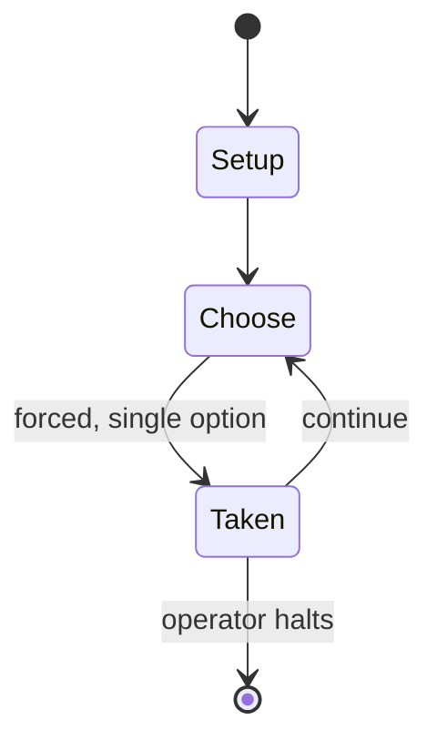

# AberMUD

*Multi User Dungeon Server*

`abermud` &nbsp; state: **DEEPENED** &nbsp; method: **heuristic**

## Found layer (recorded, not trusted)

| field | value |
| --- | --- |
| wikidata | Q4666762 |
| wikipedia | AberMUD |
| genres (source) | -- |
| instance of (source) | server software for MUD-like games, video game |
| country of origin | United Kingdom |

## Declared layer (orders bench work)

| field | value |
| --- | --- |
| year created | 1989 |
| epoch | DIGITAL |
| region | EUROPE_WEST |
| media | VIDEO |
| players | -- |
| age band | -- |
| exogenous process | -- |
| loss shape | -- |
| live axes | TRADE |
| horizon | OPEN_ENDED |
| scoring shape | -- |
| information | -- |
| interaction | -- |
| turn structure | -- |
| tractability | SAMPLING_ONLY |
| randomness | -- |
| luck factor | 0.35 |
| rules complexity | 2.05 |
| strategic depth | 2.0 |
| novelty | 0.4787 |
| solved status | -- |
| strategies | spatial_packing |
| algorithms | -- |

## Object model

```
Episode
  players      : ?
  turn_structure: ?
  horizon       : OPEN_ENDED
  scoring       : ?

WorldState     -- simulation state advanced by the engine
Avatar         -- player-controlled agent
Clock          -- frame or tick counter
Offer          -- proposed exchange between two agents
```

## State transition diagram



## Research item -- turn trace

```
# AberMUD -- simulated turn events
# generated from the DECLARED vector, not from a rulebook.
# structure: exo=None loss=None horizon=OPEN_ENDED scoring=None axes=TRADE

t=0    SETUP        players=2  pot=0  capacity=3
t=1    FORCED       p1 single legal option taken (pot_gain=+0.7)
t=2    TRADE        p1 offers 2:1 exchange to p2
t=3    FORCED       p1 single legal option taken (pot_gain=+0.6)
t=4    ENDTURN      turn passes to p2
t=5    FORCED       p2 single legal option taken (pot_gain=+1.8)
t=6    TRADE        p2 offers 2:1 exchange to p1
t=7    ENDTURN      turn passes to p1
t=8    FORCED       p1 single legal option taken (pot_gain=+1.7)
t=9    TRADE        p1 offers 2:1 exchange to p2
t=10   ENDTURN      turn passes to p2
t=11   FORCED       p2 single legal option taken (pot_gain=+1.2)
t=12   ENDTURN      turn passes to p1
t=13   FORCED       p1 single legal option taken (pot_gain=+1.2)
t=14   FORCED       p1 single legal option taken (pot_gain=+0.9)
t=15   ENDTURN      turn passes to p2
t=16   FORCED       p2 single legal option taken (pot_gain=+1.4)
t=17   TRADE        p2 offers 2:1 exchange to p1
t=18   FORCED       p2 single legal option taken (pot_gain=+0.6)
t=19   FORCED       p2 single legal option taken (pot_gain=+1.8)
t=20   FORCED       p2 single legal option taken (pot_gain=+1.7)
t=21   TRADE        p2 offers 2:1 exchange to p1
t=22   FORCED       p2 single legal option taken (pot_gain=+1.1)
t=23   FORCED       p2 single legal option taken (pot_gain=+1.1)
t=24   TRADE        p2 offers 2:1 exchange to p1
t=25   FORCED       p2 single legal option taken (pot_gain=+1.3)
t=26   FORCED       p2 single legal option taken (pot_gain=+1.4)
t=27   TRADE        p2 offers 2:1 exchange to p1

terminal: OPEN_ENDED
```

## Source extract

AberMUD  was the first popular open source MUD. It was named after the town Aberystwyth, where
it was written. The first version was written in B by Alan Cox, Richard Acott, Jim Finnis, and
Leon Thrane based at University of Wales, Aberystwyth for an old Honeywell mainframe and opened
in 1987. The gameplay was heavily influenced by MUD1, created by Roy Trubshaw and Richard Bartle
at the University of Essex, which Alan Cox had played. In late 1988, AberMUD was ported to C by
Alan Cox so it could run on Unix at Southampton University's Maths machines. This version was
named AberMUD2. In early 1989, there were three instances of AberMUD running in the UK, the
Southampton one, one at Leeds University and a third at the IBM PC User Group in London, run by
Ian Smith. In January 1989 Michael Lawrie sent a licensed copy of AberMUD3 to Vijay Subramaniam
and Bill Wisner, both American Essex MIST players. Bill Wisner subsequently spread AberMUD
around the world. AberMUD3 was renamed AberMUD II by Rich Salz in February 1989 after he cleaned
up the source code and ported it to UNIX. In 1991, Alan Cox wrote AberMUD IV (unrelated to
AberMUD 4) and then AberMUD V, which was also used, with graphic

<sub>Wikipedia, CC BY-SA. Retained as evidence for the structural
classification above. Every rule inferred from it is HYPOTHESIZED
until audited against a rulebook.</sub>
