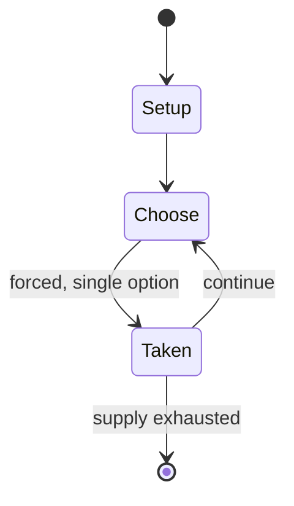

# Achi (game)

`achi_game` &nbsp; state: **DEEPENED** &nbsp; method: **heuristic**

## Found layer (recorded, not trusted)

| field | value |
| --- | --- |
| wikidata | Q4673651 |
| wikipedia | Achi (game) |
| genres (source) | -- |
| instance of (source) | -- |
| country of origin | -- |

## Declared layer (orders bench work)

| field | value |
| --- | --- |
| year created | -- |
| epoch | -- |
| region | -- |
| media | ABSTRACT |
| players | -- |
| age band | -- |
| exogenous process | -- |
| loss shape | -- |
| live axes | SPATIAL |
| horizon | -- |
| scoring shape | -- |
| information | -- |
| interaction | COMPETITIVE |
| turn structure | STRICT_TURN |
| tractability | SAMPLING_ONLY |
| randomness | -- |
| luck factor | 0.35 |
| rules complexity | 2.02 |
| strategic depth | 2.0 |
| novelty | 0.4915 |
| solved status | -- |
| strategies | -- |
| algorithms | -- |

## Object model

```
Episode
  players      : ?
  turn_structure: STRICT_TURN
  horizon       : ?
  scoring       : ?

Placement      -- position subject to geometric legality
```

## State transition diagram



## Research item -- turn trace

```
# Achi (game) -- simulated turn events
# generated from the DECLARED vector, not from a rulebook.
# structure: exo=None loss=None horizon=None scoring=None axes=SPATIAL

t=0    SETUP        players=2  pot=0  capacity=3
t=1    FORCED       p1 single legal option taken (pot_gain=+0.9)
t=2    FORCED       p1 single legal option taken (pot_gain=+1.1)
t=3    FORCED       p1 single legal option taken (pot_gain=+1.1)
t=4    FORCED       p1 single legal option taken (pot_gain=+0.6)
t=5    FORCED       p1 single legal option taken (pot_gain=+1.8)
t=6    ENDTURN      turn passes to p2
t=7    FORCED       p2 single legal option taken (pot_gain=+1.0)
t=8    FORCED       p2 single legal option taken (pot_gain=+0.9)
t=9    FORCED       p2 single legal option taken (pot_gain=+0.8)
t=10   FORCED       p2 single legal option taken (pot_gain=+1.5)
t=11   FORCED       p2 single legal option taken (pot_gain=+0.7)
t=12   FORCED       p2 single legal option taken (pot_gain=+2.0)
t=13   SPATIAL      p2 places at (6,2); adjacency legal
t=14   FORCED       p2 single legal option taken (pot_gain=+1.3)
t=15   FORCED       p2 single legal option taken (pot_gain=+0.6)
t=16   ENDTURN      turn passes to p1
t=17   FORCED       p1 single legal option taken (pot_gain=+1.0)
t=18   FORCED       p1 single legal option taken (pot_gain=+1.9)
t=19   FORCED       p1 single legal option taken (pot_gain=+2.0)
t=20   FORCED       p1 single legal option taken (pot_gain=+0.7)
t=21   SPATIAL      p1 places at (0,3); adjacency legal
t=22   FORCED       p1 single legal option taken (pot_gain=+0.6)
t=23   SPATIAL      p1 places at (1,0); adjacency legal
t=24   FORCED       p1 single legal option taken (pot_gain=+1.4)
t=25   ENDTURN      turn passes to p2
t=26   FORCED       p2 single legal option taken (pot_gain=+1.3)
t=27   ENDTURN      turn passes to p1

terminal: VARIABLE
```

## Source extract

Achi is a two-player abstract strategy game from Ghana.  It is also called tapatan. It is
related to tic-tac-toe, but even more related to three men's morris, Nine Holes, Tant Fant,
Shisima, and Dara, because pieces are moved on the board to create the 3-in-a-row.  Achi is an
alignment game. There are two versions of this game.  In one version, each player has four
pieces to drop. This is the version described below.  In another version, each player has only
three pieces to drop, which makes it identical to three men's morris.   == Equipment == A 3×3
board is used.  Three horizontal lines form the three rows. Three vertical lines form the three
columns.  Two diagonal lines connect the two opposite corners of the board.  The board is easily
drawn on the ground or paper. Each player has four pieces.  One plays the black pieces, and the
other plays the white pieces; however, any two colors or distinguishable objects will suffice.
== Rules and gameplay == The players take turns to place one of their counters on a point where
lines join. When all eight counters have been placed, each player can move along a line to an
adjacent empty point. The winner is the first player to create a 3-

<sub>Wikipedia, CC BY-SA. Retained as evidence for the structural
classification above. Every rule inferred from it is HYPOTHESIZED
until audited against a rulebook.</sub>
