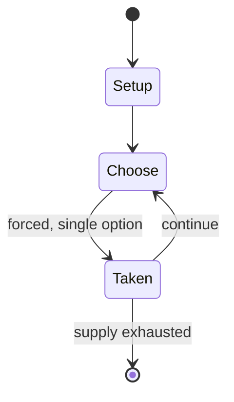

# Adji-boto

*traditional mancala game*

`adji_boto` &nbsp; state: **DEEPENED** &nbsp; method: **heuristic**

## Found layer (recorded, not trusted)

| field | value |
| --- | --- |
| wikidata | Q1057836 |
| wikipedia | Adji-boto |
| genres (source) | abstract strategy game |
| instance of (source) | board game, mancala, two-player game |
| country of origin | -- |

## Declared layer (orders bench work)

| field | value |
| --- | --- |
| year created | -- |
| epoch | -- |
| region | -- |
| media | MANCALA |
| players | 2 |
| age band | -- |
| exogenous process | -- |
| loss shape | -- |
| live axes | - |
| horizon | -- |
| scoring shape | -- |
| information | -- |
| interaction | COMPETITIVE |
| turn structure | -- |
| tractability | SAMPLING_ONLY |
| randomness | -- |
| luck factor | 0.35 |
| rules complexity | 1.68 |
| strategic depth | 2.0 |
| novelty | 0.3528 |
| solved status | -- |
| strategies | -- |
| algorithms | -- |

## Object model

```
Episode
  players      : 2
  turn_structure: ?
  horizon       : ?
  scoring       : ?

Pits           -- cyclic array of counts
Store          -- player's banked seeds
```

## State transition diagram



## Research item -- turn trace

```
# Adji-boto -- simulated turn events
# generated from the DECLARED vector, not from a rulebook.
# structure: exo=None loss=None horizon=None scoring=None axes=-

t=0    SETUP        players=2  pot=0  capacity=3
t=1    FORCED       p1 single legal option taken (pot_gain=+1.3)
t=2    FORCED       p1 single legal option taken (pot_gain=+1.4)
t=3    FORCED       p1 single legal option taken (pot_gain=+1.4)
t=4    FORCED       p1 single legal option taken (pot_gain=+0.5)
t=5    FORCED       p1 single legal option taken (pot_gain=+0.5)
t=6    ENDTURN      turn passes to p2
t=7    FORCED       p2 single legal option taken (pot_gain=+1.3)
t=8    FORCED       p2 single legal option taken (pot_gain=+1.9)
t=9    FORCED       p2 single legal option taken (pot_gain=+1.6)
t=10   FORCED       p2 single legal option taken (pot_gain=+1.5)
t=11   FORCED       p2 single legal option taken (pot_gain=+1.2)
t=12   FORCED       p2 single legal option taken (pot_gain=+1.4)
t=13   ENDTURN      turn passes to p1
t=14   FORCED       p1 single legal option taken (pot_gain=+1.3)
t=15   FORCED       p1 single legal option taken (pot_gain=+0.9)
t=16   ENDTURN      turn passes to p2
t=17   FORCED       p2 single legal option taken (pot_gain=+1.9)
t=18   ENDTURN      turn passes to p1
t=19   FORCED       p1 single legal option taken (pot_gain=+1.6)
t=20   ENDTURN      turn passes to p2
t=21   FORCED       p2 single legal option taken (pot_gain=+1.3)
t=22   FORCED       p2 single legal option taken (pot_gain=+1.8)
t=23   FORCED       p2 single legal option taken (pot_gain=+0.5)
t=24   FORCED       p2 single legal option taken (pot_gain=+1.0)
t=25   FORCED       p2 single legal option taken (pot_gain=+1.4)
t=26   FORCED       p2 single legal option taken (pot_gain=+0.8)

terminal: VARIABLE
```

## Source extract

Adji-boto is a traditional mancala game played by the Saramaccans, i.e., the Maroons who live on
the banks of the Saramacca river, in Suriname. It is similar to some mancalas played in West
Africa, especially Benin, and could be regarded as a variation of the Wari game, which is the
most common mancala game found in the Americas. The game plays an important role in the social
life of Saramaccans, and it is especially connected to funeral rituals. After someone's death,
the game is played for the ten days before burial; at night, the board is left outside in the
open so that the yorkas (spirits of the dead) can play with it. The intent is to lure the
spirits into the village so that they will eventually accept the dead's spirit in their
community. Board can only be manufactured by widows.   == References == M.J. Herskovits,
Adjiboto, an African Game of the Bush-Negroes of Dutch Guiana. In «Man: A Monthly Record of the
Royal Anthropological Institute», 1929,. 29 (90): 122–127. M.J. Herskovits, Wari in the New
World. In «Journal of the Royal Anthropological Institute», 1932, 62: 23–37.

<sub>Wikipedia, CC BY-SA. Retained as evidence for the structural
classification above. Every rule inferred from it is HYPOTHESIZED
until audited against a rulebook.</sub>
