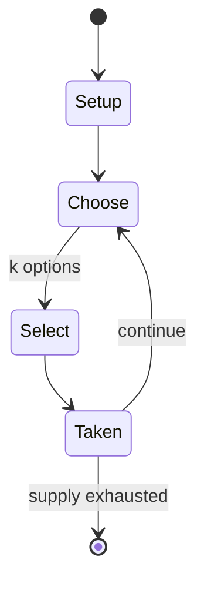

# Advanced Squad Leader

*tactical-level board wargame*

`advanced_squad_leader` &nbsp; state: **DEEPENED** &nbsp; method: **heuristic**

## Found layer (recorded, not trusted)

| field | value |
| --- | --- |
| wikidata | Q379731 |
| wikipedia | Advanced Squad Leader |
| genres (source) | tactical wargame |
| instance of (source) | board wargame |
| country of origin | United States |

## Declared layer (orders bench work)

| field | value |
| --- | --- |
| year created | 2001 |
| epoch | CONTEMPORARY |
| region | NORTH_AMERICA |
| media | WARGAME |
| players | -- |
| age band | -- |
| exogenous process | NONE |
| loss shape | OPPORTUNITY_ONLY |
| live axes | SELECT, TRADE |
| horizon | -- |
| scoring shape | -- |
| information | PERFECT |
| interaction | -- |
| turn structure | PHASE_STRUCTURED |
| tractability | EXACT_WITH_CUT |
| randomness | NONE |
| luck factor | 0.02 |
| rules complexity | 4.48 |
| strategic depth | 2.4 |
| novelty | 0.8235 |
| solved status | -- |
| strategies | -- |
| algorithms | -- |

## Object model

```
Episode
  players      : ?
  turn_structure: PHASE_STRUCTURED
  horizon       : ?
  scoring       : ?

OptionSet      -- the choices available after an exogenous draw
Offer          -- proposed exchange between two agents
```

## State transition diagram



## Research item -- turn trace

```
# Advanced Squad Leader -- simulated turn events
# generated from the DECLARED vector, not from a rulebook.
# structure: exo=NONE loss=OPPORTUNITY_ONLY horizon=None scoring=None axes=SELECT,TRADE

t=0    SETUP        players=2  pot=0  capacity=8
t=1    SELECT       p1 2 options; take #2  (pot_gain=+2.9, capacity=-0)
t=2    ENDTURN      turn passes to p2
t=3    SELECT       p2 3 options; take #1  (pot_gain=+1.2, capacity=-1)
t=4    ENDTURN      turn passes to p1
t=5    SELECT       p1 3 options; take #1  (pot_gain=+2.6, capacity=-2)
t=6    SELECT       p1 3 options; take #2  (pot_gain=+1.9, capacity=-0)
t=7    ENDTURN      turn passes to p2
t=8    SELECT       p2 4 options; take #4  (pot_gain=+2.0, capacity=-2)
t=9    SELECT       p2 2 options; take #2  (pot_gain=+2.8, capacity=-2)
t=10   SELECT       p2 4 options; take #2  (pot_gain=+2.5, capacity=-2)
t=11   ENDTURN      turn passes to p1
t=12   SELECT       p1 1 options; take #1  (pot_gain=+1.5, capacity=-0)
t=13   TRADE        p1 offers 2:1 exchange to p2
t=14   SELECT       p1 4 options; take #2  (pot_gain=+0.9, capacity=-2)
t=15   SELECT       p1 2 options; take #1  (pot_gain=+2.5, capacity=-1)
t=16   TRADE        p1 offers 2:1 exchange to p2
t=17   SELECT       p1 1 options; take #1  (pot_gain=+2.6, capacity=-0)
t=18   TRADE        p1 offers 2:1 exchange to p2
t=19   SELECT       p1 2 options; take #2  (pot_gain=+1.5, capacity=-0)
t=20   ENDTURN      turn passes to p2
t=21   SELECT       p2 4 options; take #1  (pot_gain=+1.0, capacity=-2)
t=22   SELECT       p2 4 options; take #4  (pot_gain=+1.0, capacity=-0)
t=23   SELECT       p2 1 options; take #1  (pot_gain=+2.3, capacity=-2)
t=24   TRADE        p2 offers 2:1 exchange to p1
t=25   SELECT       p2 4 options; take #3  (pot_gain=+3.3, capacity=-1)
t=26   TRADE        p2 offers 2:1 exchange to p1
t=27   ENDTURN      turn passes to p1

terminal: VARIABLE
```

## Conditions

| kind | threshold | effect | trigger |
| --- | --- | --- | --- |
| BOUNDARY | -- | -- | The new game requires at least two products, the Advanced Squad Leader Rulebook and an initial module, either Beyond Valor, which contains a brand new counter mix for the German, Russian and Finnish armies, as well as al |
| BOUNDARY | -- | -- | The new game does not feature programmed instruction, instead of requiring a thorough reading of at least four chapters of the ASL Rulebook to play a game with ordnance and/or vehicles in it. |
| PENALTY | -- | -- | Above all, the use of standardized abbreviations and jargon made the rules very technical in outlook; this language is known as "legalese" and is in contrast to more "conversational" types of rules. |

## Source extract

Advanced Squad Leader (ASL) is a tactical-level board wargame, originally marketed by Avalon
Hill Games, that simulates actions of squad sized units in World War II. It is a detailed game
system for two or more players (with solitary play also possible). Components include the ASL
Rulebook and various games called modules. ASL modules provide the standard equipment for
playing ASL, including geomorphic mapboards and counters. The mapboards are divided into
hexagons to regulate fire and movement, and depict generic terrain that can represent different
historical locations. The counters are cardboard pieces that depict squads of soldiers, crews,
individual leaders, support weapons, heavy weapons, and vehicles. Combined with the sales of the
original Squad Leader, Advanced Squad Leader sold over 1 million copies by 1997.   ==
Introduction == Fifteen core modules provide representations of nearly every troop type,
vehicle, and weapon to see combat action from any nationality involved in World War II. Each
module comes with 6 to 20 researched scenarios depicting historical battles. These scenarios are
printed on card stock with specifications of game length, map board configuration, cou

<sub>Wikipedia, CC BY-SA. Retained as evidence for the structural
classification above. Every rule inferred from it is HYPOTHESIZED
until audited against a rulebook.</sub>
