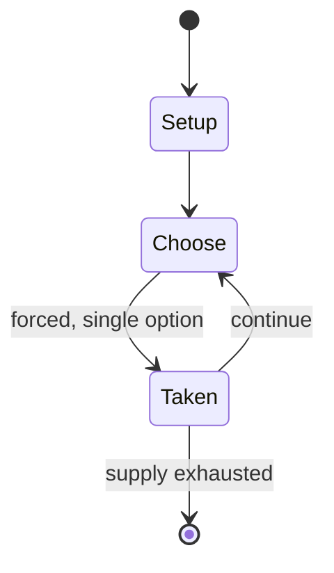

# Age of Ruin

*1990 role-playing game*

`age_of_ruin` &nbsp; state: **DEEPENED** &nbsp; method: **heuristic**

## Found layer (recorded, not trusted)

| field | value |
| --- | --- |
| wikidata | Q104862194 |
| wikipedia | Age of Ruin (role-playing game) |
| genres (source) | -- |
| instance of (source) | tabletop role-playing game |
| country of origin | -- |

## Declared layer (orders bench work)

| field | value |
| --- | --- |
| year created | 1990 |
| epoch | DIGITAL |
| region | -- |
| media | RPG |
| players | -- |
| age band | -- |
| exogenous process | -- |
| loss shape | -- |
| live axes | ALLOCATE |
| horizon | -- |
| scoring shape | SURVIVAL |
| information | -- |
| interaction | -- |
| turn structure | -- |
| tractability | SAMPLING_ONLY |
| randomness | -- |
| luck factor | 0.35 |
| rules complexity | 3.2 |
| strategic depth | 2.0 |
| novelty | 0.505 |
| solved status | -- |
| strategies | -- |
| algorithms | -- |

## Object model

```
Episode
  players      : ?
  turn_structure: ?
  horizon       : ?
  scoring       : SURVIVAL

Character      -- persistent stat block owned by a player
GameMaster     -- adjudicating agent outside the scoring loop
Scenario       -- authored state the players traverse
ResourcePool   -- divisible capacity committed across slots
```

## State transition diagram



## Research item -- turn trace

```
# Age of Ruin -- simulated turn events
# generated from the DECLARED vector, not from a rulebook.
# structure: exo=None loss=None horizon=None scoring=SURVIVAL axes=ALLOCATE

t=0    SETUP        players=2  pot=0  capacity=3
t=1    FORCED       p1 single legal option taken (pot_gain=+0.5)
t=2    FORCED       p1 single legal option taken (pot_gain=+0.7)
t=3    FORCED       p1 single legal option taken (pot_gain=+0.6)
t=4    ENDTURN      turn passes to p2
t=5    FORCED       p2 single legal option taken (pot_gain=+1.3)
t=6    ALLOCATE     p2 commits 3 of 5 capacity across 2 slots
t=7    FORCED       p2 single legal option taken (pot_gain=+1.7)
t=8    FORCED       p2 single legal option taken (pot_gain=+1.4)
t=9    ENDTURN      turn passes to p1
t=10   FORCED       p1 single legal option taken (pot_gain=+2.0)
t=11   FORCED       p1 single legal option taken (pot_gain=+1.3)
t=12   FORCED       p1 single legal option taken (pot_gain=+0.5)
t=13   ALLOCATE     p1 commits 2 of 5 capacity across 3 slots
t=14   FORCED       p1 single legal option taken (pot_gain=+0.7)
t=15   FORCED       p1 single legal option taken (pot_gain=+1.8)
t=16   ALLOCATE     p1 commits 1 of 5 capacity across 2 slots
t=17   ENDTURN      turn passes to p2
t=18   FORCED       p2 single legal option taken (pot_gain=+0.5)
t=19   ALLOCATE     p2 commits 2 of 5 capacity across 4 slots
t=20   FORCED       p2 single legal option taken (pot_gain=+0.9)
t=21   FORCED       p2 single legal option taken (pot_gain=+2.0)
t=22   ALLOCATE     p2 commits 2 of 5 capacity across 3 slots
t=23   FORCED       p2 single legal option taken (pot_gain=+0.7)
t=24   ALLOCATE     p2 commits 1 of 5 capacity across 2 slots
t=25   FORCED       p2 single legal option taken (pot_gain=+1.1)
t=26   FORCED       p2 single legal option taken (pot_gain=+1.3)
t=27   ALLOCATE     p2 commits 3 of 5 capacity across 3 slots

terminal: VARIABLE
```

## Conditions

| kind | threshold | effect | trigger |
| --- | --- | --- | --- |
| BOUNDARY | -- | -- | Don't let the cover painting scare you away, because the game is at least worth a look." |

## Source extract

Age of Ruin is a post-apocalyptic role-playing game (RPG) published by Cutting Edge Games in
1990.   == Description ==   === Setting === This RPG is set in the year 2060, after a plague has
killed 80% of the world's population. The plague and severe climate change have caused the
survivors to mutate, knowledge of the past has been reduced to word-of-mouth, and the latest
generation (the player characters) have no idea of what the world was like in the 20th century.
=== Character generation === The player allocates 425 points between eight attributes: Charisma,
Dexterity, Endurance, Intelligence, Luck, Mind Strength, Quickness, and Strength. The player
then gives their character a mutation that has both a benefit and a significant drawback. If the
character has a large enough Mind Strength, the player can choose psionic abilities, but each of
these comes with a randomly chosen Mental Malady such as a phobia or mania. From a list of 16
Primary Skills, the player then chooses eight, and then chooses five related Secondary Skills.
=== Adventures === An introductory scenario was included in the book. Cutting Edge did not
publish any stand-alone adventures.   == Publication history =

<sub>Wikipedia, CC BY-SA. Retained as evidence for the structural
classification above. Every rule inferred from it is HYPOTHESIZED
until audited against a rulebook.</sub>
