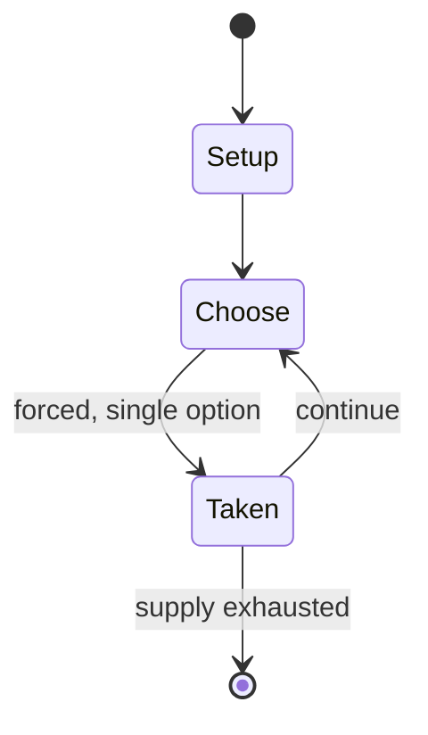

# Aggravation

*board game*

`aggravation` &nbsp; state: **DEEPENED** &nbsp; method: **heuristic**

## Found layer (recorded, not trusted)

| field | value |
| --- | --- |
| wikidata | Q4692235 |
| wikipedia | Aggravation (board game) |
| genres (source) | -- |
| instance of (source) | board game, cross and circle game |
| country of origin | -- |

## Declared layer (orders bench work)

| field | value |
| --- | --- |
| year created | 1962 |
| epoch | MODERN |
| region | -- |
| media | BOARD |
| players | -- |
| age band | -- |
| exogenous process | -- |
| loss shape | -- |
| live axes | ORDER |
| horizon | -- |
| scoring shape | -- |
| information | -- |
| interaction | COMPETITIVE |
| turn structure | STRICT_TURN |
| tractability | SAMPLING_ONLY |
| randomness | DICE |
| luck factor | 0.58 |
| rules complexity | 2.13 |
| strategic depth | 2.12 |
| novelty | 0.4915 |
| solved status | -- |
| strategies | route_optimisation |
| algorithms | -- |

## Object model

```
Episode
  players      : ?
  turn_structure: STRICT_TURN
  horizon       : ?
  scoring       : ?

Board          -- spatial substrate; cells carry position and occupancy
Piece          -- movable token owned by a player
Sequence       -- the permutation under the player's control
```

## State transition diagram



## Research item -- turn trace

```
# Aggravation -- simulated turn events
# generated from the DECLARED vector, not from a rulebook.
# structure: exo=None loss=None horizon=None scoring=None axes=ORDER

t=0    SETUP        players=2  pot=0  capacity=8
t=1    FORCED       p1 single legal option taken (pot_gain=+0.6)
t=2    ENDTURN      turn passes to p2
t=3    FORCED       p2 single legal option taken (pot_gain=+1.7)
t=4    ENDTURN      turn passes to p1
t=5    FORCED       p1 single legal option taken (pot_gain=+1.2)
t=6    FORCED       p1 single legal option taken (pot_gain=+1.6)
t=7    FORCED       p1 single legal option taken (pot_gain=+1.6)
t=8    FORCED       p1 single legal option taken (pot_gain=+1.7)
t=9    ENDTURN      turn passes to p2
t=10   FORCED       p2 single legal option taken (pot_gain=+0.9)
t=11   ENDTURN      turn passes to p1
t=12   FORCED       p1 single legal option taken (pot_gain=+1.8)
t=13   ENDTURN      turn passes to p2
t=14   FORCED       p2 single legal option taken (pot_gain=+1.3)
t=15   FORCED       p2 single legal option taken (pot_gain=+1.4)
t=16   FORCED       p2 single legal option taken (pot_gain=+1.8)
t=17   ENDTURN      turn passes to p1
t=18   FORCED       p1 single legal option taken (pot_gain=+1.0)
t=19   ENDTURN      turn passes to p2
t=20   FORCED       p2 single legal option taken (pot_gain=+0.7)
t=21   FORCED       p2 single legal option taken (pot_gain=+0.6)
t=22   FORCED       p2 single legal option taken (pot_gain=+0.9)
t=23   ENDTURN      turn passes to p1
t=24   FORCED       p1 single legal option taken (pot_gain=+1.3)
t=25   FORCED       p1 single legal option taken (pot_gain=+0.6)
t=26   FORCED       p1 single legal option taken (pot_gain=+1.5)

terminal: VARIABLE
```

## Source extract

Aggravation is a board game for up to four players and later versions for up to six players,
whose object is to be the first player to have all four playing pieces (usually represented by
marbles) reach the player's home section of the board. The game's name comes from the action of
capturing an opponent's piece by landing on its space, which is known as "aggravating". The name
was coined by one of the creators, Louis Elaine, who did not always enjoy defeat.   == History
and overview == The name Aggravation was trademarked by BERL Industries, which filed its
application on April 10, 1959. A contemporary patent filed by Howard P. Wilde, Sr. two months
earlier, in February 1959, describes a game board "which may be played, with high interest,
vexation and aggravation by two, three or four persons" but does not provide specific gameplay
instructions for the cross-shaped track and central space. The 1959 Wilde patent, in turn, cites
an earlier patent filed in 1921 by Isidor Paris for a child's racing game, also featuring a
cross-shaped track and describing how players move their markers along the track by taking turns
rolling a six-sided die. However, the first version of Aggravation,

<sub>Wikipedia, CC BY-SA. Retained as evidence for the structural
classification above. Every rule inferred from it is HYPOTHESIZED
until audited against a rulebook.</sub>
