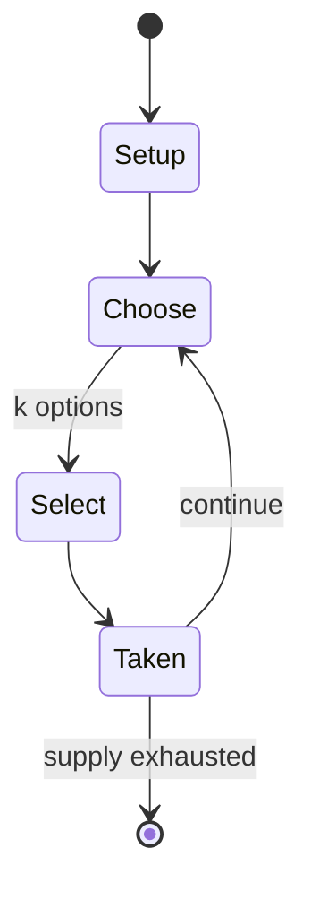

# Agricola (board game)

`agricola_board_game` &nbsp; state: **DEEPENED** &nbsp; method: **heuristic**

## Found layer (recorded, not trusted)

| field | value |
| --- | --- |
| wikidata | Q396644 |
| wikipedia | Agricola (board game) |
| genres (source) | -- |
| instance of (source) | -- |
| country of origin | -- |

## Declared layer (orders bench work)

| field | value |
| --- | --- |
| year created | 2007 |
| epoch | CONTEMPORARY |
| region | -- |
| media | BOARD |
| players | -- |
| age band | -- |
| exogenous process | -- |
| loss shape | -- |
| live axes | ALLOCATE, SELECT |
| horizon | -- |
| scoring shape | -- |
| information | -- |
| interaction | COMPETITIVE |
| turn structure | STRICT_TURN |
| tractability | SAMPLING_ONLY |
| randomness | -- |
| luck factor | 0.35 |
| rules complexity | 2.85 |
| strategic depth | 2.25 |
| novelty | 0.4915 |
| solved status | -- |
| strategies | signalling |
| algorithms | -- |

## Object model

```
Episode
  players      : ?
  turn_structure: STRICT_TURN
  horizon       : ?
  scoring       : ?

Board          -- spatial substrate; cells carry position and occupancy
Piece          -- movable token owned by a player
ResourcePool   -- divisible capacity committed across slots
OptionSet      -- the choices available after an exogenous draw
```

## State transition diagram



## Research item -- turn trace

```
# Agricola (board game) -- simulated turn events
# generated from the DECLARED vector, not from a rulebook.
# structure: exo=None loss=None horizon=None scoring=None axes=ALLOCATE,SELECT

t=0    SETUP        players=2  pot=0  capacity=4
t=1    SELECT       p1 2 options; take #2  (pot_gain=+1.8, capacity=-0)
t=2    SELECT       p1 1 options; take #1  (pot_gain=+0.7, capacity=-0)
t=3    ALLOCATE     p1 commits 2 of 5 capacity across 2 slots
t=4    SELECT       p1 4 options; take #2  (pot_gain=+1.3, capacity=-0)
t=5    ALLOCATE     p1 commits 3 of 5 capacity across 4 slots
t=6    SELECT       p1 3 options; take #3  (pot_gain=+1.8, capacity=-2)
t=7    ALLOCATE     p1 commits 2 of 5 capacity across 2 slots
t=8    ENDTURN      turn passes to p2
t=9    SELECT       p2 2 options; take #2  (pot_gain=+3.4, capacity=-0)
t=10   ENDTURN      turn passes to p1
t=11   SELECT       p1 3 options; take #2  (pot_gain=+1.1, capacity=-1)
t=12   SELECT       p1 3 options; take #2  (pot_gain=+0.8, capacity=-1)
t=13   ALLOCATE     p1 commits 1 of 5 capacity across 2 slots
t=14   SELECT       p1 3 options; take #3  (pot_gain=+0.7, capacity=-2)
t=15   ALLOCATE     p1 commits 3 of 5 capacity across 4 slots
t=16   SELECT       p1 4 options; take #1  (pot_gain=+1.3, capacity=-0)
t=17   ALLOCATE     p1 commits 3 of 5 capacity across 3 slots
t=18   SELECT       p1 2 options; take #2  (pot_gain=+2.0, capacity=-1)
t=19   ALLOCATE     p1 commits 3 of 5 capacity across 3 slots
t=20   SELECT       p1 4 options; take #1  (pot_gain=+1.3, capacity=-0)
t=21   SELECT       p1 1 options; take #1  (pot_gain=+2.7, capacity=-1)
t=22   SELECT       p1 2 options; take #2  (pot_gain=+2.3, capacity=-0)
t=23   ALLOCATE     p1 commits 1 of 5 capacity across 4 slots
t=24   SELECT       p1 3 options; take #3  (pot_gain=+0.9, capacity=-1)
t=25   SELECT       p1 3 options; take #1  (pot_gain=+2.6, capacity=-1)
t=26   SELECT       p1 2 options; take #2  (pot_gain=+3.4, capacity=-0)
t=27   ALLOCATE     p1 commits 2 of 5 capacity across 3 slots

terminal: VARIABLE
```

## Conditions

| kind | threshold | effect | trigger |
| --- | --- | --- | --- |
| BOUNDARY | -- | -- | Only one family member can occupy each action space within the same round, so players need to time their actions to get maximum profit while denying progress to the opponents. |

## Source extract

Agricola is a Euro-style board game created by Uwe Rosenberg. It is a worker placement game with
a focus on resource management. In Agricola, players are farmers who sow, plow the fields,
collect wood, build stables, buy animals, expand their farms and feed their families. After 14
rounds,  players calculate their score based on the size and prosperity of the household. The
game was published by Lookout Games and released at Spiel 2007, where it was voted second-best
game shown at the convention, according to the Fairplay in-show voting. The game was released in
English by Z-Man Games in July 2008. Playdek released an iOS conversion of the game in June
2013. A second edition of Agricola was published by Mayfair Games in May 2016. Agricola won the
Spiel des Jahres special award for "Best Complex Game 2008" and the 2008 Deutscher Spiele Preis.
It was also the game that ended Puerto Rico's run of more than five years as the highest-rated
game on the board game website BoardGameGeek, staying at the top of the rankings between
September 2008 and March 2010. As of November 2025, Agricola is ranked 61st among all board
games on BoardGameGeek, with the revised edition being ranked 84th. A

<sub>Wikipedia, CC BY-SA. Retained as evidence for the structural
classification above. Every rule inferred from it is HYPOTHESIZED
until audited against a rulebook.</sub>
