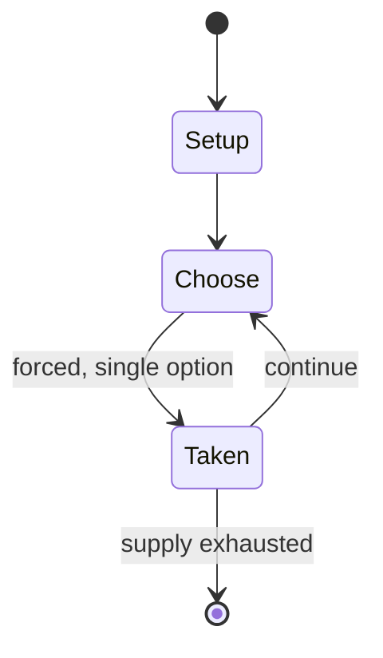

# aizkolaritza

*Basque rural sport; competitive wood-chopping*

`aizkolaritza` &nbsp; state: **DEEPENED** &nbsp; method: **heuristic**

## Found layer (recorded, not trusted)

| field | value |
| --- | --- |
| wikidata | Q2497700 |
| wikipedia | Aizkolaritza |
| genres (source) | -- |
| instance of (source) | traditional sport, type of sport |
| country of origin | Spain |

## Declared layer (orders bench work)

| field | value |
| --- | --- |
| year created | -- |
| epoch | -- |
| region | EUROPE_SOUTH |
| media | SPORT |
| players | -- |
| age band | -- |
| exogenous process | -- |
| loss shape | -- |
| live axes | - |
| horizon | -- |
| scoring shape | RACE_POSITION |
| information | -- |
| interaction | COMPETITIVE |
| turn structure | -- |
| tractability | SAMPLING_ONLY |
| randomness | -- |
| luck factor | 0.35 |
| rules complexity | 1.7 |
| strategic depth | 2.0 |
| novelty | 0.3528 |
| solved status | -- |
| strategies | -- |
| algorithms | -- |

## Object model

```
Episode
  players      : ?
  turn_structure: ?
  horizon       : ?
  scoring       : RACE_POSITION

Pitch          -- bounded physical region
Player         -- embodied agent with a foul count
Clock          -- counts down; stoppages are rule events
Official       -- detects infractions and applies penalties
```

## State transition diagram



## Research item -- turn trace

```
# aizkolaritza -- simulated turn events
# generated from the DECLARED vector, not from a rulebook.
# structure: exo=None loss=None horizon=None scoring=RACE_POSITION axes=-

t=0    SETUP        players=2  pot=0  capacity=3
t=1    FORCED       p1 single legal option taken (pot_gain=+1.4)
t=2    FORCED       p1 single legal option taken (pot_gain=+2.0)
t=3    FORCED       p1 single legal option taken (pot_gain=+0.8)
t=4    FORCED       p1 single legal option taken (pot_gain=+0.9)
t=5    ENDTURN      turn passes to p2
t=6    FORCED       p2 single legal option taken (pot_gain=+0.9)
t=7    FORCED       p2 single legal option taken (pot_gain=+1.3)
t=8    ENDTURN      turn passes to p1
t=9    FORCED       p1 single legal option taken (pot_gain=+0.7)
t=10   ENDTURN      turn passes to p2
t=11   FORCED       p2 single legal option taken (pot_gain=+0.7)
t=12   FORCED       p2 single legal option taken (pot_gain=+0.9)
t=13   FORCED       p2 single legal option taken (pot_gain=+1.4)
t=14   FORCED       p2 single legal option taken (pot_gain=+1.1)
t=15   ENDTURN      turn passes to p1
t=16   FORCED       p1 single legal option taken (pot_gain=+0.5)
t=17   FORCED       p1 single legal option taken (pot_gain=+1.6)
t=18   FORCED       p1 single legal option taken (pot_gain=+1.7)
t=19   ENDTURN      turn passes to p2
t=20   FORCED       p2 single legal option taken (pot_gain=+1.7)
t=21   FORCED       p2 single legal option taken (pot_gain=+1.5)
t=22   FORCED       p2 single legal option taken (pot_gain=+0.7)
t=23   FORCED       p2 single legal option taken (pot_gain=+1.0)
t=24   ENDTURN      turn passes to p1
t=25   FORCED       p1 single legal option taken (pot_gain=+1.6)
t=26   ENDTURN      turn passes to p2

terminal: VARIABLE
```

## Conditions

| kind | threshold | effect | trigger |
| --- | --- | --- | --- |
| BOUNDARY | -- | -- | Competitions are commonly held at most festivals, especially town festivals and usually involve at least two individuals or teams competing against each other. |

## Source extract

Aizkolaritza [ais̻ˈkolaɾiˌts̻a] is the Basque name for a type of wood-chopping competition. They
are a popular form of herri kirol (rural sport) in the Basque Country. Competitions are commonly
held at most festivals, especially town festivals and usually involve at least two individuals
or teams competing against each other.   == The name == The sport is called aizkolaritza in
Basque, from aizkolari "wood-chopper" plus the noun-forming suffix -tza. It is also known as
aizkol jokoa the "axe game". Spanish uses a loanword from Basque, aizcolari and in French the
sport is called coupeurs de bûches.   == Rules ==  The sections of trunk are usually beech
without visible knots from the forests of Navarre. For competitions, the trunk sections closest
to the roots or branches are used as they are of less value to the wood industry. The trunks are
categorised according to their circumference using Basque inches (ontza), equivalent to 0.0254m.
They commonly are used in the following sizes:   The oinbetekoa, 80 ontza, kanakoa and bigger
ones are often used in wagers; the kanaerdikoa, 60 ontza and oinbikoa most commonly in bigger
competitions and arranged in a row, each nailed to planks for s

<sub>Wikipedia, CC BY-SA. Retained as evidence for the structural
classification above. Every rule inferred from it is HYPOTHESIZED
until audited against a rulebook.</sub>
