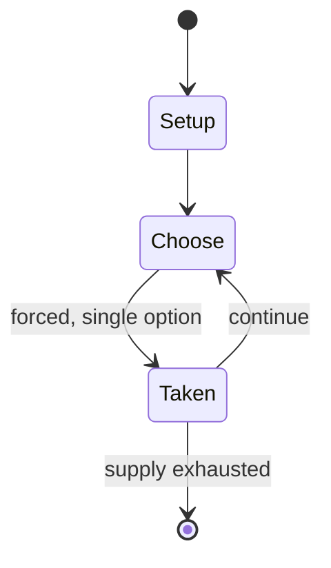

# Alex Kidd in Miracle World

`alex_kidd_in_miracle_world` &nbsp; state: **DEEPENED** &nbsp; method: **heuristic**

## Found layer (recorded, not trusted)

| field | value |
| --- | --- |
| wikidata | Q1354273 |
| wikipedia | Alex Kidd in Miracle World |
| genres (source) | -- |
| instance of (source) | -- |
| country of origin | -- |

## Declared layer (orders bench work)

| field | value |
| --- | --- |
| year created | 1986 |
| epoch | DIGITAL |
| region | -- |
| media | PUZZLE, VIDEO |
| players | -- |
| age band | -- |
| exogenous process | -- |
| loss shape | -- |
| live axes | - |
| horizon | -- |
| scoring shape | -- |
| information | -- |
| interaction | -- |
| turn structure | -- |
| tractability | SAMPLING_ONLY |
| randomness | -- |
| luck factor | 0.35 |
| rules complexity | 1.72 |
| strategic depth | 2.0 |
| novelty | 0.0876 |
| solved status | -- |
| strategies | -- |
| algorithms | -- |

## Object model

```
Episode
  players      : ?
  turn_structure: ?
  horizon       : ?
  scoring       : ?

Configuration  -- the arrangement to be resolved
Constraint     -- predicate a legal configuration must satisfy
WorldState     -- simulation state advanced by the engine
Avatar         -- player-controlled agent
Clock          -- frame or tick counter
```

## State transition diagram



## Research item -- turn trace

```
# Alex Kidd in Miracle World -- simulated turn events
# generated from the DECLARED vector, not from a rulebook.
# structure: exo=None loss=None horizon=None scoring=None axes=-

t=0    SETUP        players=2  pot=0  capacity=4
t=1    FORCED       p1 single legal option taken (pot_gain=+1.9)
t=2    ENDTURN      turn passes to p2
t=3    FORCED       p2 single legal option taken (pot_gain=+1.1)
t=4    FORCED       p2 single legal option taken (pot_gain=+1.8)
t=5    ENDTURN      turn passes to p1
t=6    FORCED       p1 single legal option taken (pot_gain=+1.2)
t=7    FORCED       p1 single legal option taken (pot_gain=+1.9)
t=8    FORCED       p1 single legal option taken (pot_gain=+1.7)
t=9    ENDTURN      turn passes to p2
t=10   FORCED       p2 single legal option taken (pot_gain=+1.2)
t=11   FORCED       p2 single legal option taken (pot_gain=+1.3)
t=12   ENDTURN      turn passes to p1
t=13   FORCED       p1 single legal option taken (pot_gain=+1.5)
t=14   ENDTURN      turn passes to p2
t=15   FORCED       p2 single legal option taken (pot_gain=+1.0)
t=16   FORCED       p2 single legal option taken (pot_gain=+0.8)
t=17   FORCED       p2 single legal option taken (pot_gain=+1.9)
t=18   FORCED       p2 single legal option taken (pot_gain=+0.8)
t=19   ENDTURN      turn passes to p1
t=20   FORCED       p1 single legal option taken (pot_gain=+1.2)
t=21   FORCED       p1 single legal option taken (pot_gain=+1.2)
t=22   FORCED       p1 single legal option taken (pot_gain=+1.0)
t=23   FORCED       p1 single legal option taken (pot_gain=+1.7)
t=24   FORCED       p1 single legal option taken (pot_gain=+1.2)
t=25   FORCED       p1 single legal option taken (pot_gain=+1.4)
t=26   FORCED       p1 single legal option taken (pot_gain=+0.9)

terminal: VARIABLE
```

## Source extract

Alex Kidd in Miracle World is a platform game developed and published by Sega for the Master
System. It was released in Japan on November 1, 1986, followed by North America in December
1986, and Europe in 1987. It was later built into many Master System and Master System II
consoles. A remake developed by Jankenteam and published by Merge Games, titled Alex Kidd in
Miracle World DX, was released on June 22, 2021.   == Gameplay ==  Alex Kidd in Miracle World is
a 2D platform game. The player must finish levels and overcome obstacles and puzzles in both
scrolling and single-screen environments. Throughout the 17 stages, Alex faces many monsters and
the three henchmen of Janken the Great, before facing Janken himself. Alex's punching ability is
used to destroy enemies and to break rocks in order to access new paths and to collect items
such as money which can then be used to purchase other items including vehicles such as
motorbikes and helicopters. At the end of many stages, Alex plays jan-ken-pon (rock-paper-
scissors) with one of Janken's henchmen. Alex dies with one hit, or by losing a game of rock,
paper, scissors. The game has no save system, but by holding the directional pad up

<sub>Wikipedia, CC BY-SA. Retained as evidence for the structural
classification above. Every rule inferred from it is HYPOTHESIZED
until audited against a rulebook.</sub>
