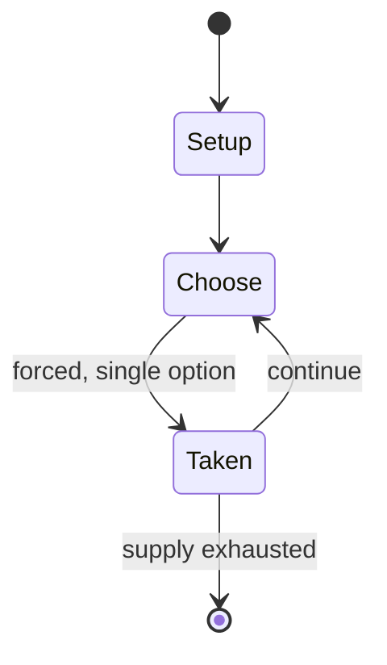

# Alias

*board game*

`alias` &nbsp; state: **DEEPENED** &nbsp; method: **heuristic**

## Found layer (recorded, not trusted)

| field | value |
| --- | --- |
| wikidata | Q1897687 |
| wikipedia | Alias (board game) |
| genres (source) | word game |
| instance of (source) | board game |
| country of origin | Finland |

## Declared layer (orders bench work)

| field | value |
| --- | --- |
| year created | 1989 |
| epoch | DIGITAL |
| region | EUROPE_NORTH |
| media | BOARD, PARTY |
| players | 4-12 |
| age band | -- |
| exogenous process | NONE |
| loss shape | OPPORTUNITY_ONLY |
| live axes | - |
| horizon | -- |
| scoring shape | -- |
| information | PERFECT |
| interaction | TEAM |
| turn structure | STRICT_TURN |
| tractability | EXACT_WITH_CUT |
| randomness | NONE |
| luck factor | 0.02 |
| rules complexity | 1.9 |
| strategic depth | 2.4 |
| novelty | 0.7876 |
| solved status | -- |
| strategies | -- |
| algorithms | -- |

## Object model

```
Episode
  players      : 4-12
  turn_structure: STRICT_TURN
  horizon       : ?
  scoring       : ?

Board          -- spatial substrate; cells carry position and occupancy
Piece          -- movable token owned by a player
```

## State transition diagram



## Research item -- turn trace

```
# Alias -- simulated turn events
# generated from the DECLARED vector, not from a rulebook.
# structure: exo=NONE loss=OPPORTUNITY_ONLY horizon=None scoring=None axes=-

t=0    SETUP        players=4  pot=0  capacity=3
t=1    FORCED       p1 single legal option taken (pot_gain=+1.6)
t=2    FORCED       p1 single legal option taken (pot_gain=+0.7)
t=3    FORCED       p1 single legal option taken (pot_gain=+1.8)
t=4    ENDTURN      turn passes to p2
t=5    FORCED       p2 single legal option taken (pot_gain=+0.8)
t=6    ENDTURN      turn passes to p3
t=7    FORCED       p3 single legal option taken (pot_gain=+0.7)
t=8    ENDTURN      turn passes to p4
t=9    FORCED       p4 single legal option taken (pot_gain=+1.0)
t=10   ENDTURN      turn passes to p1
t=11   FORCED       p1 single legal option taken (pot_gain=+1.0)
t=12   FORCED       p1 single legal option taken (pot_gain=+1.9)
t=13   ENDTURN      turn passes to p2
t=14   FORCED       p2 single legal option taken (pot_gain=+1.5)
t=15   ENDTURN      turn passes to p3
t=16   FORCED       p3 single legal option taken (pot_gain=+0.5)
t=17   FORCED       p3 single legal option taken (pot_gain=+1.7)
t=18   FORCED       p3 single legal option taken (pot_gain=+0.6)
t=19   ENDTURN      turn passes to p4
t=20   FORCED       p4 single legal option taken (pot_gain=+1.1)
t=21   FORCED       p4 single legal option taken (pot_gain=+1.7)
t=22   FORCED       p4 single legal option taken (pot_gain=+1.5)
t=23   FORCED       p4 single legal option taken (pot_gain=+1.8)
t=24   FORCED       p4 single legal option taken (pot_gain=+0.8)
t=25   ENDTURN      turn passes to p1
t=26   FORCED       p1 single legal option taken (pot_gain=+1.8)

terminal: VARIABLE
```

## Conditions

| kind | threshold | effect | trigger |
| --- | --- | --- | --- |
| WIN | -- | -- | The first team to reach the goal wins. |

## Source extract

Alias is a Finnish board game, where the objective is to define words so that other players can
guess them. It is similar to Taboo. However, the only forbidden word in the explanations is the
word to be explained. The game is played in teams of varying size, and fits well as a party game
for larger crowds. The game is very competitive. Alias has been developed in Finland and is
produced by Nelostuote Oy under the brand name Tactic. The game has been on the market since the
early 1990s and is one of the most popular party games in Finland. Over the years, many
different versions of the board game have appeared: As well as the New Alias, the Alias family
currently also includes the Junior Alias for children, the Alias travel game, and as the newest
introduction, DVD Alias.   == The name == The name Alias comes from the word alias, meaning also
known as.   == Basic Alias == The board in Alias is a "path" consisting of sequential curving
numbers on a red background. The game contains 8 numbered groups. The game is divided into turns
of about one minute of length. The teams play in turns, and on each team's turn, one of the team
members has to explain words on word cards to the other te

<sub>Wikipedia, CC BY-SA. Retained as evidence for the structural
classification above. Every rule inferred from it is HYPOTHESIZED
until audited against a rulebook.</sub>
