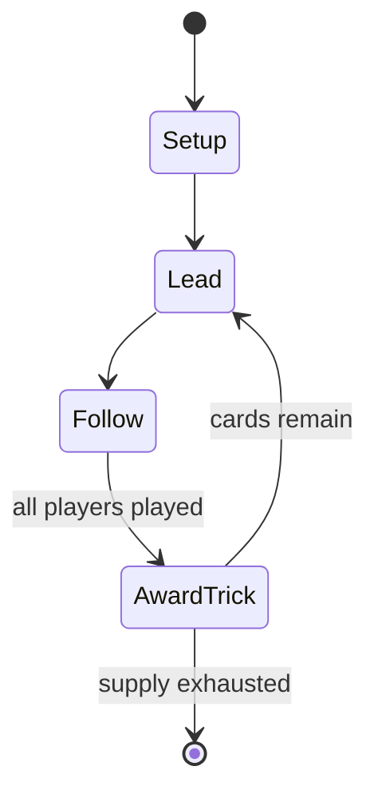

# all fours

*English card game*

`all_fours` &nbsp; state: **DEEPENED** &nbsp; method: **heuristic**

## Found layer (recorded, not trusted)

| field | value |
| --- | --- |
| wikidata | Q3456553 |
| wikipedia | All fours (card game) |
| genres (source) | -- |
| instance of (source) | trick-taking game |
| country of origin | -- |

## Declared layer (orders bench work)

| field | value |
| --- | --- |
| year created | -- |
| epoch | -- |
| region | -- |
| media | CARD, TRICK_TAKING |
| players | 2 |
| age band | -- |
| exogenous process | DEPLETING_DECK |
| loss shape | -- |
| live axes | BID, DISCARD |
| horizon | -- |
| scoring shape | SURVIVAL |
| information | -- |
| interaction | TEAM |
| turn structure | TRICK_ROUND |
| tractability | EXACT_WITH_CUT |
| randomness | DECK_SHUFFLE, DICE |
| luck factor | 0.76 |
| rules complexity | 3.4 |
| strategic depth | 1.83 |
| novelty | 0.8748 |
| solved status | -- |
| strategies | spatial_packing |
| algorithms | -- |

## Object model

```
Episode
  players      : 2
  turn_structure: TRICK_ROUND
  horizon       : ?
  scoring       : SURVIVAL

Deck           -- ordered multiset, drawn without replacement
Hand           -- private multiset held by one player
DiscardPile    -- public accumulation of spent cards
Trick          -- one card per player; a winner is determined
Trump          -- suit that dominates the ordering
Auction        -- priced competition resolving to one winner
DiscardChoice  -- what is given up to satisfy a limit
```

## State transition diagram



## Research item -- turn trace

```
# all fours -- simulated turn events
# generated from the DECLARED vector, not from a rulebook.
# structure: exo=DEPLETING_DECK loss=None horizon=None scoring=SURVIVAL axes=BID,DISCARD

t=0    SETUP        players=2  pot=0  capacity=5
t=1    DRAW         p1 draw from deck -> outcome #1  (p=0.295)
t=2    FORCED       p1 single legal option taken (pot_gain=+1.2)
t=3    DRAW         p1 draw from deck -> outcome #3  (p=0.295)
t=4    FORCED       p1 single legal option taken (pot_gain=+1.9)
t=5    BID          p1 sealed bid of 1 against 1 rivals
t=6    DRAW         p1 draw from deck -> outcome #3  (p=0.242)
t=7    FORCED       p1 single legal option taken (pot_gain=+0.5)
t=8    DISCARD      p1 discards to hand limit
t=9    DRAW         p1 draw from deck -> outcome #5  (p=0.121)
t=10   FORCED       p1 single legal option taken (pot_gain=+2.0)
t=11   DRAW         p1 draw from deck -> outcome #6  (p=0.159)
t=12   FORCED       p1 single legal option taken (pot_gain=+0.7)
t=13   BID          p1 sealed bid of 2 against 1 rivals
t=14   DISCARD      p1 discards to hand limit
t=15   ENDTURN      turn passes to p2
t=16   DRAW         p2 draw from deck -> outcome #5  (p=0.253)
t=17   FORCED       p2 single legal option taken (pot_gain=+1.6)
t=18   BID          p2 sealed bid of 4 against 1 rivals
t=19   DRAW         p2 draw from deck -> outcome #6  (p=0.055)
t=20   FORCED       p2 single legal option taken (pot_gain=+1.0)
t=21   DRAW         p2 draw from deck -> outcome #3  (p=0.037)
t=22   FORCED       p2 single legal option taken (pot_gain=+1.2)
t=23   DISCARD      p2 discards to hand limit
t=24   ENDTURN      turn passes to p1
t=25   DRAW         p1 draw from deck -> outcome #1  (p=0.284)
t=26   FORCED       p1 single legal option taken (pot_gain=+0.9)
t=27   BID          p1 sealed bid of 8 against 1 rivals

terminal: VARIABLE
```

## Conditions

| kind | threshold | effect | trigger |
| --- | --- | --- | --- |
| BOUNDARY | 6 points | -- | In a game with two parties, a maximum of 6 points can accrue in one deal if the dealer turns up a jack and runs the cards. |
| BOUNDARY | -- | -- | A highest bidder who does not win at least as many points as bid is set back the amount of the bid. |
| BOUNDARY | -- | -- | Eldest hand may refuse to sell the right to pitch to the highest bidder, in which case eldest hand must win at least as many points or is set back. |

## Source extract

All fours is a traditional English card game, once popular in pubs and taverns as well as among
the gentry, that flourished as a gambling game until the end of the 19th century. It is a trick-
taking card game that was originally designed for two players, but developed variants for more
players. According to Charles Cotton, the game originated in Kent, but spread to the whole of
England and eventually abroad.  It is the eponymous and earliest recorded game of a family that
flourished most in 19th century North America and whose progeny include pitch, pedro and cinch,
games that even competed with poker and euchre. Nowadays the original game is especially popular
in Trinidad and Tobago, but regional variants have also survived in England. The game's "great
mark of distinction" is that it gave the name 'jack' to the card previously known as the knave.
The game has a number of unusual features. In trick play, players are allowed to trump instead
of following suit even if they could. The title refers to the possibility of winning all four
game points for high, low, jack and game for holding (later winning) the highest and lowest
trump in play and the jack of trumps and for winning the g

<sub>Wikipedia, CC BY-SA. Retained as evidence for the structural
classification above. Every rule inferred from it is HYPOTHESIZED
until audited against a rulebook.</sub>
