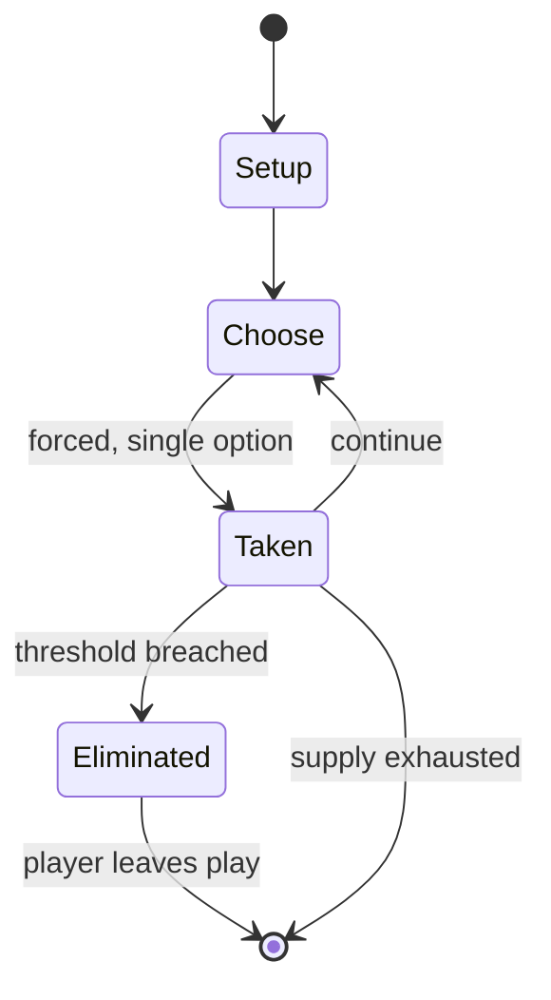

# Alquerque

`alquerque` &nbsp; state: **DEEPENED** &nbsp; method: **heuristic**

## Found layer (recorded, not trusted)

| field | value |
| --- | --- |
| wikidata | Q519071 |
| wikipedia | Alquerque |
| genres (source) | -- |
| instance of (source) | -- |
| country of origin | -- |

## Declared layer (orders bench work)

| field | value |
| --- | --- |
| year created | -- |
| epoch | -- |
| region | -- |
| media | BOARD |
| players | -- |
| age band | -- |
| exogenous process | -- |
| loss shape | ELIMINATION |
| live axes | SPATIAL |
| horizon | -- |
| scoring shape | -- |
| information | -- |
| interaction | SOLITAIRE |
| turn structure | STRICT_TURN |
| tractability | SAMPLING_ONLY |
| randomness | -- |
| luck factor | 0.35 |
| rules complexity | 2.04 |
| strategic depth | 2.0 |
| novelty | 0.5926 |
| solved status | -- |
| strategies | -- |
| algorithms | -- |

## Object model

```
Episode
  players      : ?
  turn_structure: STRICT_TURN
  horizon       : ?
  scoring       : ?

Board          -- spatial substrate; cells carry position and occupancy
Piece          -- movable token owned by a player
Placement      -- position subject to geometric legality
```

## State transition diagram



## Research item -- turn trace

```
# Alquerque -- simulated turn events
# generated from the DECLARED vector, not from a rulebook.
# structure: exo=None loss=ELIMINATION horizon=None scoring=None axes=SPATIAL

t=0    SETUP        players=2  pot=0  capacity=5
t=1    FORCED       p1 single legal option taken (pot_gain=+1.3)
t=2    SPATIAL      p1 places at (7,4); adjacency legal
t=3    FORCED       p1 single legal option taken (pot_gain=+1.6)
t=4    SPATIAL      p1 places at (4,5); adjacency legal
t=5    FORCED       p1 single legal option taken (pot_gain=+1.5)
t=6    FORCED       p1 single legal option taken (pot_gain=+0.7)
t=7    ENDTURN      turn passes to p2
t=8    FORCED       p2 single legal option taken (pot_gain=+0.5)
t=9    ENDTURN      turn passes to p1
t=10   FORCED       p1 single legal option taken (pot_gain=+0.8)
t=11   ENDTURN      turn passes to p2
t=12   FORCED       p2 single legal option taken (pot_gain=+1.9)
t=13   FORCED       p2 single legal option taken (pot_gain=+1.1)
t=14   FORCED       p2 single legal option taken (pot_gain=+1.2)
t=15   SPATIAL      p2 places at (2,3); adjacency legal
t=16   FORCED       p2 single legal option taken (pot_gain=+1.2)
t=17   SPATIAL      p2 places at (7,5); adjacency legal
t=18   ENDTURN      turn passes to p1
t=19   FORCED       p1 single legal option taken (pot_gain=+1.5)
t=20   ENDTURN      turn passes to p2
t=21   FORCED       p2 single legal option taken (pot_gain=+1.1)
t=22   SPATIAL      p2 places at (4,2); adjacency legal
t=23   FORCED       p2 single legal option taken (pot_gain=+0.9)
t=24   SPATIAL      p2 places at (3,2); adjacency legal
t=25   FORCED       p2 single legal option taken (pot_gain=+1.0)
t=26   FORCED       p2 single legal option taken (pot_gain=+1.7)
t=27   ENDTURN      turn passes to p1

terminal: VARIABLE
```

## Conditions

| kind | threshold | effect | trigger |
| --- | --- | --- | --- |
| ELIMINATE | -- | -- | The goal of the game is to eliminate the opponent's pieces. |

## Source extract

Alquerque (also known as al-qirkat from Arabic: القرقات) is a strategy board game that is
thought to have originated in the Middle East. It is considered to be the parent of draughts
(US: checkers) and Fanorona and the diagonals of its grid are the predecessor of the checkering
of the draughts board.   == History ==  The game first appears in literature late in the 10th
century when Abu al-Faraj al-Isfahani mentioned qirkat in his 24-volume work Kitab al-Aghani
("Book of Songs"). This work, however, made no direct mention of the rules of the game, most
likely because it is poetry and they would have been common knowledge in the context the book
originated in. In Board and Table Games from Many Civilizations, R. C. Bell writes that "when
the Moors invaded Spain they took El-quirkat with them". Rules are included in Libro de los
juegos ("Book of games") commissioned by Alfonso X of Castile in the 13th century. Spanish
settlers in New Mexico introduced a four-player variant of alquerque to the Zuni.   == Rules ==
Before starting, each player places their twelve pieces in the two rows closest to them and in
the two rightmost spaces in the center row. The game is played in turns, with

<sub>Wikipedia, CC BY-SA. Retained as evidence for the structural
classification above. Every rule inferred from it is HYPOTHESIZED
until audited against a rulebook.</sub>
