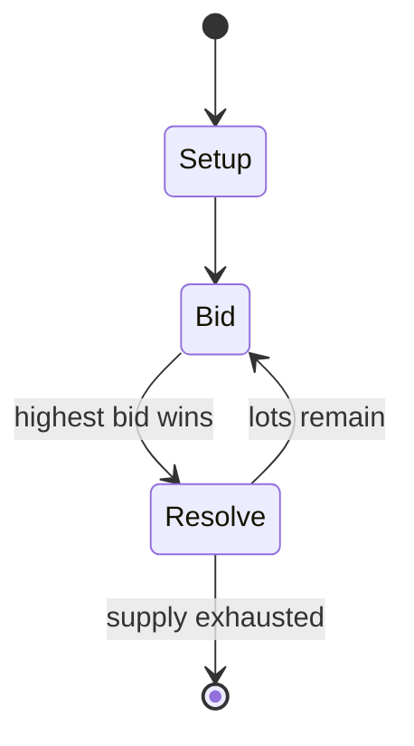

# Amun-Re (board game)

`amun_re_board_game` &nbsp; state: **DEEPENED** &nbsp; method: **heuristic**

## Found layer (recorded, not trusted)

| field | value |
| --- | --- |
| wikidata | Q481568 |
| wikipedia | Amun-Re (board game) |
| genres (source) | -- |
| instance of (source) | -- |
| country of origin | -- |

## Declared layer (orders bench work)

| field | value |
| --- | --- |
| year created | 2003 |
| epoch | CONTEMPORARY |
| region | -- |
| media | BOARD |
| players | -- |
| age band | -- |
| exogenous process | -- |
| loss shape | -- |
| live axes | BID |
| horizon | -- |
| scoring shape | SET_COLLECTION_CONVEX |
| information | ASYMMETRIC |
| interaction | -- |
| turn structure | AUCTION_ROUND |
| tractability | SAMPLING_ONLY |
| randomness | -- |
| luck factor | 0.35 |
| rules complexity | 2.16 |
| strategic depth | 2.25 |
| novelty | 0.6854 |
| solved status | -- |
| strategies | sacrifice |
| algorithms | -- |

## Object model

```
Episode
  players      : ?
  turn_structure: AUCTION_ROUND
  horizon       : ?
  scoring       : SET_COLLECTION_CONVEX

Board          -- spatial substrate; cells carry position and occupancy
Piece          -- movable token owned by a player
Auction        -- priced competition resolving to one winner
```

## State transition diagram



## Research item -- turn trace

```
# Amun-Re (board game) -- simulated turn events
# generated from the DECLARED vector, not from a rulebook.
# structure: exo=None loss=None horizon=None scoring=SET_COLLECTION_CONVEX axes=BID

t=0    SETUP        players=2  pot=0  capacity=5
t=1    FORCED       p1 single legal option taken (pot_gain=+1.8)
t=2    ENDTURN      turn passes to p2
t=3    FORCED       p2 single legal option taken (pot_gain=+1.4)
t=4    FORCED       p2 single legal option taken (pot_gain=+1.7)
t=5    FORCED       p2 single legal option taken (pot_gain=+1.1)
t=6    BID          p2 sealed bid of 4 against 1 rivals
t=7    FORCED       p2 single legal option taken (pot_gain=+1.9)
t=8    BID          p2 sealed bid of 1 against 1 rivals
t=9    FORCED       p2 single legal option taken (pot_gain=+1.8)
t=10   BID          p2 sealed bid of 1 against 1 rivals
t=11   FORCED       p2 single legal option taken (pot_gain=+1.8)
t=12   BID          p2 sealed bid of 3 against 1 rivals
t=13   FORCED       p2 single legal option taken (pot_gain=+1.3)
t=14   BID          p2 sealed bid of 6 against 1 rivals
t=15   FORCED       p2 single legal option taken (pot_gain=+1.8)
t=16   BID          p2 sealed bid of 2 against 1 rivals
t=17   FORCED       p2 single legal option taken (pot_gain=+0.5)
t=18   FORCED       p2 single legal option taken (pot_gain=+0.8)
t=19   ENDTURN      turn passes to p1
t=20   FORCED       p1 single legal option taken (pot_gain=+0.8)
t=21   FORCED       p1 single legal option taken (pot_gain=+1.4)
t=22   BID          p1 sealed bid of 9 against 1 rivals
t=23   ENDTURN      turn passes to p2
t=24   FORCED       p2 single legal option taken (pot_gain=+1.5)
t=25   BID          p2 sealed bid of 2 against 1 rivals
t=26   FORCED       p2 single legal option taken (pot_gain=+0.6)
t=27   BID          p2 sealed bid of 1 against 1 rivals

terminal: VARIABLE
```

## Conditions

| kind | threshold | effect | trigger |
| --- | --- | --- | --- |
| WIN | -- | -- | Points are scored at two instances during the game, at the end of the "Old Kingdom" and at the end of the "New Kingdom", and the player who amasses the most points wins the game. |

## Source extract

Amun-Re is a game designed by Reiner Knizia and first published in 2003 by Hans im Glück in
German and in English by Rio Grande Games. Players are leaders of different Egyptian dynasties
who try to gain influence in 15 provinces of ancient Egypt. Influence and building pyramids
earns points for the players. Points are scored at two instances during the game, at the end of
the "Old Kingdom" and at the end of the "New Kingdom", and the player who amasses the most
points wins the game.   == Gameplay == Amun-Re is played in six rounds, where each round
consists of an auction of provinces, followed by the purchase of "power cards" (for special use
or that give bonuses in scoring), farmers (that generate income), and bricks (which are
converted into pyramids on a three-for-one basis), a sacrifice phase, and then income.  All
prices in auctions, as well as for purchases, are based on the triangular numbers. The number of
provinces available for auction in each round is equal to the number of players, but it is
randomly determined which provinces will be available. Each province gives the player who wins
it different abilities. For example, some provinces can support more farmers, some all

<sub>Wikipedia, CC BY-SA. Retained as evidence for the structural
classification above. Every rule inferred from it is HYPOTHESIZED
until audited against a rulebook.</sub>
