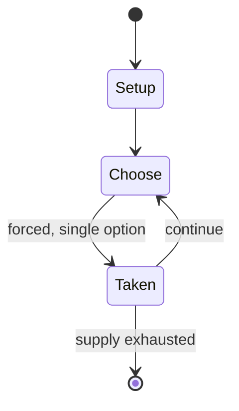

# Andada

*traditional mancala game*

`andada` &nbsp; state: **DEEPENED** &nbsp; method: **heuristic**

## Found layer (recorded, not trusted)

| field | value |
| --- | --- |
| wikidata | Q431840 |
| wikipedia | Andada (game) |
| genres (source) | -- |
| instance of (source) | board game, mancala |
| country of origin | Eritrea |

## Declared layer (orders bench work)

| field | value |
| --- | --- |
| year created | -- |
| epoch | -- |
| region | -- |
| media | MANCALA |
| players | -- |
| age band | -- |
| exogenous process | -- |
| loss shape | -- |
| live axes | - |
| horizon | -- |
| scoring shape | -- |
| information | -- |
| interaction | SOLITAIRE |
| turn structure | STRICT_TURN |
| tractability | SAMPLING_ONLY |
| randomness | -- |
| luck factor | 0.35 |
| rules complexity | 1.76 |
| strategic depth | 2.0 |
| novelty | 0.5164 |
| solved status | -- |
| strategies | -- |
| algorithms | -- |

## Object model

```
Episode
  players      : ?
  turn_structure: STRICT_TURN
  horizon       : ?
  scoring       : ?

Pits           -- cyclic array of counts
Store          -- player's banked seeds
```

## State transition diagram



## Research item -- turn trace

```
# Andada -- simulated turn events
# generated from the DECLARED vector, not from a rulebook.
# structure: exo=None loss=None horizon=None scoring=None axes=-

t=0    SETUP        players=2  pot=0  capacity=8
t=1    FORCED       p1 single legal option taken (pot_gain=+1.7)
t=2    ENDTURN      turn passes to p2
t=3    FORCED       p2 single legal option taken (pot_gain=+1.4)
t=4    FORCED       p2 single legal option taken (pot_gain=+0.6)
t=5    ENDTURN      turn passes to p1
t=6    FORCED       p1 single legal option taken (pot_gain=+1.4)
t=7    ENDTURN      turn passes to p2
t=8    FORCED       p2 single legal option taken (pot_gain=+1.8)
t=9    FORCED       p2 single legal option taken (pot_gain=+1.6)
t=10   FORCED       p2 single legal option taken (pot_gain=+1.3)
t=11   ENDTURN      turn passes to p1
t=12   FORCED       p1 single legal option taken (pot_gain=+0.7)
t=13   FORCED       p1 single legal option taken (pot_gain=+0.9)
t=14   FORCED       p1 single legal option taken (pot_gain=+1.7)
t=15   FORCED       p1 single legal option taken (pot_gain=+1.1)
t=16   FORCED       p1 single legal option taken (pot_gain=+1.0)
t=17   FORCED       p1 single legal option taken (pot_gain=+1.6)
t=18   ENDTURN      turn passes to p2
t=19   FORCED       p2 single legal option taken (pot_gain=+1.0)
t=20   FORCED       p2 single legal option taken (pot_gain=+1.8)
t=21   FORCED       p2 single legal option taken (pot_gain=+1.2)
t=22   ENDTURN      turn passes to p1
t=23   FORCED       p1 single legal option taken (pot_gain=+1.8)
t=24   FORCED       p1 single legal option taken (pot_gain=+1.5)
t=25   FORCED       p1 single legal option taken (pot_gain=+0.6)
t=26   FORCED       p1 single legal option taken (pot_gain=+1.3)
t=27   ENDTURN      turn passes to p2

terminal: VARIABLE
```

## Conditions

| kind | threshold | effect | trigger |
| --- | --- | --- | --- |
| ELIMINATE | 1 player | -- | When no hole holds more than 1 seed, any seed that reaches the end of one player's row will be removed from the game instead of moved to the opponent's row. |
| ELIMINATE | -- | removed | Captured seeds are removed from the game. |
| LOSE | -- | -- | The first player to be without any seeds in his row loses the game. |

## Source extract

Andada is a traditional mancala game played by the Kunama people of western Eritrea. It closely
resembles other mancalas from East Africa such as Enkeshui and Layli Goobalay.   == Rules == The
Andada board comprises two rows of holes; the number of holes per row may vary from 12 to 24,
but is always a multiple of 3. Holes are traditionally called ita (meaning "houses"). At the
beginning, two seeds are placed in each hole. Seeds are called ayla ("cows"). Each player owns
the row of holes closest to him.  The game is opened by a special move made by one of the
players, who will take all seeds from one of his holes and sows them counterclockwise; then
takes the seeds from the hole immediately after the one where the first sowing has ended and
sows them too, and so on, repeating this procedure until all holes have either 3 or 0 seeds.
This will lead the board in one of the following situations (assuming the board has 12 holes per
row):  The opponent then will choose who will move first in the remainder of the game. Players
will then take turns as in other mancalas. At his/her turn, the player takes all seeds from a
hole and sows them counterclockwise. If the last seed falls in a non em

<sub>Wikipedia, CC BY-SA. Retained as evidence for the structural
classification above. Every rule inferred from it is HYPOTHESIZED
until audited against a rulebook.</sub>
