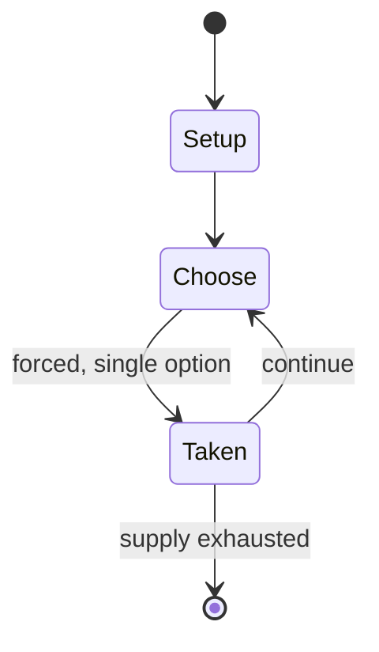

# Andernach chess

*chess variant*

`andernach_chess` &nbsp; state: **DEEPENED** &nbsp; method: **heuristic**

## Found layer (recorded, not trusted)

| field | value |
| --- | --- |
| wikidata | Q1076134 |
| wikipedia | Andernach chess |
| genres (source) | -- |
| instance of (source) | chess variant |
| country of origin | -- |

## Declared layer (orders bench work)

| field | value |
| --- | --- |
| year created | -- |
| epoch | -- |
| region | -- |
| media | - |
| players | -- |
| age band | -- |
| exogenous process | -- |
| loss shape | -- |
| live axes | - |
| horizon | -- |
| scoring shape | -- |
| information | -- |
| interaction | -- |
| turn structure | -- |
| tractability | SAMPLING_ONLY |
| randomness | -- |
| luck factor | 0.35 |
| rules complexity | 1.71 |
| strategic depth | 2.0 |
| novelty | 0.0866 |
| solved status | -- |
| strategies | -- |
| algorithms | -- |

## Object model

```
Episode
  players      : ?
  turn_structure: ?
  horizon       : ?
  scoring       : ?

State          -- opaque; no medium or axis evidence was found
Player         -- an agent that selects among legal successors
```

## State transition diagram



## Research item -- turn trace

```
# Andernach chess -- simulated turn events
# generated from the DECLARED vector, not from a rulebook.
# structure: exo=None loss=None horizon=None scoring=None axes=-

t=0    SETUP        players=2  pot=0  capacity=5
t=1    FORCED       p1 single legal option taken (pot_gain=+1.5)
t=2    ENDTURN      turn passes to p2
t=3    FORCED       p2 single legal option taken (pot_gain=+2.0)
t=4    FORCED       p2 single legal option taken (pot_gain=+1.5)
t=5    FORCED       p2 single legal option taken (pot_gain=+0.5)
t=6    FORCED       p2 single legal option taken (pot_gain=+0.8)
t=7    ENDTURN      turn passes to p1
t=8    FORCED       p1 single legal option taken (pot_gain=+1.7)
t=9    FORCED       p1 single legal option taken (pot_gain=+1.0)
t=10   FORCED       p1 single legal option taken (pot_gain=+0.5)
t=11   FORCED       p1 single legal option taken (pot_gain=+1.0)
t=12   FORCED       p1 single legal option taken (pot_gain=+1.9)
t=13   FORCED       p1 single legal option taken (pot_gain=+1.1)
t=14   ENDTURN      turn passes to p2
t=15   FORCED       p2 single legal option taken (pot_gain=+1.0)
t=16   ENDTURN      turn passes to p1
t=17   FORCED       p1 single legal option taken (pot_gain=+1.6)
t=18   FORCED       p1 single legal option taken (pot_gain=+0.5)
t=19   FORCED       p1 single legal option taken (pot_gain=+1.0)
t=20   FORCED       p1 single legal option taken (pot_gain=+1.4)
t=21   FORCED       p1 single legal option taken (pot_gain=+0.9)
t=22   FORCED       p1 single legal option taken (pot_gain=+0.8)
t=23   FORCED       p1 single legal option taken (pot_gain=+1.4)
t=24   FORCED       p1 single legal option taken (pot_gain=+1.5)
t=25   FORCED       p1 single legal option taken (pot_gain=+1.6)
t=26   FORCED       p1 single legal option taken (pot_gain=+1.7)

terminal: VARIABLE
```

## Source extract

Andernach chess is a chess variant in which a piece making a capture (except kings) changes
colour. For instance, if a white bishop on a2 were to capture a black knight on g8, the result
would be a black bishop on g8. Non-capturing moves are played as in orthodox chess. If a pawn
captures on eighth rank, it is promoted first and then changes colour. The game was named after
the German town of Andernach, which is the site of annual meetings of fairy chess enthusiasts.
It was during the 1993 meeting there that Andernach chess was introduced with a chess problem
composing tournament for Andernach problems. It has since become a popular variant in problem
composition, though it has not yet become popular as a game-playing variant.   == Example
problem ==  An example Andernach chess problem is shown in the diagram. The task is to find a
proof game, which would last three moves and lead to the position shown. The solution is:   1.
Nf3 Nc6 2. Ne5 Nxe5(=wN) The black knight turns into a white knight after capture on e5. White
can now move this knight.  3. Nxd7(=bN) This time a white knight turns into a black knight.
3... Nb8 (see diagram)   == Variations == The precursor of Andernach ches

<sub>Wikipedia, CC BY-SA. Retained as evidence for the structural
classification above. Every rule inferred from it is HYPOTHESIZED
until audited against a rulebook.</sub>
