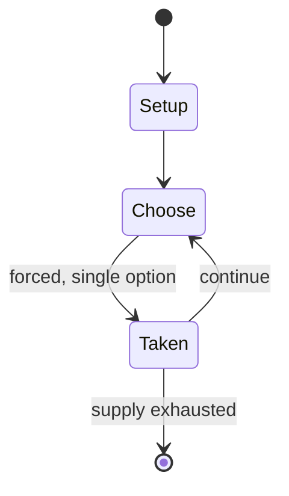

# Angband

*roguelike video game, open source, first release version in 1990, community driven development up to now*

`angband` &nbsp; state: **DEEPENED** &nbsp; method: **heuristic**

## Found layer (recorded, not trusted)

| field | value |
| --- | --- |
| wikidata | Q244140 |
| wikipedia | Angband (video game) |
| genres (source) | roguelike |
| instance of (source) | application software, free software, video game |
| country of origin | United Kingdom |

## Declared layer (orders bench work)

| field | value |
| --- | --- |
| year created | 1990 |
| epoch | DIGITAL |
| region | EUROPE_WEST |
| media | VIDEO |
| players | -- |
| age band | -- |
| exogenous process | -- |
| loss shape | -- |
| live axes | - |
| horizon | -- |
| scoring shape | SURVIVAL |
| information | -- |
| interaction | -- |
| turn structure | -- |
| tractability | SAMPLING_ONLY |
| randomness | HIDDEN_INFO, PROCEDURAL_GENERATION |
| luck factor | 0.35 |
| rules complexity | 1.73 |
| strategic depth | 2.0 |
| novelty | 0.5044 |
| solved status | -- |
| strategies | -- |
| algorithms | -- |

## Object model

```
Episode
  players      : ?
  turn_structure: ?
  horizon       : ?
  scoring       : SURVIVAL

WorldState     -- simulation state advanced by the engine
Avatar         -- player-controlled agent
Clock          -- frame or tick counter
```

## State transition diagram



## Research item -- turn trace

```
# Angband -- simulated turn events
# generated from the DECLARED vector, not from a rulebook.
# structure: exo=None loss=None horizon=None scoring=SURVIVAL axes=-

t=0    SETUP        players=2  pot=0  capacity=8
t=1    FORCED       p1 single legal option taken (pot_gain=+1.0)
t=2    FORCED       p1 single legal option taken (pot_gain=+1.0)
t=3    FORCED       p1 single legal option taken (pot_gain=+1.6)
t=4    ENDTURN      turn passes to p2
t=5    FORCED       p2 single legal option taken (pot_gain=+1.2)
t=6    ENDTURN      turn passes to p1
t=7    FORCED       p1 single legal option taken (pot_gain=+0.9)
t=8    ENDTURN      turn passes to p2
t=9    FORCED       p2 single legal option taken (pot_gain=+0.9)
t=10   FORCED       p2 single legal option taken (pot_gain=+1.0)
t=11   FORCED       p2 single legal option taken (pot_gain=+1.1)
t=12   FORCED       p2 single legal option taken (pot_gain=+0.5)
t=13   ENDTURN      turn passes to p1
t=14   FORCED       p1 single legal option taken (pot_gain=+0.9)
t=15   FORCED       p1 single legal option taken (pot_gain=+0.5)
t=16   FORCED       p1 single legal option taken (pot_gain=+1.0)
t=17   FORCED       p1 single legal option taken (pot_gain=+1.1)
t=18   FORCED       p1 single legal option taken (pot_gain=+0.5)
t=19   FORCED       p1 single legal option taken (pot_gain=+2.0)
t=20   ENDTURN      turn passes to p2
t=21   FORCED       p2 single legal option taken (pot_gain=+0.7)
t=22   FORCED       p2 single legal option taken (pot_gain=+1.1)
t=23   FORCED       p2 single legal option taken (pot_gain=+1.4)
t=24   ENDTURN      turn passes to p1
t=25   FORCED       p1 single legal option taken (pot_gain=+1.7)
t=26   FORCED       p1 single legal option taken (pot_gain=+2.0)

terminal: VARIABLE
```

## Source extract

Angband is a dungeon-crawling roguelike video game derived from Umoria. It is based on the
writings of J. R. R. Tolkien, in which Angband is the fortress of Morgoth. The current version
of Angband is available for all major operating systems, including Unix, Windows, Mac OS X, and
Android. It is identified as one of the "major roguelikes" by John Harris. Angband is a free and
open source game under the GNU GPLv2 or the angband license.   == Gameplay == The goal of
Angband is to survive 100 floor levels of the fortress Angband in order to defeat Morgoth. The
game is reputed to be extremely difficult. The player begins in a town where they can buy
equipment before beginning the descent. Once in the maze-like fortress, the player encounters
traps, monsters, equipment, and hidden doors. With the help of found objects and enchantments,
the player's attack and defense power increases, and can even neutralise specific attacks. The
player also meets characters and finds artifacts from Tolkien's legendarium. Angband gameplay
emphasises combat and careful resource management. The player has a certain amount of health
points. Although Angband records the player's progress to a save file, it d

<sub>Wikipedia, CC BY-SA. Retained as evidence for the structural
classification above. Every rule inferred from it is HYPOTHESIZED
until audited against a rulebook.</sub>
