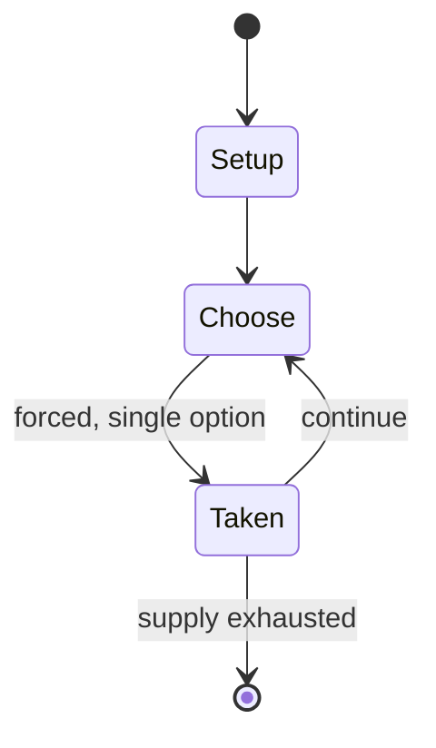

# Ante Over

`ante_over` &nbsp; state: **DEEPENED** &nbsp; method: **heuristic**

## Found layer (recorded, not trusted)

| field | value |
| --- | --- |
| wikidata | Q18205276 |
| wikipedia | Ante Over |
| genres (source) | -- |
| instance of (source) | -- |
| country of origin | -- |

## Declared layer (orders bench work)

| field | value |
| --- | --- |
| year created | -- |
| epoch | -- |
| region | -- |
| media | - |
| players | -- |
| age band | CHILD |
| exogenous process | -- |
| loss shape | -- |
| live axes | - |
| horizon | -- |
| scoring shape | -- |
| information | -- |
| interaction | -- |
| turn structure | -- |
| tractability | SAMPLING_ONLY |
| randomness | -- |
| luck factor | 0.35 |
| rules complexity | 1.85 |
| strategic depth | 2.0 |
| novelty | 0.0914 |
| solved status | -- |
| strategies | -- |
| algorithms | -- |

## Object model

```
Episode
  players      : ?
  turn_structure: ?
  horizon       : ?
  scoring       : ?

State          -- opaque; no medium or axis evidence was found
Player         -- an agent that selects among legal successors
```

## State transition diagram



## Research item -- turn trace

```
# Ante Over -- simulated turn events
# generated from the DECLARED vector, not from a rulebook.
# structure: exo=None loss=None horizon=None scoring=None axes=-

t=0    SETUP        players=2  pot=0  capacity=6
t=1    FORCED       p1 single legal option taken (pot_gain=+0.7)
t=2    FORCED       p1 single legal option taken (pot_gain=+0.7)
t=3    FORCED       p1 single legal option taken (pot_gain=+0.6)
t=4    ENDTURN      turn passes to p2
t=5    FORCED       p2 single legal option taken (pot_gain=+1.4)
t=6    FORCED       p2 single legal option taken (pot_gain=+1.1)
t=7    FORCED       p2 single legal option taken (pot_gain=+1.9)
t=8    FORCED       p2 single legal option taken (pot_gain=+1.5)
t=9    ENDTURN      turn passes to p1
t=10   FORCED       p1 single legal option taken (pot_gain=+1.3)
t=11   FORCED       p1 single legal option taken (pot_gain=+1.4)
t=12   FORCED       p1 single legal option taken (pot_gain=+1.2)
t=13   FORCED       p1 single legal option taken (pot_gain=+0.6)
t=14   ENDTURN      turn passes to p2
t=15   FORCED       p2 single legal option taken (pot_gain=+1.7)
t=16   FORCED       p2 single legal option taken (pot_gain=+0.7)
t=17   FORCED       p2 single legal option taken (pot_gain=+0.7)
t=18   FORCED       p2 single legal option taken (pot_gain=+0.6)
t=19   FORCED       p2 single legal option taken (pot_gain=+1.6)
t=20   ENDTURN      turn passes to p1
t=21   FORCED       p1 single legal option taken (pot_gain=+2.0)
t=22   FORCED       p1 single legal option taken (pot_gain=+2.0)
t=23   FORCED       p1 single legal option taken (pot_gain=+0.8)
t=24   FORCED       p1 single legal option taken (pot_gain=+1.1)
t=25   FORCED       p1 single legal option taken (pot_gain=+1.7)
t=26   ENDTURN      turn passes to p2

terminal: VARIABLE
```

## Conditions

| kind | threshold | effect | trigger |
| --- | --- | --- | --- |
| BOUNDARY | -- | -- | Ante Over (also known as Andy I Over, Andy Over, Annie, Annie Over, Annie, Annie Over the Shanty, Anti-Anti-I-Over, Nicky Nicky Nee) is a children's game played in the United States and Canada, dating back to at least th |

## Source extract

Ante Over (also known as Andy I Over, Andy Over, Annie, Annie Over, Annie, Annie Over the
Shanty, Anti-Anti-I-Over, Nicky Nicky Nee)  is a children's game played in the United States and
Canada, dating back to at least the mid-nineteenth century. The game requires a ball or any
other small object and a barrier (such as a small building) between the two teams over which the
ball is thrown.    == Basic play == There are two teams, one on each side of the barrier. A
player on the team that starts with the ball throws the ball over the barrier to the other team,
yelling some version of "Ante Over" to warn them that it has been thrown. If the other team
fails to catch the ball before it hits the ground, then they will yell "Ante Over" and throw it
back. If the team that is thrown to catches the ball, then the player holding the ball and this
team run around the building and attempt to hit one of the members of the opposing team with the
ball. Players are "safe" if they succeed in running around the building without being hit. If a
player is hit, they then join the team of the player who hit them with the ball. Play continues
until one team has all of the players  or just one is left. In

<sub>Wikipedia, CC BY-SA. Retained as evidence for the structural
classification above. Every rule inferred from it is HYPOTHESIZED
until audited against a rulebook.</sub>
