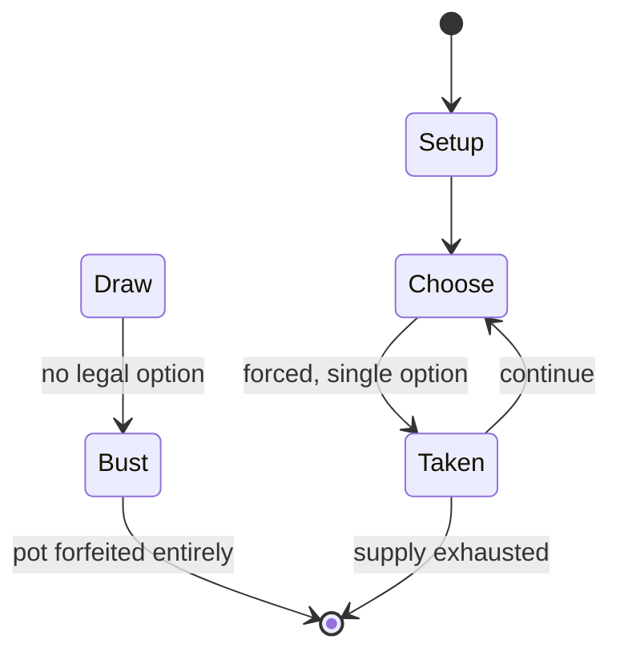

# antichess

*chess variant whose goal is to lose pieces*

`antichess` &nbsp; state: **DEEPENED** &nbsp; method: **heuristic**

## Found layer (recorded, not trusted)

| field | value |
| --- | --- |
| wikidata | Q1003361 |
| wikipedia | Losing chess |
| genres (source) | -- |
| instance of (source) | chess variant, solved game |
| country of origin | -- |

## Declared layer (orders bench work)

| field | value |
| --- | --- |
| year created | -- |
| epoch | -- |
| region | -- |
| media | - |
| players | -- |
| age band | -- |
| exogenous process | -- |
| loss shape | TOTAL_RUIN |
| live axes | ORDER |
| horizon | -- |
| scoring shape | WINNER_TAKE_ALL |
| information | -- |
| interaction | SOLITAIRE |
| turn structure | -- |
| tractability | EXACT |
| randomness | DICE |
| luck factor | 0.05 |
| rules complexity | 2.13 |
| strategic depth | 1.4 |
| novelty | 0.9012 |
| solved status | SOLVED_STRONG |
| strategies | -- |
| algorithms | -- |

## Object model

```
Episode
  players      : ?
  turn_structure: ?
  horizon       : ?
  scoring       : WINNER_TAKE_ALL

Sequence       -- the permutation under the player's control
```

## State transition diagram



## Research item -- turn trace

```
# antichess -- simulated turn events
# generated from the DECLARED vector, not from a rulebook.
# structure: exo=None loss=TOTAL_RUIN horizon=None scoring=WINNER_TAKE_ALL axes=ORDER

t=0    SETUP        players=2  pot=0  capacity=4
t=1    FORCED       p1 single legal option taken (pot_gain=+1.8)
t=2    ENDTURN      turn passes to p2
t=3    FORCED       p2 single legal option taken (pot_gain=+1.9)
t=4    ENDTURN      turn passes to p1
t=5    FORCED       p1 single legal option taken (pot_gain=+1.6)
t=6    ENDTURN      turn passes to p2
t=7    FORCED       p2 single legal option taken (pot_gain=+0.7)
t=8    FORCED       p2 single legal option taken (pot_gain=+0.6)
t=9    FORCED       p2 single legal option taken (pot_gain=+1.9)
t=10   ENDTURN      turn passes to p1
t=11   FORCED       p1 single legal option taken (pot_gain=+1.1)
t=12   ENDTURN      turn passes to p2
t=13   FORCED       p2 single legal option taken (pot_gain=+0.7)
t=14   FORCED       p2 single legal option taken (pot_gain=+1.7)
t=15   ENDTURN      turn passes to p1
t=16   FORCED       p1 single legal option taken (pot_gain=+0.8)
t=17   FORCED       p1 single legal option taken (pot_gain=+1.1)
t=18   FORCED       p1 single legal option taken (pot_gain=+1.7)
t=19   FORCED       p1 single legal option taken (pot_gain=+0.9)
t=20   FORCED       p1 single legal option taken (pot_gain=+1.7)
t=21   FORCED       p1 single legal option taken (pot_gain=+1.7)
t=22   FORCED       p1 single legal option taken (pot_gain=+1.9)
t=23   FORCED       p1 single legal option taken (pot_gain=+1.4)
t=24   FORCED       p1 single legal option taken (pot_gain=+1.9)
t=25   FORCED       p1 single legal option taken (pot_gain=+0.6)
t=26   FORCED       p1 single legal option taken (pot_gain=+0.8)

terminal: VARIABLE
```

## Source extract

Losing chess is one of the most popular chess variants. The objective of each player is to lose
all of their pieces or be stalemated. Players must make a capturing move if they are able to. In
some variations, a player may also win by checkmating or by being checkmated.   == Rules (main
variant) == The rules are the same as those for standard chess, except for the following special
rules:  Capturing is compulsory. When more than one capture is available, the capturing player
may choose. The king has no royal power, being effectively replaced by a mann, and accordingly:
it may be captured like any other piece; there is no check or checkmate; therefore the king may
expose itself to capture; there is no castling; a pawn may also be promoted to a king. A player
wins if all of their pieces have been taken, or if they are otherwise unable to make any legal
moves (stalemate). Draws by repetition, agreement, or the fifty-move rule work as in standard
chess. Positions when neither player can win are also draws: for example, when the only pieces
remaining are bishops of opposite colors. (This is similar to the dead position rule in standard
chess.)   == History == The origin of the game is u

<sub>Wikipedia, CC BY-SA. Retained as evidence for the structural
classification above. Every rule inferred from it is HYPOTHESIZED
until audited against a rulebook.</sub>
