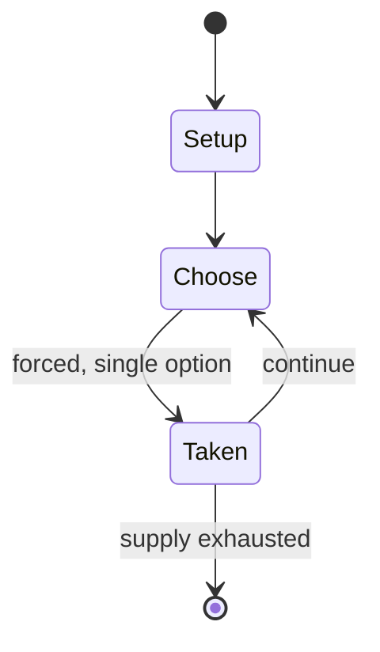

# Anywoli

*traditional mancala game*

`anywoli` &nbsp; state: **DEEPENED** &nbsp; method: **heuristic**

## Found layer (recorded, not trusted)

| field | value |
| --- | --- |
| wikidata | Q3620522 |
| wikipedia | Anywoli |
| genres (source) | -- |
| instance of (source) | board game, mancala |
| country of origin | -- |

## Declared layer (orders bench work)

| field | value |
| --- | --- |
| year created | -- |
| epoch | -- |
| region | -- |
| media | BOARD, MANCALA |
| players | -- |
| age band | -- |
| exogenous process | -- |
| loss shape | -- |
| live axes | - |
| horizon | -- |
| scoring shape | -- |
| information | -- |
| interaction | -- |
| turn structure | STRICT_TURN |
| tractability | SAMPLING_ONLY |
| randomness | -- |
| luck factor | 0.35 |
| rules complexity | 1.73 |
| strategic depth | 2.0 |
| novelty | 0.4324 |
| solved status | -- |
| strategies | -- |
| algorithms | -- |

## Object model

```
Episode
  players      : ?
  turn_structure: STRICT_TURN
  horizon       : ?
  scoring       : ?

Board          -- spatial substrate; cells carry position and occupancy
Piece          -- movable token owned by a player
Pits           -- cyclic array of counts
Store          -- player's banked seeds
```

## State transition diagram



## Research item -- turn trace

```
# Anywoli -- simulated turn events
# generated from the DECLARED vector, not from a rulebook.
# structure: exo=None loss=None horizon=None scoring=None axes=-

t=0    SETUP        players=2  pot=0  capacity=4
t=1    FORCED       p1 single legal option taken (pot_gain=+1.6)
t=2    FORCED       p1 single legal option taken (pot_gain=+1.7)
t=3    FORCED       p1 single legal option taken (pot_gain=+0.7)
t=4    ENDTURN      turn passes to p2
t=5    FORCED       p2 single legal option taken (pot_gain=+1.0)
t=6    FORCED       p2 single legal option taken (pot_gain=+1.3)
t=7    ENDTURN      turn passes to p1
t=8    FORCED       p1 single legal option taken (pot_gain=+1.7)
t=9    FORCED       p1 single legal option taken (pot_gain=+1.2)
t=10   ENDTURN      turn passes to p2
t=11   FORCED       p2 single legal option taken (pot_gain=+1.4)
t=12   ENDTURN      turn passes to p1
t=13   FORCED       p1 single legal option taken (pot_gain=+1.4)
t=14   FORCED       p1 single legal option taken (pot_gain=+1.2)
t=15   ENDTURN      turn passes to p2
t=16   FORCED       p2 single legal option taken (pot_gain=+1.1)
t=17   FORCED       p2 single legal option taken (pot_gain=+1.5)
t=18   FORCED       p2 single legal option taken (pot_gain=+1.6)
t=19   FORCED       p2 single legal option taken (pot_gain=+1.9)
t=20   FORCED       p2 single legal option taken (pot_gain=+1.1)
t=21   ENDTURN      turn passes to p1
t=22   FORCED       p1 single legal option taken (pot_gain=+1.5)
t=23   FORCED       p1 single legal option taken (pot_gain=+1.5)
t=24   FORCED       p1 single legal option taken (pot_gain=+1.5)
t=25   FORCED       p1 single legal option taken (pot_gain=+1.0)
t=26   FORCED       p1 single legal option taken (pot_gain=+0.8)

terminal: VARIABLE
```

## Conditions

| kind | threshold | effect | trigger |
| --- | --- | --- | --- |
| ELIMINATE | -- | removed | Capture occurs whenever, during play, a hole holds exactly four seeds: those seeds are removed from the game, and taken by the player who owns the hole. |
| TERMINATE | -- | -- | The sowing ends when the last seed falls in an empty hole or when a capture occurs. |
| TERMINATE | -- | -- | When only 8 seeds are left on a board, the player who moved first at the beginning of the game captures them and the game ends. |

## Source extract

Anywoli is a traditional mancala game played by the Anuak people of the Gambela province, in
Ethiopia, as well as in the Akobo, Pochalla and Jokau regions of Sudan. The name of the game
means "bringing to life" ("giving birth"). Anywoli has similarities to mancalas found in Nigeria
and Ghana, such as Ba-awa and Obridjie.   == Rules == The board used to play Anywoli has two
rows of twelve holes each. Anuak call these holes "oto" (pl.: "udi"), meaning "house". At game
setup, four seeds are placed in each hole. Seeds are called "nyibaré", meaning "children (sons)
of the board game".  Players take turns; each owns one of the rows. At his or her turn, the
player takes all the seeds from one of his/her holes and relay sows them counterclockwise. The
sowing ends when the last seed falls in an empty hole or when a capture occurs. Capture occurs
whenever, during play, a hole holds exactly four seeds: those seeds are removed from the game,
and taken by the player who owns the hole. In the special case where the last seed of a sowing
is placed in a hole holding three seeds (thus forming a four-seed hole), the captured seeds are
taken by the player who is moving, independent of who owns the ho

<sub>Wikipedia, CC BY-SA. Retained as evidence for the structural
classification above. Every rule inferred from it is HYPOTHESIZED
until audited against a rulebook.</sub>
