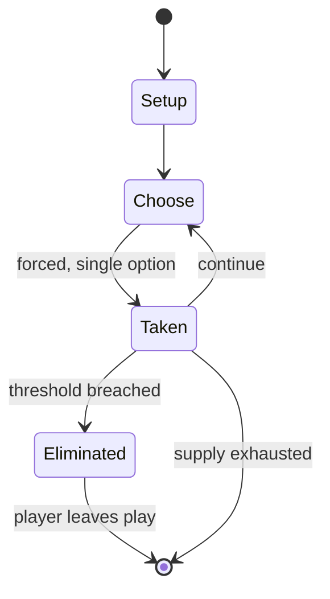

# Arcola, The Battle for Italy 1796

*board wargame published in 1979*

`arcola_the_battle_for_italy_1796` &nbsp; state: **DEEPENED** &nbsp; method: **heuristic**

## Found layer (recorded, not trusted)

| field | value |
| --- | --- |
| wikidata | Q110654694 |
| wikipedia | Arcola, The Battle for Italy 1796 |
| genres (source) | -- |
| instance of (source) | board wargame |
| country of origin | -- |

## Declared layer (orders bench work)

| field | value |
| --- | --- |
| year created | 1979 |
| epoch | DIGITAL |
| region | -- |
| media | WARGAME |
| players | -- |
| age band | -- |
| exogenous process | -- |
| loss shape | ELIMINATION |
| live axes | TIMING |
| horizon | -- |
| scoring shape | -- |
| information | ASYMMETRIC |
| interaction | COMPETITIVE |
| turn structure | -- |
| tractability | SAMPLING_ONLY |
| randomness | DICE |
| luck factor | 0.58 |
| rules complexity | 3.33 |
| strategic depth | 2.12 |
| novelty | 0.6102 |
| solved status | -- |
| strategies | tempo |
| algorithms | -- |

## Object model

```
Episode
  players      : ?
  turn_structure: ?
  horizon       : ?
  scoring       : ?

Initiative     -- who acts, and when, relative to others
```

## State transition diagram



## Research item -- turn trace

```
# Arcola, The Battle for Italy 1796 -- simulated turn events
# generated from the DECLARED vector, not from a rulebook.
# structure: exo=None loss=ELIMINATION horizon=None scoring=None axes=TIMING

t=0    SETUP        players=2  pot=0  capacity=3
t=1    FORCED       p1 single legal option taken (pot_gain=+0.6)
t=2    FORCED       p1 single legal option taken (pot_gain=+0.9)
t=3    FORCED       p1 single legal option taken (pot_gain=+1.1)
t=4    ENDTURN      turn passes to p2
t=5    FORCED       p2 single legal option taken (pot_gain=+0.9)
t=6    FORCED       p2 single legal option taken (pot_gain=+1.4)
t=7    FORCED       p2 single legal option taken (pot_gain=+0.8)
t=8    FORCED       p2 single legal option taken (pot_gain=+1.9)
t=9    ENDTURN      turn passes to p1
t=10   FORCED       p1 single legal option taken (pot_gain=+1.5)
t=11   FORCED       p1 single legal option taken (pot_gain=+1.2)
t=12   FORCED       p1 single legal option taken (pot_gain=+2.0)
t=13   ENDTURN      turn passes to p2
t=14   FORCED       p2 single legal option taken (pot_gain=+0.8)
t=15   FORCED       p2 single legal option taken (pot_gain=+0.7)
t=16   ENDTURN      turn passes to p1
t=17   FORCED       p1 single legal option taken (pot_gain=+1.6)
t=18   ENDTURN      turn passes to p2
t=19   FORCED       p2 single legal option taken (pot_gain=+0.6)
t=20   FORCED       p2 single legal option taken (pot_gain=+1.0)
t=21   FORCED       p2 single legal option taken (pot_gain=+1.7)
t=22   ENDTURN      turn passes to p1
t=23   FORCED       p1 single legal option taken (pot_gain=+1.4)
t=24   FORCED       p1 single legal option taken (pot_gain=+1.6)
t=25   ENDTURN      turn passes to p2
t=26   FORCED       p2 single legal option taken (pot_gain=+0.5)

terminal: VARIABLE
```

## Source extract

Arcola, The Battle for Italy 1796 is a board wargame published by Operational Studies Group
(OSG) in 1979 and republished by Avalon Hill in 1983 that is a simulation of the Battle of
Arcola between French and Austrian forces in 1796. The game was designed to tempt players to
purchase OSG's previously published and larger wargame Napoleon in Italy.   == Background == In
Italy in 1796, French forces under Napoleon Bonaparte had besieged the Austrian-held city of
Mantua.  Austrian commander József Alvinczi led a two-pronged attack to try to break the siege.
Napoleon, in a risky move, divided his forces to try to meet and defeat both prongs of
Alvinczi's attack.   == Description == Arcola is a two-player microgame in which one player
controls French forces, and the other controls the Austrian forces. Unlike many board wargames,
where all the unit counters are placed on the map, in Arcola, only the leaders are put on the
map. The units they are leading are put on an organizational chart   === Components === The
original OSG edition, packaged in a ziplock bag, contains:  11" x 17" paper hex grid map scaled
at 3.2 km (2 mi) per hex 100 counters 8-page rule booklet   === Gameplay === The g

<sub>Wikipedia, CC BY-SA. Retained as evidence for the structural
classification above. Every rule inferred from it is HYPOTHESIZED
until audited against a rulebook.</sub>
