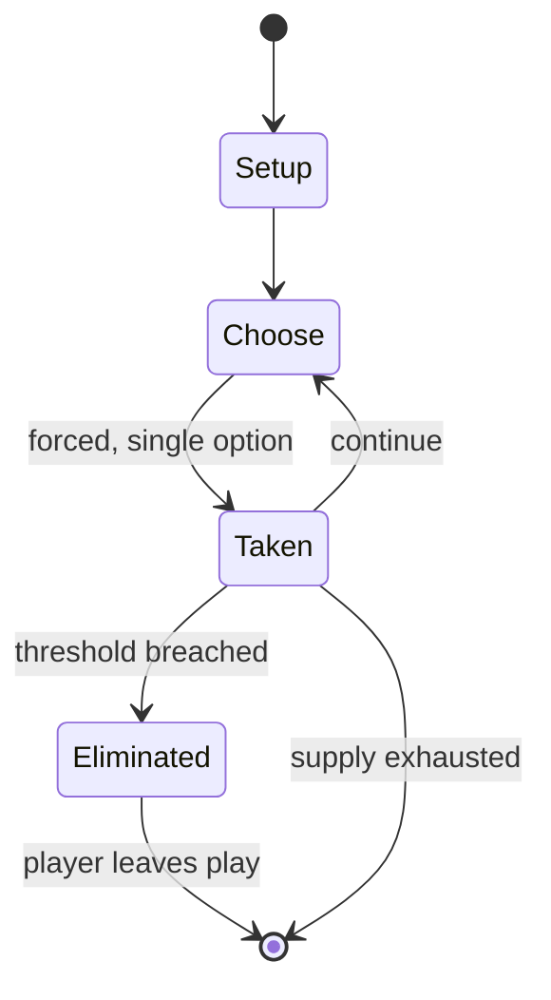

# Are you there, Moriarty?

*parlour game*

`are_you_there_moriarty` &nbsp; state: **DEEPENED** &nbsp; method: **heuristic**

## Found layer (recorded, not trusted)

| field | value |
| --- | --- |
| wikidata | Q4788501 |
| wikipedia | Are you there, Moriarty? |
| genres (source) | -- |
| instance of (source) | parlour game, party game |
| country of origin | -- |

## Declared layer (orders bench work)

| field | value |
| --- | --- |
| year created | -- |
| epoch | -- |
| region | -- |
| media | PARTY |
| players | -- |
| age band | -- |
| exogenous process | -- |
| loss shape | ELIMINATION |
| live axes | COMMIT_BLIND |
| horizon | -- |
| scoring shape | -- |
| information | -- |
| interaction | COMPETITIVE |
| turn structure | -- |
| tractability | SAMPLING_ONLY |
| randomness | -- |
| luck factor | 0.35 |
| rules complexity | 2.03 |
| strategic depth | 2.0 |
| novelty | 0.5098 |
| solved status | -- |
| strategies | -- |
| algorithms | -- |

## Object model

```
Episode
  players      : ?
  turn_structure: ?
  horizon       : ?
  scoring       : ?

SealedChoice   -- irrevocable choice made without observation
```

## State transition diagram



## Research item -- turn trace

```
# Are you there, Moriarty? -- simulated turn events
# generated from the DECLARED vector, not from a rulebook.
# structure: exo=None loss=ELIMINATION horizon=None scoring=None axes=COMMIT_BLIND

t=0    SETUP        players=2  pot=0  capacity=7
t=1    FORCED       p1 single legal option taken (pot_gain=+1.1)
t=2    FORCED       p1 single legal option taken (pot_gain=+1.3)
t=3    ENDTURN      turn passes to p2
t=4    FORCED       p2 single legal option taken (pot_gain=+1.9)
t=5    FORCED       p2 single legal option taken (pot_gain=+0.6)
t=6    FORCED       p2 single legal option taken (pot_gain=+1.3)
t=7    ENDTURN      turn passes to p1
t=8    FORCED       p1 single legal option taken (pot_gain=+1.2)
t=9    FORCED       p1 single legal option taken (pot_gain=+0.7)
t=10   ENDTURN      turn passes to p2
t=11   FORCED       p2 single legal option taken (pot_gain=+0.8)
t=12   FORCED       p2 single legal option taken (pot_gain=+0.6)
t=13   FORCED       p2 single legal option taken (pot_gain=+0.9)
t=14   ENDTURN      turn passes to p1
t=15   FORCED       p1 single legal option taken (pot_gain=+1.0)
t=16   FORCED       p1 single legal option taken (pot_gain=+0.7)
t=17   FORCED       p1 single legal option taken (pot_gain=+1.0)
t=18   ENDTURN      turn passes to p2
t=19   FORCED       p2 single legal option taken (pot_gain=+1.6)
t=20   FORCED       p2 single legal option taken (pot_gain=+1.4)
t=21   FORCED       p2 single legal option taken (pot_gain=+1.5)
t=22   FORCED       p2 single legal option taken (pot_gain=+1.2)
t=23   FORCED       p2 single legal option taken (pot_gain=+1.4)
t=24   FORCED       p2 single legal option taken (pot_gain=+1.5)
t=25   ENDTURN      turn passes to p1
t=26   FORCED       p1 single legal option taken (pot_gain=+1.5)

terminal: VARIABLE
```

## Conditions

| kind | threshold | effect | trigger |
| --- | --- | --- | --- |
| ELIMINATE | -- | eliminated | The first player to be hit is eliminated from the game and another player takes their place. |

## Source extract

Are you there Moriarty? is a parlour game in which two players at a time participate in a duel
of sorts.  Each player is blindfolded and given a rolled up newspaper (or anything that comes
handy and is not likely to injure) to use as a weapon.  The players then lie on their fronts
head to head with about three feet (one metre) of space between them – or in other versions hold
outstretched hands, or stand holding hands as in a handshake. The starting player says "Are you
there Moriarty?".  The other player, when ready, says "Yes".  At this point the start player
attempts to hit the other player with their newspaper by swinging it over their head.  The other
player then attempts to hit the starting player with their newspaper.  The first player to be
hit is eliminated from the game and another player takes their place.  The objective of the game
is to remain in the game as long as possible. There is a certain element of tactics to the game.
In order to avoid being hit, each player may roll to one side or the other.  The decision of
which direction to roll, or whether to roll at all often determines whether the player is hit by
his opponent.  A player who can quickly roll out of the

<sub>Wikipedia, CC BY-SA. Retained as evidence for the structural
classification above. Every rule inferred from it is HYPOTHESIZED
until audited against a rulebook.</sub>
