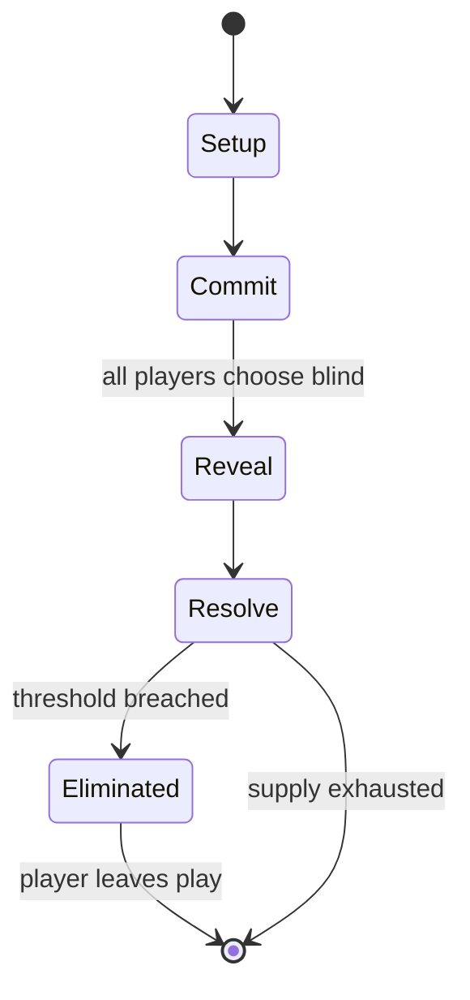

# Arimaa

`arimaa` &nbsp; state: **DEEPENED** &nbsp; method: **heuristic**

## Found layer (recorded, not trusted)

| field | value |
| --- | --- |
| wikidata | Q238950 |
| wikipedia | Arimaa |
| genres (source) | -- |
| instance of (source) | -- |
| country of origin | -- |

## Declared layer (orders bench work)

| field | value |
| --- | --- |
| year created | 1997 |
| epoch | DIGITAL |
| region | -- |
| media | ABSTRACT, BOARD, DEXTERITY |
| players | -- |
| age band | -- |
| exogenous process | NONE |
| loss shape | ELIMINATION |
| live axes | SPATIAL, TRADE |
| horizon | -- |
| scoring shape | -- |
| information | SIMULTANEOUS |
| interaction | COMPETITIVE |
| turn structure | SIMULTANEOUS |
| tractability | EXACT_WITH_CUT |
| randomness | SIMULTANEOUS_CHOICE |
| luck factor | 0.05 |
| rules complexity | 2.78 |
| strategic depth | 2.5 |
| novelty | 0.7294 |
| solved status | -- |
| strategies | route_optimisation, sacrifice |
| algorithms | alpha_zero_self_play, heuristic_evaluation |

## Object model

```
Episode
  players      : ?
  turn_structure: SIMULTANEOUS
  horizon       : ?
  scoring       : ?

Board          -- spatial substrate; cells carry position and occupancy
Piece          -- movable token owned by a player
Placement      -- position subject to geometric legality
Offer          -- proposed exchange between two agents
```

## State transition diagram



## Research item -- turn trace

```
# Arimaa -- simulated turn events
# generated from the DECLARED vector, not from a rulebook.
# structure: exo=NONE loss=ELIMINATION horizon=None scoring=None axes=SPATIAL,TRADE

t=0    SETUP        players=2  pot=0  capacity=3
t=1    FORCED       p1 single legal option taken (pot_gain=+1.5)
t=2    TRADE        p1 offers 2:1 exchange to p2
t=3    ENDTURN      turn passes to p2
t=4    FORCED       p2 single legal option taken (pot_gain=+1.7)
t=5    TRADE        p2 offers 2:1 exchange to p1
t=6    SPATIAL      p2 places at (3,7); adjacency legal
t=7    FORCED       p2 single legal option taken (pot_gain=+1.8)
t=8    FORCED       p2 single legal option taken (pot_gain=+0.5)
t=9    TRADE        p2 offers 2:1 exchange to p1
t=10   SPATIAL      p2 places at (6,0); adjacency legal
t=11   ENDTURN      turn passes to p1
t=12   FORCED       p1 single legal option taken (pot_gain=+0.9)
t=13   SPATIAL      p1 places at (6,0); adjacency legal
t=14   ENDTURN      turn passes to p2
t=15   FORCED       p2 single legal option taken (pot_gain=+1.6)
t=16   TRADE        p2 offers 2:1 exchange to p1
t=17   FORCED       p2 single legal option taken (pot_gain=+0.8)
t=18   SPATIAL      p2 places at (4,2); adjacency legal
t=19   FORCED       p2 single legal option taken (pot_gain=+1.6)
t=20   SPATIAL      p2 places at (4,1); adjacency legal
t=21   FORCED       p2 single legal option taken (pot_gain=+1.3)
t=22   FORCED       p2 single legal option taken (pot_gain=+0.9)
t=23   SPATIAL      p2 places at (7,1); adjacency legal
t=24   ENDTURN      turn passes to p1
t=25   FORCED       p1 single legal option taken (pot_gain=+1.9)
t=26   TRADE        p1 offers 2:1 exchange to p2
t=27   SPATIAL      p1 places at (4,3); adjacency legal

terminal: VARIABLE
```

## Conditions

| kind | threshold | effect | trigger |
| --- | --- | --- | --- |
| ELIMINATE | -- | -- | The game can also be won by capturing all of the opponent's rabbits (elimination) or by depriving the opponent of legal moves (immobilization). |
| ELIMINATE | -- | -- | A piece which enters a trap square is captured and removed from the game unless there is a friendly piece orthogonally adjacent. |
| ELIMINATE | -- | -- | Furthermore, a "hostage fork" is when a piece is taken hostage in between two traps, and can taken out of the game from either direction in four move steps. |
| WIN | -- | -- | (In competition, in order to avoid drawn games, the player who captures the eight opposing rabbits wins the game.) |
| LOSE | -- | -- | Immobilization: if, at the beginning of its turn, a player cannot make any step because all of its pieces are frozen or blocked, that player loses the game. |
| LOSE | -- | -- | Repetition: if the same position occurs three times, the player who causes the repetition by ending their turn loses the game. |

## Source extract

Arimaa   (ə-REE-mə) is a two-player strategy board game that was designed to be playable with a
standard chess set and difficult for computers while still being easy to learn and fun to play
for humans. It was invented between 1997 and 2002 by Omar Syed. Arimaa is a complex abstract
strategy game and after decades of play, a body of theory has developed among high level
players, along with a few books on the game. Arimaa has also developed a community on the
internet, where tournaments are played.  An Indian-American computer engineer trained in
artificial intelligence, Omar Syed was inspired to design a new game by Garry Kasparov's defeat
by the chess computer Deep Blue. His goal was to make a game that could be played with a
standard chess set, would be difficult for computers to play well, but would have rules simple
enough for his then four-year-old son Aamir to understand. The name "Arimaa" is "Aamir" spelled
backwards plus an initial "a". In 2002, Omar Syed published the rules of Arimaa and had them
patented in 2003 (the patent expired in 2023), and the name Arimaa became a registered
trademark. Arimaa sets were developed and sold by Z-man Games beginning in 2009.    Syed als

<sub>Wikipedia, CC BY-SA. Retained as evidence for the structural
classification above. Every rule inferred from it is HYPOTHESIZED
until audited against a rulebook.</sub>
