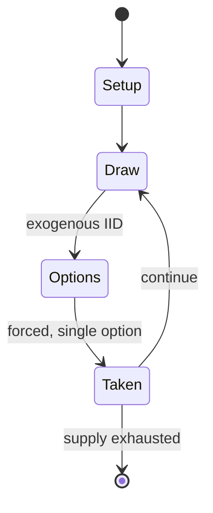

# Armada

*board game*

`armada` &nbsp; state: **DEEPENED** &nbsp; method: **heuristic**

## Found layer (recorded, not trusted)

| field | value |
| --- | --- |
| wikidata | Q104866690 |
| wikipedia | Armada (board game) |
| genres (source) | -- |
| instance of (source) | board game |
| country of origin | -- |

## Declared layer (orders bench work)

| field | value |
| --- | --- |
| year created | 1986 |
| epoch | DIGITAL |
| region | -- |
| media | BOARD |
| players | 2-4 |
| age band | -- |
| exogenous process | IID |
| loss shape | -- |
| live axes | SPATIAL, TRADE |
| horizon | -- |
| scoring shape | -- |
| information | -- |
| interaction | -- |
| turn structure | ACTION_POINT |
| tractability | EXACT_WITH_CUT |
| randomness | DICE |
| luck factor | 0.58 |
| rules complexity | 3.23 |
| strategic depth | 1.87 |
| novelty | 0.7817 |
| solved status | -- |
| strategies | -- |
| algorithms | -- |

## Object model

```
Episode
  players      : 2-4
  turn_structure: ACTION_POINT
  horizon       : ?
  scoring       : ?

Board          -- spatial substrate; cells carry position and occupancy
Piece          -- movable token owned by a player
Placement      -- position subject to geometric legality
Offer          -- proposed exchange between two agents
```

## State transition diagram



## Research item -- turn trace

```
# Armada -- simulated turn events
# generated from the DECLARED vector, not from a rulebook.
# structure: exo=IID loss=None horizon=None scoring=None axes=SPATIAL,TRADE

t=0    SETUP        players=2  pot=0  capacity=5
t=1    DRAW         p1 roll from d6 pool -> outcome #1  (p=0.071)
t=2    FORCED       p1 single legal option taken (pot_gain=+0.6)
t=3    ENDTURN      turn passes to p2
t=4    DRAW         p2 roll from d6 pool -> outcome #2  (p=0.209)
t=5    FORCED       p2 single legal option taken (pot_gain=+1.4)
t=6    TRADE        p2 offers 2:1 exchange to p1
t=7    DRAW         p2 roll from d6 pool -> outcome #2  (p=0.227)
t=8    FORCED       p2 single legal option taken (pot_gain=+1.0)
t=9    TRADE        p2 offers 2:1 exchange to p1
t=10   DRAW         p2 roll from d6 pool -> outcome #5  (p=0.262)
t=11   FORCED       p2 single legal option taken (pot_gain=+1.5)
t=12   DRAW         p2 roll from d6 pool -> outcome #6  (p=0.234)
t=13   FORCED       p2 single legal option taken (pot_gain=+1.8)
t=14   DRAW         p2 roll from d6 pool -> outcome #5  (p=0.041)
t=15   FORCED       p2 single legal option taken (pot_gain=+1.0)
t=16   TRADE        p2 offers 2:1 exchange to p1
t=17   SPATIAL      p2 places at (5,3); adjacency legal
t=18   DRAW         p2 roll from d6 pool -> outcome #6  (p=0.020)
t=19   FORCED       p2 single legal option taken (pot_gain=+1.1)
t=20   SPATIAL      p2 places at (1,3); adjacency legal
t=21   DRAW         p2 roll from d6 pool -> outcome #1  (p=0.224)
t=22   FORCED       p2 single legal option taken (pot_gain=+1.1)
t=23   DRAW         p2 roll from d6 pool -> outcome #3  (p=0.055)
t=24   FORCED       p2 single legal option taken (pot_gain=+1.6)
t=25   ENDTURN      turn passes to p1
t=26   DRAW         p1 roll from d6 pool -> outcome #5  (p=0.280)
t=27   FORCED       p1 single legal option taken (pot_gain=+1.9)
t=28   SPATIAL      p1 places at (0,4); adjacency legal
t=29   ENDTURN      turn passes to p2

terminal: VARIABLE
```

## Conditions

| kind | threshold | effect | trigger |
| --- | --- | --- | --- |
| WIN | -- | -- | In order to win the game, a player either needs to |
| BOUNDARY | -- | -- | The player can attempt to conquer an area that is either unclaimed by another player or already conquered by another player by spending one Action Point to move at least two colonist/pirate counters into the area. |
| BOUNDARY | -- | -- | The attacking player, who must attack with at least two colonist/pirate counters, rolls the Combat die, which will indicate either how many Attacker or Defender counters must be removed from the board. |

## Source extract

Armada is a board game published by Jeux Descartes in 1986. After Jeux Descartes published a
second edition, Eurogames published a third edition in 2001 that changed the theme of the game
from colonisation to treasure-seeking pirates.   == Description ==  Armada is a game of maritime
exploration and world domination for 2–4 players. Each player plays one of four island nations
who want to explore an island in the center of the board.   === Game components === The first
and second editions of the game come with:  300 plastic markers 150 tokens eight 2-masted metal
ships three special six-sided dice, one each for combat, indigenous people and gold rules
booklet The third edition adds a deck of 55 Action cards.   === Set-up === In the first and
second editions, the players play island nations on the edges of the map seeking to colonize a
central island. In the third edition, each player is a pirate captain who is seeking buried
treasure on the central island.  Each player chooses one of four colors, and is given 18
colonist/pirate markers, which are placed on the player's home island. Each player also receives
two ships which are placed next to the player's home cities. In the third e

<sub>Wikipedia, CC BY-SA. Retained as evidence for the structural
classification above. Every rule inferred from it is HYPOTHESIZED
until audited against a rulebook.</sub>
