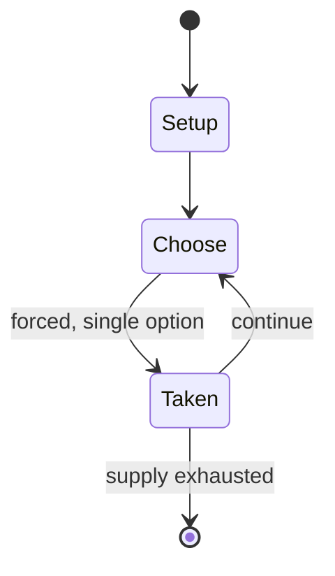

# Ashta Chamma

`ashta_chamma` &nbsp; state: **DEEPENED** &nbsp; method: **heuristic**

## Found layer (recorded, not trusted)

| field | value |
| --- | --- |
| wikidata | Q4805922 |
| wikipedia | Ashta Chamma |
| genres (source) | -- |
| instance of (source) | -- |
| country of origin | -- |

## Declared layer (orders bench work)

| field | value |
| --- | --- |
| year created | -- |
| epoch | -- |
| region | -- |
| media | BOARD, VIDEO |
| players | -- |
| age band | -- |
| exogenous process | NONE |
| loss shape | OPPORTUNITY_ONLY |
| live axes | ORDER |
| horizon | -- |
| scoring shape | -- |
| information | PERFECT |
| interaction | -- |
| turn structure | -- |
| tractability | SAMPLING_ONLY |
| randomness | HIDDEN_INFO |
| luck factor | 0.05 |
| rules complexity | 2.57 |
| strategic depth | 2.65 |
| novelty | 0.6623 |
| solved status | -- |
| strategies | opponent_modelling |
| algorithms | -- |

## Object model

```
Episode
  players      : ?
  turn_structure: ?
  horizon       : ?
  scoring       : ?

Board          -- spatial substrate; cells carry position and occupancy
Piece          -- movable token owned by a player
WorldState     -- simulation state advanced by the engine
Avatar         -- player-controlled agent
Clock          -- frame or tick counter
Sequence       -- the permutation under the player's control
```

## State transition diagram



## Research item -- turn trace

```
# Ashta Chamma -- simulated turn events
# generated from the DECLARED vector, not from a rulebook.
# structure: exo=NONE loss=OPPORTUNITY_ONLY horizon=None scoring=None axes=ORDER

t=0    SETUP        players=2  pot=0  capacity=5
t=1    FORCED       p1 single legal option taken (pot_gain=+0.9)
t=2    FORCED       p1 single legal option taken (pot_gain=+1.9)
t=3    ENDTURN      turn passes to p2
t=4    FORCED       p2 single legal option taken (pot_gain=+0.5)
t=5    FORCED       p2 single legal option taken (pot_gain=+1.5)
t=6    FORCED       p2 single legal option taken (pot_gain=+0.9)
t=7    FORCED       p2 single legal option taken (pot_gain=+1.9)
t=8    FORCED       p2 single legal option taken (pot_gain=+2.0)
t=9    FORCED       p2 single legal option taken (pot_gain=+1.8)
t=10   FORCED       p2 single legal option taken (pot_gain=+1.3)
t=11   ENDTURN      turn passes to p1
t=12   FORCED       p1 single legal option taken (pot_gain=+2.0)
t=13   FORCED       p1 single legal option taken (pot_gain=+1.5)
t=14   FORCED       p1 single legal option taken (pot_gain=+1.4)
t=15   FORCED       p1 single legal option taken (pot_gain=+1.4)
t=16   ENDTURN      turn passes to p2
t=17   FORCED       p2 single legal option taken (pot_gain=+1.0)
t=18   FORCED       p2 single legal option taken (pot_gain=+1.8)
t=19   ENDTURN      turn passes to p1
t=20   FORCED       p1 single legal option taken (pot_gain=+0.9)
t=21   FORCED       p1 single legal option taken (pot_gain=+0.9)
t=22   ENDTURN      turn passes to p2
t=23   FORCED       p2 single legal option taken (pot_gain=+1.5)
t=24   FORCED       p2 single legal option taken (pot_gain=+2.0)
t=25   FORCED       p2 single legal option taken (pot_gain=+0.6)
t=26   ENDTURN      turn passes to p1

terminal: VARIABLE
```

## Source extract

Ashta Chamma (transl. A four-player board game) is a 2008 Indian Telugu-language romantic comedy
film written and directed by Mohana Krishna Indraganti. The film stars Nani, Swathi Reddy,
Srinivas Avasarala, and Bhargavi, with Tanikella Bharani in a supporting role. An adaptation of
Oscar Wilde's play The Importance of Being Earnest, the film deals with four quirky characters
interwoven in a romantic narration. Upon release, the film received positive reviews and box
office success. Swathi won the Filmfare Award and Nandi Award for Best Actress.   == Plot ==
The movie starts with an introduction of the ardent female fans of actor Mahesh Babu, who turn
into an enraged frenzy when he gets married. Lavanya is the craziest of them all. She's caught
up on marrying Mahesh, despite her aunt, Mandira Devi, repeatedly telling her that it's
impossible. Lavanya pays no heed and stays depressed for days. She eventually reaches a
compromise with her aunt by demanding that her husband's name must be Mahesh. Mandira Devi
relents and starts the hunt for a groom, though in vain. Their neighbour, Anand, promises to
help Lavanya by finding a seemingly perfect "Mahesh". As all hope seems gone, Anand

<sub>Wikipedia, CC BY-SA. Retained as evidence for the structural
classification above. Every rule inferred from it is HYPOTHESIZED
until audited against a rulebook.</sub>
