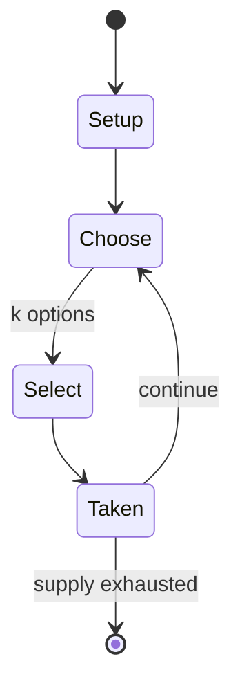

# Asian Pacific Mathematics Olympiad

*regional mathematics competition*

`asian_pacific_mathematics_olympiad` &nbsp; state: **DEEPENED** &nbsp; method: **heuristic**

## Found layer (recorded, not trusted)

| field | value |
| --- | --- |
| wikidata | Q1039254 |
| wikipedia | Asian Pacific Mathematics Olympiad |
| genres (source) | -- |
| instance of (source) | mathematics competition |
| country of origin | -- |

## Declared layer (orders bench work)

| field | value |
| --- | --- |
| year created | -- |
| epoch | -- |
| region | -- |
| media | - |
| players | -- |
| age band | -- |
| exogenous process | -- |
| loss shape | -- |
| live axes | SELECT, TRADE |
| horizon | -- |
| scoring shape | -- |
| information | -- |
| interaction | COMPETITIVE |
| turn structure | -- |
| tractability | SAMPLING_ONLY |
| randomness | -- |
| luck factor | 0.35 |
| rules complexity | 2.32 |
| strategic depth | 2.0 |
| novelty | 0.3117 |
| solved status | -- |
| strategies | -- |
| algorithms | -- |

## Object model

```
Episode
  players      : ?
  turn_structure: ?
  horizon       : ?
  scoring       : ?

OptionSet      -- the choices available after an exogenous draw
Offer          -- proposed exchange between two agents
```

## State transition diagram



## Research item -- turn trace

```
# Asian Pacific Mathematics Olympiad -- simulated turn events
# generated from the DECLARED vector, not from a rulebook.
# structure: exo=None loss=None horizon=None scoring=None axes=SELECT,TRADE

t=0    SETUP        players=2  pot=0  capacity=3
t=1    SELECT       p1 4 options; take #1  (pot_gain=+3.0, capacity=-0)
t=2    SELECT       p1 2 options; take #2  (pot_gain=+3.4, capacity=-1)
t=3    SELECT       p1 1 options; take #1  (pot_gain=+3.3, capacity=-1)
t=4    SELECT       p1 2 options; take #1  (pot_gain=+2.6, capacity=-1)
t=5    TRADE        p1 offers 2:1 exchange to p2
t=6    SELECT       p1 3 options; take #2  (pot_gain=+1.8, capacity=-2)
t=7    ENDTURN      turn passes to p2
t=8    SELECT       p2 4 options; take #2  (pot_gain=+2.5, capacity=-1)
t=9    SELECT       p2 4 options; take #1  (pot_gain=+0.8, capacity=-2)
t=10   TRADE        p2 offers 2:1 exchange to p1
t=11   SELECT       p2 3 options; take #3  (pot_gain=+2.0, capacity=-0)
t=12   TRADE        p2 offers 2:1 exchange to p1
t=13   SELECT       p2 3 options; take #2  (pot_gain=+1.4, capacity=-0)
t=14   TRADE        p2 offers 2:1 exchange to p1
t=15   SELECT       p2 1 options; take #1  (pot_gain=+2.4, capacity=-0)
t=16   ENDTURN      turn passes to p1
t=17   SELECT       p1 4 options; take #1  (pot_gain=+3.3, capacity=-2)
t=18   SELECT       p1 2 options; take #1  (pot_gain=+1.8, capacity=-0)
t=19   TRADE        p1 offers 2:1 exchange to p2
t=20   SELECT       p1 1 options; take #1  (pot_gain=+2.8, capacity=-0)
t=21   SELECT       p1 1 options; take #1  (pot_gain=+2.5, capacity=-1)
t=22   SELECT       p1 1 options; take #1  (pot_gain=+0.7, capacity=-1)
t=23   TRADE        p1 offers 2:1 exchange to p2
t=24   SELECT       p1 4 options; take #2  (pot_gain=+0.8, capacity=-1)
t=25   SELECT       p1 4 options; take #1  (pot_gain=+1.1, capacity=-0)
t=26   TRADE        p1 offers 2:1 exchange to p2

terminal: VARIABLE
```

## Conditions

| kind | threshold | effect | trigger |
| --- | --- | --- | --- |
| BOUNDARY | 7 points | -- | The APMO contest consists of one four-hour paper consisting of five questions of varying difficulty and each having a maximum score of 7 points. |

## Source extract

The Asian Pacific Mathematics Olympiad (APMO) starting from 1989 is a regional mathematics
competition which involves countries from the Asian Pacific region.  The United States also
takes part in the APMO. Every year, APMO is held in the afternoon of the second Monday of March
for participating countries in the North and South Americas, and in the morning of the second
Tuesday of March for participating countries on the Western Pacific and in Asia.   == APMO's
Aims == the discovering, encouraging and challenging of mathematically gifted school students in
all Pacific-Rim countries the fostering of friendly international relations and cooperation
between students and teachers in the Pacific-Rim Region the creating of an opportunity for the
exchange of information on school syllabi and practice throughout the Pacific Region the
encouragement and support of mathematical involvement with Olympiad type activities, not only in
the APMO participating countries, but also in other Pacific-Rim countries.   == Scoring and
Format == The APMO contest consists of one four-hour paper consisting of five questions of
varying difficulty and each having a maximum score of 7 points. Contestants shoul

<sub>Wikipedia, CC BY-SA. Retained as evidence for the structural
classification above. Every rule inferred from it is HYPOTHESIZED
until audited against a rulebook.</sub>
