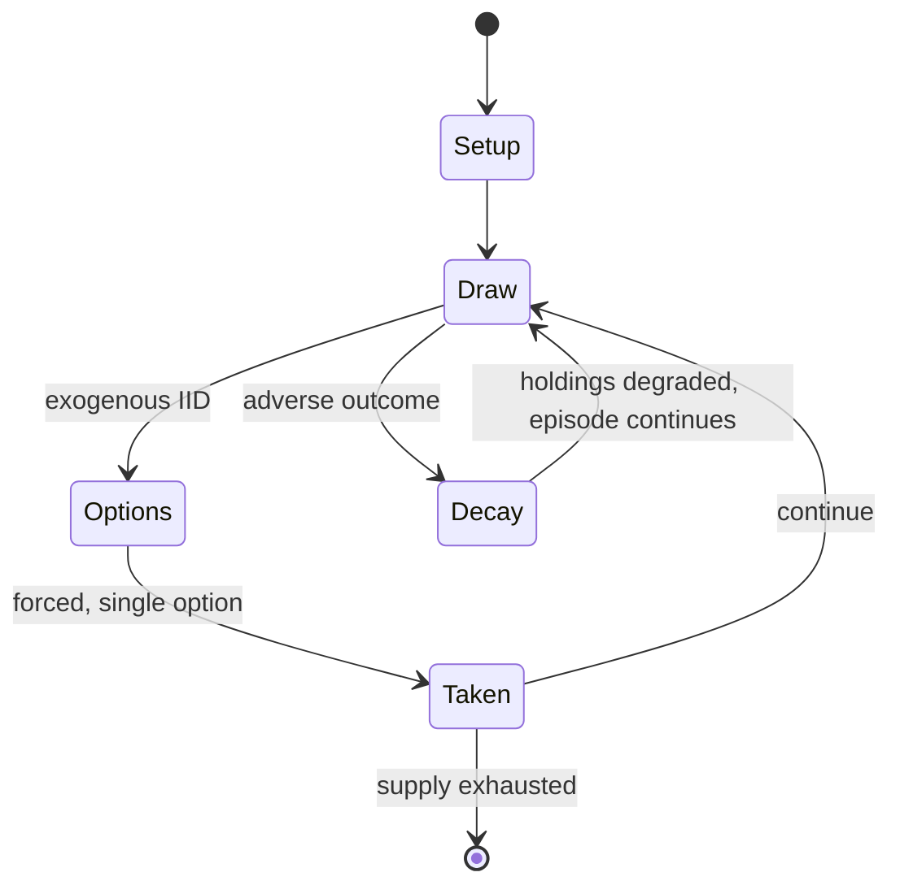

# Astronomical chess

`astronomical_chess` &nbsp; state: **DEEPENED** &nbsp; method: **heuristic**

## Found layer (recorded, not trusted)

| field | value |
| --- | --- |
| wikidata | Q4071799 |
| wikipedia | Astronomical chess |
| genres (source) | -- |
| instance of (source) | -- |
| country of origin | -- |

## Declared layer (orders bench work)

| field | value |
| --- | --- |
| year created | -- |
| epoch | -- |
| region | -- |
| media | BOARD, DICE |
| players | -- |
| age band | -- |
| exogenous process | IID |
| loss shape | PARTIAL_DECAY |
| live axes | - |
| horizon | -- |
| scoring shape | -- |
| information | -- |
| interaction | -- |
| turn structure | -- |
| tractability | EXACT_WITH_CUT |
| randomness | DICE |
| luck factor | 0.58 |
| rules complexity | 1.74 |
| strategic depth | 1.87 |
| novelty | 0.7084 |
| solved status | -- |
| strategies | -- |
| algorithms | -- |

## Object model

```
Episode
  players      : ?
  turn_structure: ?
  horizon       : ?
  scoring       : ?

Board          -- spatial substrate; cells carry position and occupancy
Piece          -- movable token owned by a player
DicePool       -- n dice, each an iid categorical draw
Roll           -- realised outcome of a pool
```

## State transition diagram



## Research item -- turn trace

```
# Astronomical chess -- simulated turn events
# generated from the DECLARED vector, not from a rulebook.
# structure: exo=IID loss=PARTIAL_DECAY horizon=None scoring=None axes=-

t=0    SETUP        players=2  pot=0  capacity=3
t=1    DRAW         p1 roll from d6 pool -> outcome #1  (p=0.009)
t=2    FORCED       p1 single legal option taken (pot_gain=+1.2)
t=3    ENDTURN      turn passes to p2
t=4    DRAW         p2 roll from d6 pool -> outcome #2  (p=0.224)
t=5    FORCED       p2 single legal option taken (pot_gain=+1.8)
t=6    DRAW         p2 roll from d6 pool -> outcome #4  (p=0.165)
t=7    FORCED       p2 single legal option taken (pot_gain=+1.7)
t=8    DRAW         p2 roll from d6 pool -> outcome #4  (p=0.080)
t=9    FORCED       p2 single legal option taken (pot_gain=+1.0)
t=10   DRAW         p2 roll from d6 pool -> outcome #6  (p=0.047)
t=11   FORCED       p2 single legal option taken (pot_gain=+1.6)
t=12   DRAW         p2 roll from d6 pool -> outcome #2  (p=0.022)
t=13   FORCED       p2 single legal option taken (pot_gain=+0.9)
t=14   ENDTURN      turn passes to p1
t=15   DRAW         p1 roll from d6 pool -> outcome #2  (p=0.262)
t=16   FORCED       p1 single legal option taken (pot_gain=+2.0)
t=17   DRAW         p1 roll from d6 pool -> outcome #6  (p=0.091)
t=18   FORCED       p1 single legal option taken (pot_gain=+0.6)
t=19   DRAW         p1 roll from d6 pool -> outcome #2  (p=0.204)
t=20   FORCED       p1 single legal option taken (pot_gain=+0.9)
t=21   DRAW         p1 roll from d6 pool -> outcome #5  (p=0.152)
t=22   FORCED       p1 single legal option taken (pot_gain=+1.5)
t=23   ENDTURN      turn passes to p2
t=24   DRAW         p2 roll from d6 pool -> outcome #1  (p=0.157)
t=25   FORCED       p2 single legal option taken (pot_gain=+1.1)
t=26   ENDTURN      turn passes to p1

terminal: VARIABLE
```

## Source extract

Astronomical chess or Astrological chess is a game for seven players from the book Libro de los
Juegos (Book of Games), written under king Alfonso X the Wise in 1283. The game was played on a
round board with concentric circles. The sky, zodiac signs and planets are the elements of this
chess. The book described the games and problems of playing situations in chess, dice and other
board games that formed the basis of modern backgammon. In some sources astronomical chess is
called the "Zodiac". Despite the name, the game is a dice game that has nothing to do with
chess.   == Description == The board has seven sides for seven players; within, there are 12
concentric circles representing the geocentric model of the universe. Starting from the outside
and moving inward, these represent:  The stars, given by the 12 symbols of the zodiac Saturn,
with 84 (12×7) spaces of alternating color Jupiter, with 72 (12×6) spaces Mars, with 60 (12×5)
spaces The Sun, with 48 (12×4) spaces Venus, with 36 (12×3) spaces Mercury, with 24 (12×2)
spaces The Moon, with 12 (12×1) spaces Earth: fire element as a single red ring Earth: air
element as a single purple ring Earth: water element as a single white

<sub>Wikipedia, CC BY-SA. Retained as evidence for the structural
classification above. Every rule inferred from it is HYPOTHESIZED
until audited against a rulebook.</sub>
