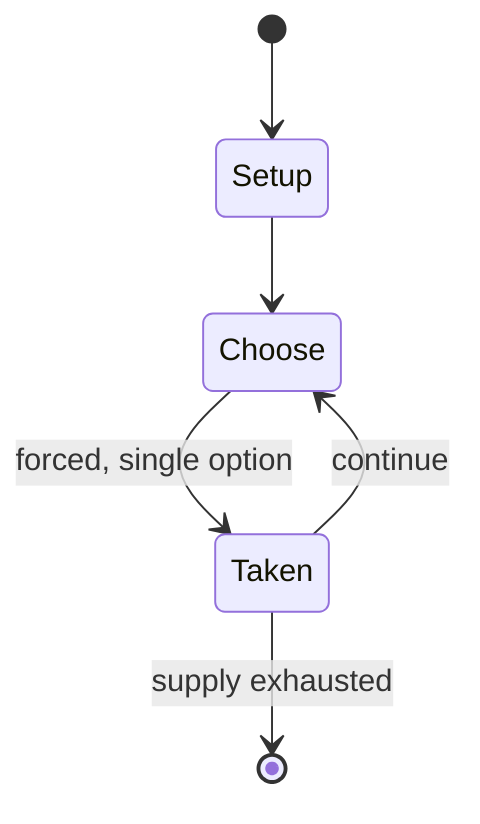

# Attack from Mars

*pinball/video game*

`attack_from_mars` &nbsp; state: **DEEPENED** &nbsp; method: **heuristic**

## Found layer (recorded, not trusted)

| field | value |
| --- | --- |
| wikidata | Q4817939 |
| wikipedia | Attack from Mars |
| genres (source) | science fiction video game |
| instance of (source) | pinball machine game, video game |
| country of origin | United States |

## Declared layer (orders bench work)

| field | value |
| --- | --- |
| year created | 1995 |
| epoch | DIGITAL |
| region | NORTH_AMERICA |
| media | VIDEO |
| players | -- |
| age band | -- |
| exogenous process | -- |
| loss shape | -- |
| live axes | - |
| horizon | -- |
| scoring shape | -- |
| information | -- |
| interaction | COOPERATIVE |
| turn structure | -- |
| tractability | SAMPLING_ONLY |
| randomness | -- |
| luck factor | 0.35 |
| rules complexity | 1.88 |
| strategic depth | 2.0 |
| novelty | 0.5223 |
| solved status | -- |
| strategies | -- |
| algorithms | -- |

## Object model

```
Episode
  players      : ?
  turn_structure: ?
  horizon       : ?
  scoring       : ?

WorldState     -- simulation state advanced by the engine
Avatar         -- player-controlled agent
Clock          -- frame or tick counter
```

## State transition diagram



## Research item -- turn trace

```
# Attack from Mars -- simulated turn events
# generated from the DECLARED vector, not from a rulebook.
# structure: exo=None loss=None horizon=None scoring=None axes=-

t=0    SETUP        players=2  pot=0  capacity=3
t=1    FORCED       p1 single legal option taken (pot_gain=+1.6)
t=2    FORCED       p1 single legal option taken (pot_gain=+0.8)
t=3    ENDTURN      turn passes to p2
t=4    FORCED       p2 single legal option taken (pot_gain=+0.7)
t=5    FORCED       p2 single legal option taken (pot_gain=+0.8)
t=6    ENDTURN      turn passes to p1
t=7    FORCED       p1 single legal option taken (pot_gain=+1.8)
t=8    FORCED       p1 single legal option taken (pot_gain=+1.0)
t=9    ENDTURN      turn passes to p2
t=10   FORCED       p2 single legal option taken (pot_gain=+0.8)
t=11   FORCED       p2 single legal option taken (pot_gain=+0.6)
t=12   FORCED       p2 single legal option taken (pot_gain=+1.6)
t=13   FORCED       p2 single legal option taken (pot_gain=+0.8)
t=14   ENDTURN      turn passes to p1
t=15   FORCED       p1 single legal option taken (pot_gain=+1.8)
t=16   FORCED       p1 single legal option taken (pot_gain=+1.7)
t=17   ENDTURN      turn passes to p2
t=18   FORCED       p2 single legal option taken (pot_gain=+0.8)
t=19   FORCED       p2 single legal option taken (pot_gain=+1.0)
t=20   FORCED       p2 single legal option taken (pot_gain=+1.4)
t=21   FORCED       p2 single legal option taken (pot_gain=+0.9)
t=22   ENDTURN      turn passes to p1
t=23   FORCED       p1 single legal option taken (pot_gain=+0.8)
t=24   FORCED       p1 single legal option taken (pot_gain=+1.6)
t=25   FORCED       p1 single legal option taken (pot_gain=+1.6)
t=26   ENDTURN      turn passes to p2

terminal: VARIABLE
```

## Conditions

| kind | threshold | effect | trigger |
| --- | --- | --- | --- |
| BOUNDARY | -- | -- | 5-Way Combo: Make at least five lit shots in quick succession. |

## Source extract

Attack from Mars is a 1995 pinball game designed by Brian Eddy, and released by Midway (under
the Bally label). The game uses the DCS sound system. In this game, the player must fend off an
alien invasion from the planet Mars by defending the world's major cities, destroying the
invasion fleet, and conquering Mars itself.   == Design == The game was conceived of by Brian
Eddy celebrating classic 50s sci-fi movies like The War of the Worlds, but with a modern sense
of humour. It has a fan layout, meaning all shots can be hit from the two flippers at the bottom
of the playfield. Notable features on the playfield include four mechanized Martian figures, a
strobe light (for Strobe Multiball), and several flying saucers mounted above the ramps/loops.
The largest of these, placed above a set of targets at the top center of the playfield, can
shake and flash in time with the player's success in defeating Martian forces. The diverters use
a different method of operation than on earlier games. During the earlier part of the design
process of the machine the large flying saucer could move around the middle third of the
playfield, but was removed due to cost and reliability concerns. In the p

<sub>Wikipedia, CC BY-SA. Retained as evidence for the structural
classification above. Every rule inferred from it is HYPOTHESIZED
until audited against a rulebook.</sub>
