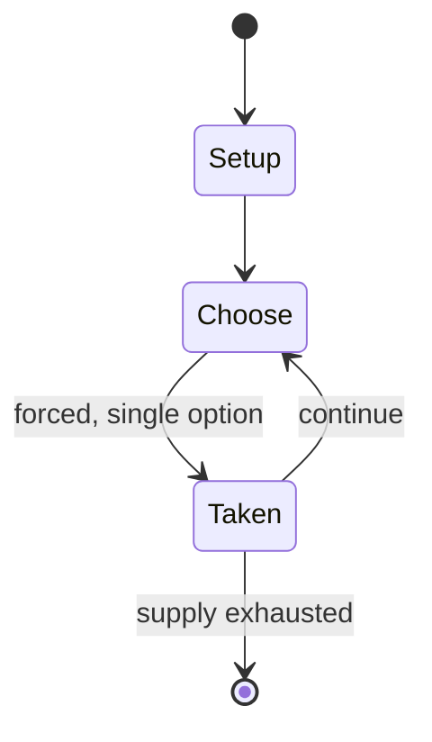

# Australian handball

`australian_handball` &nbsp; state: **DEEPENED** &nbsp; method: **heuristic**

## Found layer (recorded, not trusted)

| field | value |
| --- | --- |
| wikidata | Q4825016 |
| wikipedia | Australian handball |
| genres (source) | -- |
| instance of (source) | -- |
| country of origin | -- |

## Declared layer (orders bench work)

| field | value |
| --- | --- |
| year created | -- |
| epoch | -- |
| region | -- |
| media | SPORT |
| players | -- |
| age band | -- |
| exogenous process | -- |
| loss shape | -- |
| live axes | - |
| horizon | -- |
| scoring shape | -- |
| information | -- |
| interaction | -- |
| turn structure | -- |
| tractability | SAMPLING_ONLY |
| randomness | -- |
| luck factor | 0.35 |
| rules complexity | 1.71 |
| strategic depth | 2.0 |
| novelty | 0.0914 |
| solved status | -- |
| strategies | -- |
| algorithms | -- |

## Object model

```
Episode
  players      : ?
  turn_structure: ?
  horizon       : ?
  scoring       : ?

Pitch          -- bounded physical region
Player         -- embodied agent with a foul count
Clock          -- counts down; stoppages are rule events
Official       -- detects infractions and applies penalties
```

## State transition diagram



## Research item -- turn trace

```
# Australian handball -- simulated turn events
# generated from the DECLARED vector, not from a rulebook.
# structure: exo=None loss=None horizon=None scoring=None axes=-

t=0    SETUP        players=2  pot=0  capacity=4
t=1    FORCED       p1 single legal option taken (pot_gain=+1.8)
t=2    ENDTURN      turn passes to p2
t=3    FORCED       p2 single legal option taken (pot_gain=+1.0)
t=4    FORCED       p2 single legal option taken (pot_gain=+1.3)
t=5    FORCED       p2 single legal option taken (pot_gain=+1.3)
t=6    FORCED       p2 single legal option taken (pot_gain=+1.2)
t=7    FORCED       p2 single legal option taken (pot_gain=+1.0)
t=8    FORCED       p2 single legal option taken (pot_gain=+1.0)
t=9    FORCED       p2 single legal option taken (pot_gain=+1.8)
t=10   FORCED       p2 single legal option taken (pot_gain=+1.9)
t=11   FORCED       p2 single legal option taken (pot_gain=+0.7)
t=12   FORCED       p2 single legal option taken (pot_gain=+1.8)
t=13   ENDTURN      turn passes to p1
t=14   FORCED       p1 single legal option taken (pot_gain=+1.3)
t=15   FORCED       p1 single legal option taken (pot_gain=+1.3)
t=16   FORCED       p1 single legal option taken (pot_gain=+0.7)
t=17   FORCED       p1 single legal option taken (pot_gain=+1.9)
t=18   FORCED       p1 single legal option taken (pot_gain=+1.9)
t=19   FORCED       p1 single legal option taken (pot_gain=+1.1)
t=20   FORCED       p1 single legal option taken (pot_gain=+1.3)
t=21   FORCED       p1 single legal option taken (pot_gain=+0.8)
t=22   FORCED       p1 single legal option taken (pot_gain=+1.7)
t=23   FORCED       p1 single legal option taken (pot_gain=+1.9)
t=24   FORCED       p1 single legal option taken (pot_gain=+0.7)
t=25   ENDTURN      turn passes to p2
t=26   FORCED       p2 single legal option taken (pot_gain=+0.7)

terminal: VARIABLE
```

## Source extract

Australian handball is a sport in which players strike a small ball against one or more walls
using their hands. It is distinct from the Olympic sport of team handball, being more closely
related to other wall/handball sports such as Gaelic handball, Welsh handball, and American
handball.  Organised forms of the game were recorded in Australia as early as 1923.   == Rules
of play ==  Australian handball is generally played in an enclosed court in which players strike
a small ball directly against a front wall using their palm or fist rather than a racquet or
other equipment. Play begins with a serve, in which the ball is hit directly against the front
wall without first bouncing on the ground, and then the opposing player must return the ball
before it bounces twice. During play the ball may rebound from side walls either before or after
striking the front wall, but after a player strikes the ball it must contact the front wall
before touching the ground. The game can be played in singles or doubles formats on courts with
one, three, or four walls, with the three-wall court the most common configuration used for
organised play. Courts used for the sport are found at a number of edu

<sub>Wikipedia, CC BY-SA. Retained as evidence for the structural
classification above. Every rule inferred from it is HYPOTHESIZED
until audited against a rulebook.</sub>
