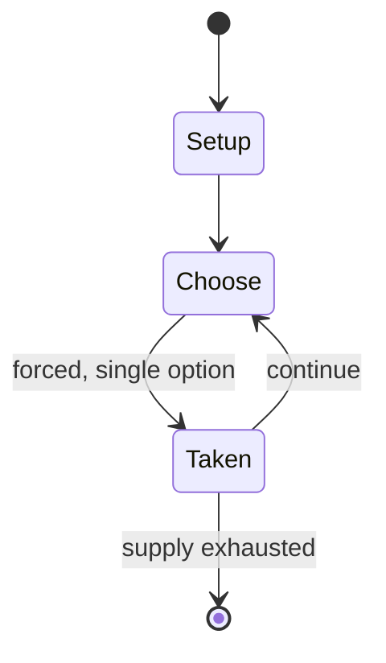

# Authors

*card game*

`authors` &nbsp; state: **DEEPENED** &nbsp; method: **heuristic**

## Found layer (recorded, not trusted)

| field | value |
| --- | --- |
| wikidata | Q4825971 |
| wikipedia | Authors (card game) |
| genres (source) | -- |
| instance of (source) | card game |
| country of origin | -- |

## Declared layer (orders bench work)

| field | value |
| --- | --- |
| year created | 1861 |
| epoch | INDUSTRIAL |
| region | -- |
| media | CARD |
| players | -- |
| age band | -- |
| exogenous process | -- |
| loss shape | -- |
| live axes | - |
| horizon | -- |
| scoring shape | -- |
| information | -- |
| interaction | -- |
| turn structure | -- |
| tractability | SAMPLING_ONLY |
| randomness | -- |
| luck factor | 0.35 |
| rules complexity | 1.67 |
| strategic depth | 2.0 |
| novelty | 0.0876 |
| solved status | -- |
| strategies | -- |
| algorithms | -- |

## Object model

```
Episode
  players      : ?
  turn_structure: ?
  horizon       : ?
  scoring       : ?

Deck           -- ordered multiset, drawn without replacement
Hand           -- private multiset held by one player
DiscardPile    -- public accumulation of spent cards
```

## State transition diagram



## Research item -- turn trace

```
# Authors -- simulated turn events
# generated from the DECLARED vector, not from a rulebook.
# structure: exo=None loss=None horizon=None scoring=None axes=-

t=0    SETUP        players=2  pot=0  capacity=8
t=1    FORCED       p1 single legal option taken (pot_gain=+0.8)
t=2    FORCED       p1 single legal option taken (pot_gain=+1.5)
t=3    FORCED       p1 single legal option taken (pot_gain=+0.9)
t=4    FORCED       p1 single legal option taken (pot_gain=+1.0)
t=5    FORCED       p1 single legal option taken (pot_gain=+1.6)
t=6    FORCED       p1 single legal option taken (pot_gain=+1.7)
t=7    FORCED       p1 single legal option taken (pot_gain=+1.5)
t=8    FORCED       p1 single legal option taken (pot_gain=+0.5)
t=9    FORCED       p1 single legal option taken (pot_gain=+1.2)
t=10   ENDTURN      turn passes to p2
t=11   FORCED       p2 single legal option taken (pot_gain=+1.9)
t=12   FORCED       p2 single legal option taken (pot_gain=+0.8)
t=13   ENDTURN      turn passes to p1
t=14   FORCED       p1 single legal option taken (pot_gain=+0.7)
t=15   FORCED       p1 single legal option taken (pot_gain=+1.3)
t=16   FORCED       p1 single legal option taken (pot_gain=+1.7)
t=17   FORCED       p1 single legal option taken (pot_gain=+1.4)
t=18   FORCED       p1 single legal option taken (pot_gain=+2.0)
t=19   ENDTURN      turn passes to p2
t=20   FORCED       p2 single legal option taken (pot_gain=+1.4)
t=21   FORCED       p2 single legal option taken (pot_gain=+0.6)
t=22   ENDTURN      turn passes to p1
t=23   FORCED       p1 single legal option taken (pot_gain=+0.9)
t=24   FORCED       p1 single legal option taken (pot_gain=+1.6)
t=25   FORCED       p1 single legal option taken (pot_gain=+0.9)
t=26   FORCED       p1 single legal option taken (pot_gain=+1.2)
t=27   ENDTURN      turn passes to p2

terminal: VARIABLE
```

## Source extract

Authors or, The Game of Authors is an educational game for three to five players. First
published by G. M. Whipple & A. A. Smith of Salem, Massachusetts in 1861, The Game of Authors
was in 1897 published by Parker Brothers, also located in Salem, Massachusetts at that time. The
Game of Authors is one of the earliest versions of the family of Go Fish games, in which players
call on each other to give up a named card. The play is based on a specialized deck of playing
cards. Later decks included additional authors, but the authors represented in most decks are:
Mark Twain Charles Dickens William Makepeace Thackeray Robert Louis Stevenson William
Shakespeare James Fenimore Cooper Washington Irving Nathaniel Hawthorne Henry Wadsworth
Longfellow Sir Walter Scott Alfred, Lord Tennyson Louisa May Alcott Edgar Allan Poe   ==
References ==   == External links ==  The Game of Authors   at BoardGameGeek

<sub>Wikipedia, CC BY-SA. Retained as evidence for the structural
classification above. Every rule inferred from it is HYPOTHESIZED
until audited against a rulebook.</sub>
