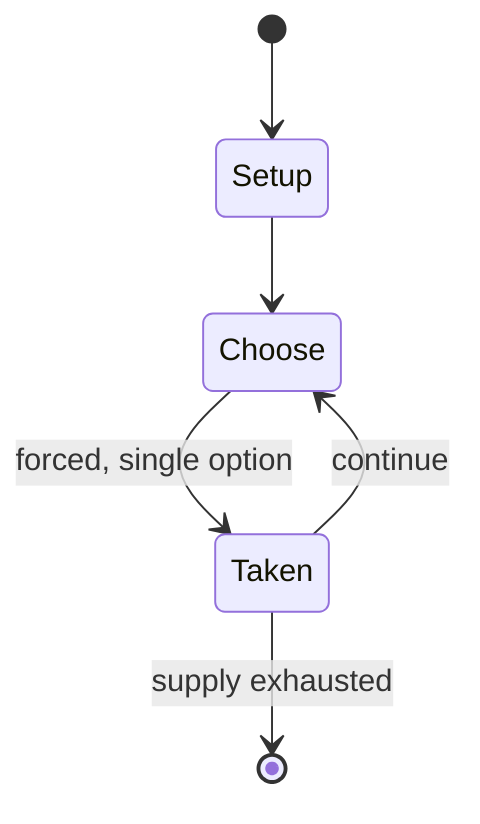

# Aw-li On-nam Ot-tjin

*traditional mancala game*

`aw_li_on_nam_ot_tjin` &nbsp; state: **DEEPENED** &nbsp; method: **heuristic**

## Found layer (recorded, not trusted)

| field | value |
| --- | --- |
| wikidata | Q3631287 |
| wikipedia | Aw-li On-nam Ot-tjin |
| genres (source) | -- |
| instance of (source) | board game, mancala |
| country of origin | -- |

## Declared layer (orders bench work)

| field | value |
| --- | --- |
| year created | -- |
| epoch | -- |
| region | -- |
| media | MANCALA |
| players | -- |
| age band | -- |
| exogenous process | -- |
| loss shape | -- |
| live axes | - |
| horizon | -- |
| scoring shape | -- |
| information | -- |
| interaction | COMPETITIVE |
| turn structure | STRICT_TURN |
| tractability | SAMPLING_ONLY |
| randomness | -- |
| luck factor | 0.35 |
| rules complexity | 1.71 |
| strategic depth | 2.0 |
| novelty | 0.4915 |
| solved status | -- |
| strategies | -- |
| algorithms | -- |

## Object model

```
Episode
  players      : ?
  turn_structure: STRICT_TURN
  horizon       : ?
  scoring       : ?

Pits           -- cyclic array of counts
Store          -- player's banked seeds
```

## State transition diagram



## Research item -- turn trace

```
# Aw-li On-nam Ot-tjin -- simulated turn events
# generated from the DECLARED vector, not from a rulebook.
# structure: exo=None loss=None horizon=None scoring=None axes=-

t=0    SETUP        players=2  pot=0  capacity=6
t=1    FORCED       p1 single legal option taken (pot_gain=+1.6)
t=2    FORCED       p1 single legal option taken (pot_gain=+1.3)
t=3    FORCED       p1 single legal option taken (pot_gain=+1.8)
t=4    FORCED       p1 single legal option taken (pot_gain=+1.3)
t=5    FORCED       p1 single legal option taken (pot_gain=+1.1)
t=6    FORCED       p1 single legal option taken (pot_gain=+0.6)
t=7    FORCED       p1 single legal option taken (pot_gain=+0.7)
t=8    ENDTURN      turn passes to p2
t=9    FORCED       p2 single legal option taken (pot_gain=+1.4)
t=10   FORCED       p2 single legal option taken (pot_gain=+0.6)
t=11   FORCED       p2 single legal option taken (pot_gain=+1.3)
t=12   FORCED       p2 single legal option taken (pot_gain=+0.8)
t=13   FORCED       p2 single legal option taken (pot_gain=+1.9)
t=14   ENDTURN      turn passes to p1
t=15   FORCED       p1 single legal option taken (pot_gain=+1.2)
t=16   FORCED       p1 single legal option taken (pot_gain=+1.9)
t=17   FORCED       p1 single legal option taken (pot_gain=+1.5)
t=18   FORCED       p1 single legal option taken (pot_gain=+1.1)
t=19   FORCED       p1 single legal option taken (pot_gain=+0.5)
t=20   FORCED       p1 single legal option taken (pot_gain=+1.5)
t=21   FORCED       p1 single legal option taken (pot_gain=+0.5)
t=22   FORCED       p1 single legal option taken (pot_gain=+0.6)
t=23   FORCED       p1 single legal option taken (pot_gain=+0.8)
t=24   FORCED       p1 single legal option taken (pot_gain=+0.8)
t=25   FORCED       p1 single legal option taken (pot_gain=+0.8)
t=26   ENDTURN      turn passes to p2

terminal: VARIABLE
```

## Conditions

| kind | threshold | effect | trigger |
| --- | --- | --- | --- |
| TERMINATE | -- | -- | When one of the players cannot play anymore, their opponent captures all the seeds that are left on the board, and the game ends. |

## Source extract

Aw-li On-nam Ot-tjin (or simply Otjin) is a traditional mancala game played by the Penihing
people of Borneo. The first transcription of the rules of the game was completed by Norwegian
ethnographist Carl Sofus Lumholtz. Despite its origin, Otjin is similar to African mancalas such
as Ba-awa (Ghana) and quite different than most Asian mancalas.   == Rules == The Otjin board
comprises two rows of 10 holes each. Each player owns a row of holes. Upon the game setup, each
of smaller holes holds an equal number of seeds, usually 3 (but 2 to 5 are admissible). On their
turn, the player takes all the seeds from one of their holes and relay sows them
counterclockwise. If the last seed is sown in a hole such that, after sowing, the number of
seeds in the hole is equal to the number of seeds per hole at the beginning of the game (e.g.,
3), the player captures those seeds and removes them from the game. Capture is traditionally
called "fishing". When one of the players cannot play anymore, their opponent captures all the
seeds that are left on the board, and the game ends. The winner of the game is the player who
captured the most seeds.   == References == R. Gering, Otjin: Trying to make fis

<sub>Wikipedia, CC BY-SA. Retained as evidence for the structural
classification above. Every rule inferred from it is HYPOTHESIZED
until audited against a rulebook.</sub>
